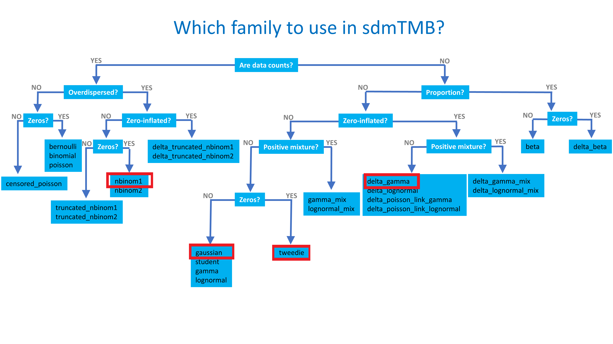

<!-- Build with: xaringan::inf_mr() -->

```{r preamble, include=FALSE, cache=FALSE}
source(here::here("afsc-simulating-2024/preamble.R"))
do.call(knitr::opts_chunk$set, knitr_opts)
```

```{r libs, include=FALSE}
library(dplyr)
library(sdmTMB)
library(ggplot2)
```

# Why is space important? 

* Data often have spatial attributes

* Ideal world:
  * Plug spatial covariates into a GLM / GLMM
  * Residuals are uncorrelated  
  
```{r sim-rf-intro, echo=FALSE, fig.asp=0.4}
set.seed(123)
predictor_dat <- data.frame(
  X = runif(300), Y = runif(300),
  year = 1
)
mesh <- make_mesh(predictor_dat,
  xy_cols = c("X", "Y"),
  cutoff = 0.1
)
sim_dat <- sdmTMB_simulate(
  formula = ~1,
  data = predictor_dat,
  time = "year",
  mesh = mesh,
  family = gaussian(link = "identity"),
  range = 0.00001,
  sigma_E = 0.1,
  phi = 0.01,
  sigma_O = 0.2,
  seed = 3542,
  B = c(0) # B0 = intercept
)

ggplot(sim_dat, aes(X, Y, col = observed)) +
  geom_point(alpha = 0.7, size = 3) +
  guides(col = guide_legend(title = "Residuals")) +
  scale_color_gradient2()
```

---

# Reality
  
* Residual spatial autocorrelation
  * Data covary spatially (data that are closer are more similar)

```{r sim-rf-intro-cor, echo=FALSE, fig.asp=0.4}
set.seed(123)
predictor_dat <- data.frame(
  X = runif(300), Y = runif(300),
  year = 1
)
mesh <- make_mesh(predictor_dat,
  xy_cols = c("X", "Y"),
  cutoff = 0.1
)
sim_dat <- sdmTMB_simulate(
  formula = ~1,
  data = predictor_dat,
  time = "year",
  mesh = mesh,
  family = gaussian(link = "identity"),
  range = 0.25,
  sigma_E = 0.1,
  phi = 0.01,
  sigma_O = 0.1,
  seed = 3542,
  B = c(0) # B0 = intercept
)

ggplot(sim_dat, aes(X, Y, col = observed)) +
  geom_point(alpha=0.7, size=3) + 
  guides(col=guide_legend(title="Residuals")) +
  scale_color_gradient2()
```

---

# Modeling spatial autocorrelation

* Need 'wiggly'/smooth surface for approximating all spatial variables missing from model ('latent' variables)

* Several approaches exist
  * 2D smooths in mgcv
  * Random fields and the Stochastic Partial Differential Equation (SPDE)

---

# Predictive process models 

* Gaussian process predictive process models:
  * Estimate values at a subset of locations in the time series
  *   'knots', 'vertices', or 'control points'
  * Use covariance function to interpolate from knots to locations of observations

* Estimate spatial field as random effects (also called random fields)

---

# What is a random field?

```{r sim-rf-dat, message=FALSE, warning=FALSE}
predictor_dat <- expand.grid(
  x = seq(0, 1, length.out = 100),
  y = seq(0, 1, length.out = 100),
  year = seq_len(6)
)
mesh <- make_mesh(predictor_dat, xy_cols = c("x", "y"), cutoff = 0.05)
sim_dat <- sdmTMB_simulate(
  formula = ~1,
  data = predictor_dat,
  time = "year",
  mesh = mesh,
  family = gaussian(),
  range = 0.5,
  sigma_E = 0.2,
  phi = 0.1,
  sigma_O = NULL,
  seed = 1,
  B = 0
)
```

```{r random-field-demo}
ggplot(sim_dat, aes(x, y, fill = mu)) +
  facet_wrap(vars(year)) +
  geom_raster() +
  scale_fill_gradient2() +
  coord_fixed(expand = FALSE)
```

---

background-image: url("images/beaker.png")
background-position: bottom right
background-size: 35%

# Random field

* A 2 dimensional "Gaussian Process"

--

* A realization from a multivariate normal distribution with some covariance function

---

background-image: url("images/elmo.png")
background-position: bottom right
background-size: 30%

# Random field

* A way of estimating a wiggly surface to account for spatial and/or spatiotemporal correlation in data.

--

* Alternatively, a way of estimating a wiggly surface to account for "latent" or unobserved variables.

--

* As a bonus, it provides useful covariance parameter estimates: spatial variance and the distance at data points are effectively uncorrelated ("range")

<!-- TODO: include nugget / sill? Show slide with semivariogram image? -->
---

# Many ways to simulate random fields

* `RandomFields::RFsimulate()` simulates univariate / multivariate fields
* `fields::sim.rf()` simulates random fields on a grid
* `geoR::grf()` simulates random fields with irregular observations
* `glmmfields::sim_glmmfields()` simulates random fields with/without extreme values
* `sdmTMB::sdmTMB_simulate()` simulates univariate fields with `sdmTMB`

---

class: center, middle, inverse

# Simulating from scratch with sdmTMB_simulate()

---

# Effects of changing variance and range

```{r sim-rf-grid, echo=FALSE, fig.asp=0.7}
set.seed(123)
predictor_dat <- data.frame(
  X = runif(300), Y = runif(300),
  year = 1
)
mesh <- make_mesh(predictor_dat,
  xy_cols = c("X", "Y"),
  cutoff = 0.1
)

grid_pars = expand.grid("range"=c(0.1, 0.5),
                        "sigma_O" = c(0.05, 0.1))

for(i in 1:nrow(grid_pars)) {
  s <- sdmTMB_simulate(
    formula = ~1,
    data = predictor_dat,
    time = "year",
    mesh = mesh,
    family = gaussian(link = "identity"),
    range = grid_pars$range[i],
    sigma_E = NULL,
    phi = 0.01,
    sigma_O = grid_pars$sigma_O[i],
    seed = 3542,
    B = c(0) # B0 = intercept
  )
  s$range = grid_pars$range[i]
  s$sigma_O = grid_pars$sigma_O[i]
  if(i == 1) {
    sim_dat = s
  } else sim_dat = rbind(s, sim_dat)
}

sim_dat$sigma_O = paste0("sigma_O = ", sim_dat$sigma_O)
sim_dat$range = paste0("range = ", sim_dat$range)
ggplot(sim_dat, aes(X, Y, col = observed)) +
  geom_point(size=1) + 
  scale_color_gradient2() + 
  facet_wrap(range ~ sigma_O)
```

---

# Effects of adding noise 

* Large observation error looks like noise

* $\sigma_{obs}$ >> $\sigma_{O}$, $\sigma_{E}$

```{r sim-rf-large_phi, echo=FALSE, fig.asp=0.5}
set.seed(123)
predictor_dat <- data.frame(
  X = runif(300), Y = runif(300),
  year = 1
)
mesh <- make_mesh(predictor_dat,
  xy_cols = c("X", "Y"),
  cutoff = 0.1
)

sim_dat <- sdmTMB_simulate(
  formula = ~1,
  data = predictor_dat,
  time = "year",
  mesh = mesh,
  family = gaussian(link = "identity"),
  range = 0.5,
  sigma_E = 0.1,
  phi = 1.0,
  sigma_O = 0.1,
  seed = 3542,
  B = c(0.2) # B0 = intercept
)

ggplot(sim_dat, aes(X, Y, col = observed)) +
  geom_point(alpha=0.7, size=3) + 
  scale_color_gradient2()
```
 
---
  
# Moderate observation errors

* $\sigma_{obs}$ = $\sigma_{O}$ = $\sigma_{E}$
    
```{r sim-rf-med_phi, echo = FALSE, fig.asp=0.5}
sim_dat <- sdmTMB_simulate(
  formula = ~1,
  data = predictor_dat,
  time = "year",
  mesh = mesh,
  family = gaussian(link = "identity"),
  range = 0.5,
  sigma_E = 0.1,
  phi = 0.1,
  sigma_O = 0.1,
  seed = 3542,
  B = 0.2 # B0 = intercept
)

ggplot(sim_dat, aes(X, Y, col = observed)) +
  geom_point(alpha=0.7, size=3) + 
  scale_color_gradient2()
```
  
---
     
# Small observation errors  
    
* $\sigma_{obs}$ << $\sigma_{O}$, $\sigma_{E}$
    
```{r sim-rf-small_phi, echo = FALSE, fig.asp=0.5}
sim_dat <- sdmTMB_simulate(
  formula = ~ 1 ,
  data = predictor_dat,
  time = "year",
  mesh = mesh,
  family = gaussian(),
  range = 0.5,
  sigma_E = 0.1,
  phi = 0.01,
  sigma_O = 0.1,
  seed = 3542,
  B = 0.2
)

ggplot(sim_dat, aes(X, Y, col = observed)) +
  geom_point(alpha=0.7, size=3) + 
  scale_color_gradient2()
```

---

class: center, middle, inverse

# Simulating or projecting from a model fitted with sdmTMB()

---

# sdmTMB()

Set up is similar to `glmmTMB()`. Common arguments:

```r
fit <- sdmTMB(
  formula,
  data,
  mesh,
  time = NULL,
  family = gaussian(link = "identity"),
  spatial = c("on", "off"),
  spatiotemporal = c("iid", "ar1", "rw", "off"),
  silent = TRUE,
  ...
)
```

See `?sdmTMB`

---

# Families

Many of the same families used in `glm()`, `glmmTMB()`, `mgcv::gam()` can be used here

Includes:
  `gaussian()`, `Gamma()`, 
  `binomial()`, `poisson()`, `Beta()`, 
  `student()`, `tweedie()`, 
  `nbinom1()`, `nbinom2()`,
  `truncated_nbinom1()`, `truncated_nbinom2()`,
  `delta_gamma()`, `delta_lognormal()`, `delta_beta()`, and more...
  
All have `link` arguments
  
See `?sdmTMB::Families`

---

# Decision tree for family choice

.center[

]

---

# Spatial & spatiotemporal random fields

* By default `sdmTMB()` estimates a spatial field  

```{r echo=TRUE, eval=FALSE}
fit <- sdmTMB(
  y ~ x,
  family = gaussian(),
  data = dat,
  mesh = mesh,
  spatial = "on", #<<
  ...
)
```

---

# Why *not* estimate a spatial field?

* If shared process across time slices isn't of interest

* If magnitude of spatiotemporal variability >> spatial variation

* If confounded with other parameters

---

# Spatiotemporal field options

* None (`spatiotemporal = "off"`)

* Independent (`spatiotemporal = "iid"`)

* Random walk (`spatiotemporal = "rw"`)

* Autoregressive (`spatiotemporal = "ar1"`)

---

# Independent (IID) spatiotemporal fields

.small[
Useful if pattern changes much between years
]

```{r iid-demo}
predictor_dat <- expand.grid(
  x = seq(0, 1, length.out = 100),
  y = seq(0, 1, length.out = 100),
  year = seq_len(6)
)
mesh2 <- make_mesh(predictor_dat, xy_cols = c("x", "y"), cutoff = 0.05)
sim_dat <- sdmTMB_simulate(
  formula = ~ 1,
  data = predictor_dat,
  time = "year",
  mesh = mesh2,
  family = gaussian(),
  range = 0.5,
  sigma_E = 0.2,
  phi = 0.1,
  sigma_O = NULL,
  seed = 1,
  B = 0
)
ggplot(sim_dat, aes(x, y, fill = mu)) +
  facet_wrap(vars(year)) +
  geom_raster() +
  scale_fill_gradient2() +
  coord_fixed(expand = FALSE) +
  guides(fill = "none")
```

---

# AR1 spatiotemporal fields

.small[
Useful if pattern are related between years.                 
P.S: Random walk = AR1 with 1.0 correlation
]

```{r ar1-demo}
sim_dat <- sdmTMB_simulate(
  formula = ~ 1,
  data = predictor_dat,
  time = "year",
  mesh = mesh2,
  family = gaussian(),
  range = 0.5,
  sigma_E = 0.2,
  rho = 0.85,
  phi = 0.1,
  sigma_O = NULL,
  seed = 1,
  B = 0
)
ggplot(sim_dat, aes(x, y, fill = mu)) +
  facet_wrap(vars(year)) +
  geom_raster() +
  scale_fill_gradient2() +
  coord_fixed(expand = FALSE) +
  guides(fill = "none")
```

---

# Spatiotemporal fields

* Why include spatiotemporal fields?
  * If the data are collected in both space and time *and* 
    there are 'latent' spatial processes that vary through time
      * E.g., effect of water temperature on abundance if temperature wasn't in the model

--

* Why would a field be IID vs RW/AR1?
  * Do we expect hotspots to be independent with each time slice or adapt slowly over time?
  * Do we want to predict to missing or future years?

---

class: center, middle, inverse

# Forecasting or interpolating in time

---

# Predicting to missing/future years

* Need a model for time: e.g., can't predict with years as factors

* Options: 
  * AR(1) or random walk random fields
  * Time-varying intercept
  * Smoother on year (`s(year)`)
  * Ignore time (fixed)
  * Some combination of these

---

# AR(1) spatiotemporal field

```{r pcod-mesh}
mesh <- make_mesh(pcod, c("X", "Y"), cutoff = 15)
```

.small[
```{r fit-ar1, echo=TRUE, eval=TRUE, results='hide'}
# missing and forecasted years:
extra_years <- c(
  2006, 2008, 2010, 2012, 2014, 2016,
  2018:2025
)
fit_ar1 <- sdmTMB(
  density ~ depth_scaled + depth_scaled2,
  time = "year",
  extra_time = extra_years, #<<
  spatiotemporal = "AR1", #<<
  data = pcod,
  mesh = mesh,
  family = tweedie(link = "log"),
  spatial = "off",
  silent = FALSE
)
```
]

---

# Random walk spatiotemporal field

.small[
```{r fit-rw, echo=TRUE, eval=TRUE, results='hide'}
fit_rw <- sdmTMB(
  density ~ depth_scaled + depth_scaled2,
  time = "year",
  extra_time = extra_years, #<<
  spatiotemporal = "RW", #<<
  data = pcod,
  mesh = mesh,
  family = tweedie(link = "log"),
  spatial = "off",
  silent = FALSE
)
```
]

---

# Random walk intercept + AR(1) fields

.small[
```{r, fit-rw-ar1, echo=TRUE, eval=TRUE, results='hide'}
fit_rw_ar1 <- sdmTMB(
  density ~ 0 + depth_scaled + depth_scaled2,
  time = "year",
  time_varying = ~1, #<<
  extra_time = extra_years, #<<
  spatiotemporal = "AR1", #<<
  data = pcod,
  mesh = mesh,
  family = tweedie(link = "log"),
  spatial = "off",
  silent = FALSE
)
```
]

---

# Smoother on year + AR(1) fields

.small[
```{r, fit-sm, echo=TRUE, eval=TRUE, results='hide'}
fit_sm <- sdmTMB(
  density ~ s(year) + depth_scaled + depth_scaled2, #<<
  time = "year",
  extra_time = extra_years, #<<
  spatiotemporal = "AR1", #<<
  data = pcod,
  mesh = mesh,
  family = tweedie(link = "log"),
  spatial = "off",
  silent = FALSE
)
```
]

---

# Comparing predicted density at a point in space

.xsmall[Vertical dashed lines indicate observations]

```{r pred-all}
newdf <- data.frame(
  year = unique(fit_ar1$data$year),
  X = mean(pcod$X),
  Y = mean(pcod$Y),
  depth_scaled = mean(pcod$depth_scaled),
  depth_scaled2 = mean(pcod$depth_scaled)^2
)
fits <- list(fit_ar1, fit_rw, fit_rw_ar1, fit_sm)
names(fits) <- c("AR1-fields", "RW-fields", "RW-time, AR1-fields", "s(year), AR1-fields")
set.seed(123)
preds <- purrr::map(fits, ~ predict(.x, newdf, nsim = 50L))
preds_df <- purrr::map_dfr(preds, function(.x) {
  reshape2::melt(.x, value.name = "est") %>%
    rename(year = Var1, iter = Var2)
}, .id = "type")
pred_df <- purrr::map_dfr(fits, ~ predict(.x, newdf, se_fit = TRUE), .id = "type")
```

```{r plot-time-comparison, fig.asp=0.62}
set.seed(1922)
iters <- sample(1:max(preds_df$iter), 12L)
ggplot(pred_df, aes(year, exp(est), ymin = exp(est - 2 * est_se), ymax = exp(est + 2 * est_se))) +
  geom_ribbon(alpha = 0.2) +
  geom_line(lwd = 1) +
  scale_y_log10() +
  facet_wrap(vars(type)) +
  geom_vline(xintercept = unique(pcod$year), lty = 2, alpha = 0.2) +
  theme(panel.grid = element_blank()) +
  geom_line(aes(year, exp(est), group = iter),
    alpha = 0.4,
    data = filter(preds_df, iter %in% iters), inherit.aes = FALSE, lwd = 0.5
  ) +
  ylab("Fish density (log-distributed axis)") + xlab("")
```

---

# AR(1) spatiotemporal fields evolve towards mean zero

```{r pred-ar1-plot-eps}
grid <- replicate_df(qcs_grid, "year", unique(fit_ar1$data$year))
p_ar1 <- predict(fit_ar1, newdata = grid)
ggplot(p_ar1, aes(X, Y, fill = epsilon_st)) +
  geom_raster() +
  facet_wrap(~year) +
  scale_fill_gradient2() +
  coord_fixed()
```

---

# Random walk fields do not evolve towards mean

```{r pred-rw-plot-eps}
p_rw <- predict(fit_rw, newdata = grid)
ggplot(p_rw, aes(X, Y, fill = epsilon_st)) +
  geom_raster() +
  facet_wrap(~year) +
  scale_fill_gradient2() +
  coord_fixed()
```

---

# Forecasting or interpolating summary

* Use `extra_time` argument to fill in or forecast  
* Need a model for time
* AR(1) field processes revert towards mean
* Random walk field processes do not revert towards mean
* Smoothers should be used with caution when forecasting  
  .xsmall[(they continue whatever the basis functions were doing)]
