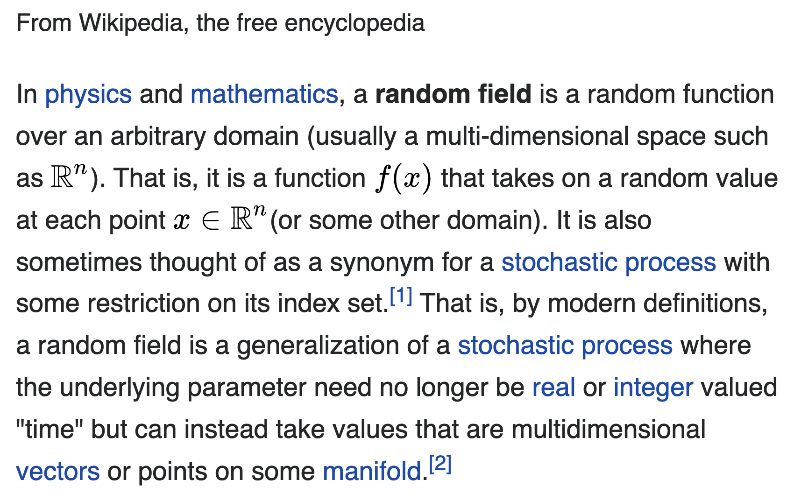

<!-- Build with: xaringan::inf_mr() -->

```{r preamble, include=FALSE, cache=FALSE}
source("preamble.R")
do.call(knitr::opts_chunk$set, knitr_opts)
```

```{r libs, include=FALSE}
library(dplyr)
library(sdmTMB)
library(ggplot2)
library(mgcv)
```

<!-- # Who we are -->

<!--  -->
<!-- <!-- * Eric Ward, Northwest Fisheries Science Center (Seattle) --> -->
<!-- <!-- * Sean Anderson, Fisheries and Oceans Canada (Nanaimo) --> -->
<!-- <!-- * Lewis Barnett, Alaska Fisheries Science Center (Seattle)  --> -->
<!-- <!-- * Philina English, Fisheries and Oceans Canada (Nanaimo) --> -->

<!-- --- -->

# Plan for the 3-day course

* Day 1: Intro to random fields, intro to sdmTMB, spatial models

* Day 2: Spatiotemporal models

* Day 3: Time-varying effects, spatially varying effects, index standardization

---

# Plan for the 3-day course

* Each day: about 75 minutes of lectures, 5 minute break, ~60 minutes of exercises, ~25 minute regroup

* Have questions? Use the [Google Doc](https://docs.google.com/document/d/12ZVzOmjbBa8VVTK0tmaNEcN1eP93g6iagDM2c8sSsfo/edit?usp=sharing), ask during any pause, or at the end of each day. Thanks!

---

# Motivating questions

* Data often have spatial attributes

* Ideal world:
  * Plug spatial covariates into a GLM / GLMM
  * Residuals are uncorrelated  
  
```{r sim-rf-intro, echo=FALSE, fig.asp=0.4}
set.seed(123)
predictor_dat <- data.frame(
  X = runif(300), Y = runif(300),
  year = 1
)
mesh <- make_mesh(predictor_dat,
  xy_cols = c("X", "Y"),
  cutoff = 0.1
)
sim_dat <- sdmTMB_simulate(
  formula = ~1,
  data = predictor_dat,
  time = "year",
  mesh = mesh,
  family = gaussian(link = "identity"),
  range = 0.00001,
  sigma_E = 0.1,
  phi = 0.01,
  sigma_O = 0.2,
  seed = 3542,
  B = c(0) # B0 = intercept
)

ggplot(sim_dat, aes(X, Y, col = observed)) +
  geom_point(alpha = 0.7, size = 3) +
  guides(col = guide_legend(title = "Residuals")) +
  scale_color_gradient2()
```

---

# Reality
  
* Residual spatial autocorrelation

```{r sim-rf-intro-cor, echo=FALSE, fig.asp=0.4}
set.seed(123)
predictor_dat <- data.frame(
  X = runif(300), Y = runif(300),
  year = 1
)
mesh <- make_mesh(predictor_dat,
  xy_cols = c("X", "Y"),
  cutoff = 0.1
)
sim_dat <- sdmTMB_simulate(
  formula = ~1,
  data = predictor_dat,
  time = "year",
  mesh = mesh,
  family = gaussian(link = "identity"),
  range = 0.25,
  sigma_E = 0.1,
  phi = 0.01,
  sigma_O = 0.1,
  seed = 3542,
  B = c(0) # B0 = intercept
)

ggplot(sim_dat, aes(X, Y, col = observed)) +
  geom_point(alpha=0.7, size=3) + 
  guides(col=guide_legend(title="Residuals")) +
  scale_color_gradient2()
```

---

# Modeling spatial autocorrelation

* Need 'wiggly'/smooth surface for approximating all spatial variables missing from model ('latent' variables)

* Several approaches exist
  * 2D smooths in mgcv
  * Random fields and the Stochastic Partial Differential Equation (SPDE)

---

# Spatial smoothing with GAMs (mgcv)

```{r gam-examples, eval=FALSE, echo=TRUE}
gam(y ~ s(lon, lat) + s(time), ...)

gam(y ~ s(lon, lat) + s(time) + 
      ti(lon, lat, time, d=c(2,1)), ...)

gam(y ~ s(lon, lat, by = "time") + 
      s(time), ...)
```

---

# Spatial smoothing with SPDE (INLA, inlabru)

* SPDE differs in that it explicitly estimates meaningful parameters for spatial covariance function

* SPDE and GAMs can produce the identical results


.small[
Miller, D.L., Glennie, R. & Seaton, A.E. Understanding the Stochastic Partial Differential Equation Approach to Smoothing. JABES 25, 1–16 (2020)
]

---

# Matérn covariance

Flexible, can be exponential or Gaussian shape

```{r matern-plot}
x <- seq(from = 0, to = 1, length.out = 100)
df <- data.frame(
  x = rep(x, 4),
  "nu" = sort(rep(c(0.5, 1.5, 2.5, 10), 100))
)
df$row <- seq(1, nrow(df))
df <- dplyr::group_by(df, row) %>%
  dplyr::mutate(
    cov =
      rSPDE::matern.covariance(h = x, kappa = 5, nu = nu, sigma = 1)
  )
df$nu <- as.factor(df$nu)
# TODO INLA is fixed at...
ggplot(df, aes(x, cov, col = nu, group = nu)) +
  geom_line(size = 1.3, alpha = 0.8) +
  theme_bw() +
  xlab("Distance") +
  ylab("Covariance") +
  ggtitle("Matérn covariance") +
  guides(col = guide_legend(title = expression(nu))) +
  theme(text = element_text(size = 21)) +
  coord_cartesian(expand = FALSE)
```

---

# Predictive process models 

* Estimate spatial field as random effects 

* High dimensional datasets computationally challenging

* Gaussian process predictive process models:
  * Estimate values at a subset of locations in the time series
  *   'knots', 'vertices', or 'control points'
  * Use covariance function to interpolate from knots to locations of observations

---

# Predictive process models 

* More knots (vertical dashed lines) = more wiggliness & parameters to estimate

```{r show-gp, fig.height=4}
x <- seq(1, 50)
d <- as.matrix(dist(x, diag = TRUE))
set.seed(123)
df <- data.frame(
  x = x,
  true = c(spam::rmvnorm(1, mu = 0, Sigma = 1 * exp(-0.05 * d)))
)
df$y <- rnorm(df$true, df$true, 0.1)

f1 <- mgcv::gam(y ~ s(x, k = 25, bs = "bs"), data = df)

knots <- data.frame("x" = f1$smooth[[1]]$knots, ymin = 0, ymax = 1.0e10)
g1 <- ggplot(df, aes(x, y)) +
  geom_vline(data = knots, aes(xintercept = x), col = "grey20", size = 0.3, linetype = "dashed") +
  geom_point(col = "red", alpha = 0.7) +
  theme(panel.grid = element_blank()) +
  xlab("") +
  ylab("Observations") +
  geom_smooth(
    method = "gam",
    formula = y ~ s(x, bs = "bs", k = 25)
  ) +
  coord_cartesian(xlim = c(0, 50))

f2 <- mgcv::gam(y ~ s(x, k = 7, bs = "bs"), data = df)
knots <- data.frame("x" = f2$smooth[[1]]$knots, ymin = 0, ymax = 1.0e10)

g2 <- ggplot(df, aes(x, y)) +
  geom_vline(data = knots, aes(xintercept = x), col = "grey20", size = 0.3, linetype = "dashed") +
  geom_point(col = "red", alpha = 0.7) +
  theme(panel.grid = element_blank()) +
  xlab("") +
  ylab("Observations") +
  geom_smooth(method = "gam", formula = y ~ s(x, bs = "gp", k = 7)) +
  coord_cartesian(xlim = c(0, 50))
gridExtra::grid.arrange(g1, g2, ncol = 1)
```

---

# Spatial data types

* Lattice: gridded data, e.g. interpolated SST from satellite observations 

--

* Areal: data collected in neighboring spatial areas, e.g. commercial catch records by state / county

--

* Georeferenced: data where observations are associated with latitude and longitude 
  * Locations may be unique or repeated (stations)
---

# Why is space important? 

* Data covary spatially (data that are closer are more similar)

--

* Relationship between distance and covariance can be described with a spatial covariance function

--

* Covariance function in 2D may be
  * isotropic (same covariance in each direction)
  * anisotropic (different in each direction)

<!-- * Assumed stationary -->

---

# What is a random field?

```{r sim-rf-dat, message=FALSE, warning=FALSE}
predictor_dat <- expand.grid(
  x = seq(0, 1, length.out = 100),
  y = seq(0, 1, length.out = 100),
  year = seq_len(6)
)
mesh <- make_mesh(predictor_dat, xy_cols = c("x", "y"), cutoff = 0.05)
sim_dat <- sdmTMB_simulate(
  formula = ~1,
  data = predictor_dat,
  time = "year",
  mesh = mesh,
  family = gaussian(),
  range = 0.5,
  sigma_E = 0.2,
  phi = 0.1,
  sigma_O = NULL,
  seed = 1,
  B = 0
)
```

```{r random-field-demo}
ggplot(sim_dat, aes(x, y, fill = mu)) +
  facet_wrap(vars(year)) +
  geom_raster() +
  scale_fill_gradient2() +
  coord_fixed(expand = FALSE)
```

---
background-image: url("images/eagle.png")
background-position: bottom right
background-size: 35%

# Random field



---
background-image: url("images/beaker.png")
background-position: bottom right
background-size: 35%

# Random field

* A 2 dimensional "Gaussian Process"

--

* A realization from a multivariate normal distribution with some covariance function

---
background-image: url("images/elmo.png")
background-position: bottom right
background-size: 30%

# Random field

* A way of estimating a wiggly surface to account for spatial and/or spatiotemporal correlation in data.

--

* Alternatively, a way of estimating a wiggly surface to account for "latent" or unobserved variables.

--

* As a bonus, it provides useful covariance parameter estimates: spatial variance and the distance at data points are effectively uncorrelated ("range")

<!-- TODO: include nugget / sill? Show slide with semivariogram image? -->
---

# Many ways to simulate random fields

* `RandomFields::RFsimulate()` simulates univariate / multivariate fields
* `fields::sim.rf()` simulates random fields on a grid
* `geoR::grf()` simulates random fields with irregular observations
* `glmmfields::sim_glmmfields()` simulates random fields with/without extreme values
* `sdmTMB::sdmTMB_simulate()` simulates univariate fields with `sdmTMB`

???
Homework: try to work through some of these yourself. Make some plots, and see how changing the covariance affects the smoothness of these fields.

---

# Effects of changing variance and range

```{r sim-rf-grid, echo=FALSE, fig.asp=0.7}
set.seed(123)
predictor_dat <- data.frame(
  X = runif(300), Y = runif(300),
  year = 1
)
mesh <- make_mesh(predictor_dat,
  xy_cols = c("X", "Y"),
  cutoff = 0.1
)

grid_pars = expand.grid("range"=c(0.1, 0.5),
                        "sigma_O" = c(0.05, 0.1))

for(i in 1:nrow(grid_pars)) {
  s <- sdmTMB_simulate(
    formula = ~1,
    data = predictor_dat,
    time = "year",
    mesh = mesh,
    family = gaussian(link = "identity"),
    range = grid_pars$range[i],
    sigma_E = NULL,
    phi = 0.01,
    sigma_O = grid_pars$sigma_O[i],
    seed = 3542,
    B = c(0) # B0 = intercept
  )
  s$range = grid_pars$range[i]
  s$sigma_O = grid_pars$sigma_O[i]
  if(i == 1) {
    sim_dat = s
  } else sim_dat = rbind(s, sim_dat)
}

sim_dat$sigma_O = paste0("sigma_O = ", sim_dat$sigma_O)
sim_dat$range = paste0("range = ", sim_dat$range)
ggplot(sim_dat, aes(X, Y, col = observed)) +
  geom_point(size=1) + 
  scale_color_gradient2() + 
  facet_wrap(range ~ sigma_O)
```

---

# Effects of adding noise 

* Large observation error looks like noise

* $\sigma_{obs}$ >> $\sigma_{O}$, $\sigma_{E}$

```{r sim-rf-large_phi, echo=FALSE, fig.asp=0.5}
set.seed(123)
predictor_dat <- data.frame(
  X = runif(300), Y = runif(300),
  year = 1
)
mesh <- make_mesh(predictor_dat,
  xy_cols = c("X", "Y"),
  cutoff = 0.1
)

sim_dat <- sdmTMB_simulate(
  formula = ~1,
  data = predictor_dat,
  time = "year",
  mesh = mesh,
  family = gaussian(link = "identity"),
  range = 0.5,
  sigma_E = 0.1,
  phi = 1.0,
  sigma_O = 0.1,
  seed = 3542,
  B = c(0.2) # B0 = intercept
)

ggplot(sim_dat, aes(X, Y, col = observed)) +
  geom_point(alpha=0.7, size=3) + 
  scale_color_gradient2()
```
 
---
  
# Moderate observation errors

* $\sigma_{obs}$ = $\sigma_{O}$ = $\sigma_{E}$
    
```{r sim-rf-med_phi, echo = FALSE, fig.asp=0.5}
sim_dat <- sdmTMB_simulate(
  formula = ~1,
  data = predictor_dat,
  time = "year",
  mesh = mesh,
  family = gaussian(link = "identity"),
  range = 0.5,
  sigma_E = 0.1,
  phi = 0.1,
  sigma_O = 0.1,
  seed = 3542,
  B = 0.2 # B0 = intercept
)

ggplot(sim_dat, aes(X, Y, col = observed)) +
  geom_point(alpha=0.7, size=3) + 
  scale_color_gradient2()
```
  
  
---
     
# Small observation errors  
    
* $\sigma_{obs}$ << $\sigma_{O}$, $\sigma_{E}$
    
```{r sim-rf-small_phi, echo = FALSE, fig.asp=0.5}
sim_dat <- sdmTMB_simulate(
  formula = ~ 1 ,
  data = predictor_dat,
  time = "year",
  mesh = mesh,
  family = gaussian(),
  range = 0.5,
  sigma_E = 0.1,
  phi = 0.01,
  sigma_O = 0.1,
  seed = 3542,
  B = 0.2
)

ggplot(sim_dat, aes(X, Y, col = observed)) +
  geom_point(alpha=0.7, size=3) + 
  scale_color_gradient2()
```

---

# Estimating random fields 

.small[
* Georeferenced data often involve 1000s or more points

* Like in the 1-D setting, we need to approximate the spatial field 
  * Options include nearest neighbor methods, covariance tapering, etc.

* sdmTMB uses an approach from INLA
  * for VAST users, this is the same
  * INLA books:  
    <https://www.r-inla.org/learnmore/books>
]

---

# INLA and the SPDE approach

.xsmall[
* SPDE: stochastic partial differential equation

* The solution to a specific SPDE is a Gaussian random field (GRF) with Matérn covariance

* This, and sparse precision matrices, let us efficiently fit approximations to GRFs to large spatial datasets

* INLA is software that performs data wrangling for SPDE estimation
  * INLA also performs approximate Bayesian estimation
  * sdmTMB uses INLA to wrangle matrices, but uses TMB for maximum likelihood estimation
]

.tiny[
Lindgren, F., Rue, H., and Lindström, J. 2011. An explicit link between Gaussian fields and Gaussian Markov random fields: the stochastic partial differential equation approach. Journal of the Royal Statistical Society: Series B. 73(4): 423–498.
]

---

# Introducing meshes

Implementing the SPDE with INLA requires constructing a 'mesh'

```{r mesh-example, fig.width=6.5}
mesh <- make_mesh(pcod, xy_cols = c("X", "Y"), cutoff = 10)
ggplot() +
  inlabru::gg(mesh$mesh) +
  geom_point(data = pcod, aes(x = X, y = Y), alpha = 0.1, pch = 20) +
  coord_equal()
```

---

# Mesh construction

.small[
* A unique mesh is generally made for each dataset
* Rules of thumb:
  * More triangles = more computation time
  * More triangles = more fine-scale spatial predictions
  * Borders with coarser resolution reduce number of triangles
  * Use minimum edge size to avoid meshes becoming too fine
  * Want fewer vertices than data points
  * Triangle edge size needs to be smaller than spatial range

* "How to make a bad mesh?" [Haakon Bakka's book](https://haakonbakkagit.github.io/btopic114.html)
]

---

# Building your own mesh

* `INLA::inla.mesh.2d()`: lets many arguments be customized

* `INLA::meshbuilder()`: Shiny app for constructing a mesh, provides R code

* Meshes can include barriers / islands / coastlines with shapefiles

* INLA books
<https://www.r-inla.org/learnmore/books>

---

# Simplifying mesh construction in sdmTMB

sdmTMB has a function `make_mesh()` to quickly construct a basic mesh

Details in next set of slides

---

# Example: cutoff = 50km

```{r mesh-example4, fig.width=6.5}
mesh <- make_mesh(pcod, xy_cols = c("X", "Y"), cutoff = 50)
ggplot() +
  inlabru::gg(mesh$mesh) +
  geom_point(data = pcod, aes(x = X, y = Y), alpha = 0.1, pch = 20) +
  coord_equal()
```

---

# Example: cutoff = 25km

```{r mesh-example3, fig.width=6.5}
mesh <- make_mesh(pcod, xy_cols = c("X", "Y"), cutoff = 25)
ggplot() +
  inlabru::gg(mesh$mesh) +
  geom_point(data = pcod, aes(x = X, y = Y), alpha = 0.1, pch = 20) +
  coord_equal()
```

---


# Example: cutoff = 10km

```{r mesh-example2, fig.width=6.5}
mesh <- make_mesh(pcod, xy_cols = c("X", "Y"), cutoff = 10)
ggplot() +
  inlabru::gg(mesh$mesh) +
  geom_point(data = pcod, aes(x = X, y = Y), alpha = 0.1, pch = 20) +
  coord_equal()
```


