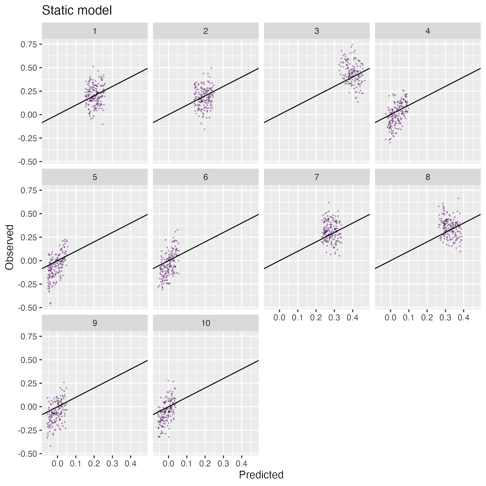

<!-- Build with: xaringan::inf_mr() -->

```{r preamble, include=FALSE, cache=FALSE}
source("preamble.R")
do.call(knitr::opts_chunk$set, knitr_opts)
```

```{r libs, include=FALSE}
library(dplyr)
library(sdmTMB)
library(ggplot2)
library(viridis)
```

# Combining surveys is a common challenge

* Ideally overlapping in time - space

* Otherwise some set of parameters need to be shared

---

# Combining surveys is a common challenge

```{r}
df = data.frame(Year = 1980:2020)
set.seed(123)
df$y <- cumsum(rnorm(nrow(df))) + 3
df$y[15:25] = NA
df$Survey <- c(rep("Survey 1",25), rep("Survey 2",16))
ggplot(df, aes(Year,y, col=Survey)) + 
  geom_line(linewidth=1) + 
  geom_point(size=3) + 
  theme_bw() + ylab("CPUE") + 
  scale_color_viridis_d(end=0.8)
```

---

# Combining surveys is a common challenge

.small[
* Gaps in time may be smoothed if:
* Assumption: equal catchability between surveys (scales intercept)
* Reasonable to use smooth or time-varying coefficients  
]
```{r eval=FALSE, echo=TRUE}
fit <- sdmTMB(density ~ s(year), ...)

fit <- sdmTMB(density ~ 1, 
              time_varying = ~ 1,
              time="year",...)

fit <- sdmTMB(density ~ 1, 
              time="year",
              spatiotemporal = "ar1",
              ...)
```

---

# Combining surveys is a common challenge

* Ok if assumption of equal catchabilty is equal. 
```{r warning=FALSE, message=FALSE}
set.seed(123)
df1 <- data.frame(X = runif(500, min=0,max=500),
             Y = runif(500, min=0,max=500))
df2 <- data.frame(X = runif(500, min=500,max=1000),
             Y = runif(500, min=500,max=1000))
df1$Survey = "Survey 1"
df2$Survey = "Survey 2"

df <- rbind(df1, df2)
ggplot(df, aes(X,Y, col=Survey)) + 
  geom_point() + 
  theme_bw() + 
  scale_color_viridis_d(end=0.8)
```

---

# Overlapping surveys and catchability

```{r warning=FALSE, message=FALSE}
set.seed(123)
df1 <- data.frame(X = runif(500, min=0,max=800),
             Y = runif(500, min=0,max=800))
df2 <- data.frame(X = runif(500, min=200,max=1000),
             Y = runif(500, min=200,max=1000))
df1$Survey = "Survey 1"
df2$Survey = "Survey 2"

df <- rbind(df1, df2)
ggplot(df, aes(X,Y, col=Survey)) + 
  geom_point() + 
  theme_bw() + 
  scale_color_viridis_d(end=0.8)
```

---

# Overlapping surveys and catchability

* Interactions between survey (or gears) and other fixed effects 

```{r echo=TRUE, eval=FALSE}
fit <- sdmTMB(density ~ fyear + survey, ...)

fit <- sdmTMB(density ~ fyear * survey, ...)

fit <- sdmTMB(density ~ s(year, by = survey), ...)
```

---

# Overlapping surveys and catchability

* Example: combining trawl and acoustic surveys for pelagic species

* Surveys overlap in space/time, but sample different portions of population

---

# Simulation testing

* Assume species has some depth affinity 
```{r}
set.seed(123)
df <- data.frame(x = rnorm(10000, 500, 100))
p1 <- ggplot(df, aes(x)) + 
  geom_histogram(bins=100) + 
  xlab("Depth") + ylab("Density") + 
  coord_cartesian(ylim=c(0,800))
p1
```

---

# Simulation testing

.small[
* Layer on 2 surveys (acoustic, trawl) which might not overlap
* Can we recover depth relationship?? 
]
```{r}
set.seed(123)
df <- data.frame(x = rnorm(10000, 500, 100),
                 y = abs(rnorm(1000, 0, 150)),
                 z = rnorm(10000, 600, 50))
p1 <- ggplot(df, aes(x)) + 
  geom_histogram(bins=100) + 
  xlab("Depth") + ylab("Density") + 
  geom_histogram(aes(y), fill="red", bins=100, alpha=0.3) + 
  geom_histogram(aes(z), fill="blue", bins=100, alpha=0.3)
p1
```

---

# Model in sdmTMB

```{r echo=TRUE, eval=FALSE}
fit <- sdmTMB(
  observed ~ log_depth + log_depth2+ survey,
  data = surveys, 
  mesh = mesh,
  spatiotemporal = "iid",
  time="year"
)
```

---

```{r eval=TRUE, echo=FALSE}
set.seed(1)
n_year <- 10
n_pts <- 500
predictor_dat <- data.frame(X = runif(n_pts*10, 0, 10), 
                            Y = runif(n_pts*10, 0, 10), 
                            year = sample(1:10, size=n_pts*n_year, replace=T))
# about 300 knots
mesh <- make_mesh(predictor_dat, 
                  xy_cols = c("X", "Y"), 
                  cutoff = 0.5)

set.seed(123)
bathy <- sdmTMB_simulate(
    formula = ~ 1,
    data = predictor_dat,
    mesh = mesh,
    range = 0.5,
    sigma_O = 0.7,
    sigma_E = 0,
    phi = 0.001,
    seed = 42,
    B = c(log(1000)) 
  )
# convery log depth to depth
bathy$observed <- exp(bathy$observed)

predictor_dat <- dplyr::left_join(predictor_dat,
                          bathy[,c("X","Y","observed")]) %>%
  dplyr::rename(bottom_depth = observed)

set.seed(123)
predictor_dat$survey = sample(c("survey_1","survey_2"), 
                              size=nrow(predictor_dat), 
                              replace=T)

# simulate depth -- used for vertical distribution
predictor_dat$depth <- runif(nrow(predictor_dat), 0, predictor_dat$bottom_depth)

# bottom trawl survey
predictor_dat$depth[which(predictor_dat$survey=="survey_2")] = 
  predictor_dat$bottom_depth[which(predictor_dat$survey=="survey_2")]

# convert depth to log_depth
predictor_dat$log_depth <- log(predictor_dat$depth)
predictor_dat$log_depth2 <- predictor_dat$log_depth^2

# convert depth to log_depth
predictor_dat$log_depth <- log(predictor_dat$depth)
predictor_dat$log_depth2 <- predictor_dat$log_depth^2


fit_quad = function(par, x) {
  s = seq(quantile(x,0.05), quantile(x,0.95), 
          length.out=100)
  pred = dnorm(s, mean = mean(x), sd = sd(x), log=FALSE)
  # come up with quadratic approximation
  a = par[1]
  b = par[2]
  c = par[3]
  est = c*s*s + b*s + a
  return (sum((pred-est)^2))
}

set.seed(123)
mean_depth <- rnorm(1, 5, 0.5)

  y <- rnorm(1000, mean = mean_depth, sd = 1)
  # get quadratic parameters
  o <- optim(runif(3), fit_quad, x = y)
  q_pars = o$par
  
  mesh <- make_mesh(predictor_dat, 
                  xy_cols = c("X", "Y"), 
                  cutoff = 0.5)
  
  dat <- sdmTMB_simulate(
    formula = ~ 1 + log_depth + log_depth2,
    data = predictor_dat,
    mesh = mesh,
    range = 0.5,
    sigma_O = 0.05,
    sigma_E = 0.2,
    phi = 0.1,
    seed = 42,
    B = c(o$par[1], o$par[2], o$par[3]) 
  )  
  
    all_dat <- dat


all_dat <- dplyr::left_join(all_dat, predictor_dat[,c("X","Y","survey","year")])

survey_shallow <- dplyr::filter(all_dat,
                                survey=="survey_1",
                             log_depth < c(quantile(all_dat$log_depth,0.33))) %>%
  dplyr::mutate(survey="shallow")

# split off trawl survey. Downsample so rows are about the same as the surface survey
survey_deep <- dplyr::filter(all_dat, 
                             survey=="survey_2") %>%
  dplyr::mutate(survey="deep")
idx <- sample(1:nrow(survey_deep),size = nrow(survey_shallow), replace=FALSE)
survey_deep <- survey_deep[idx,]

# further make shallow affected by offset
survey_shallow$observed <- survey_shallow$observed + 1.1

```



---

# What sdmTMB cannot (yet) do

* Combine surveys using multiple responses (counts, densities)
  * Delta / hurdle model is exception 
  
* Link models with different meshes


