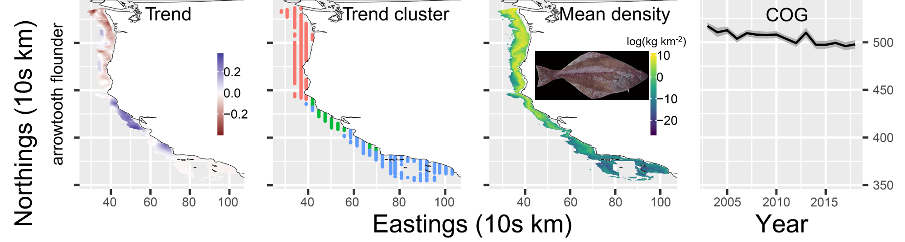
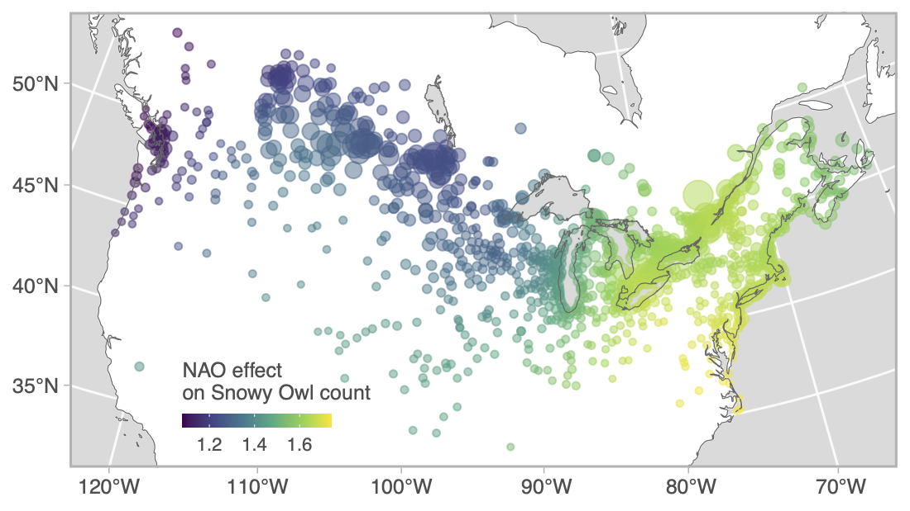
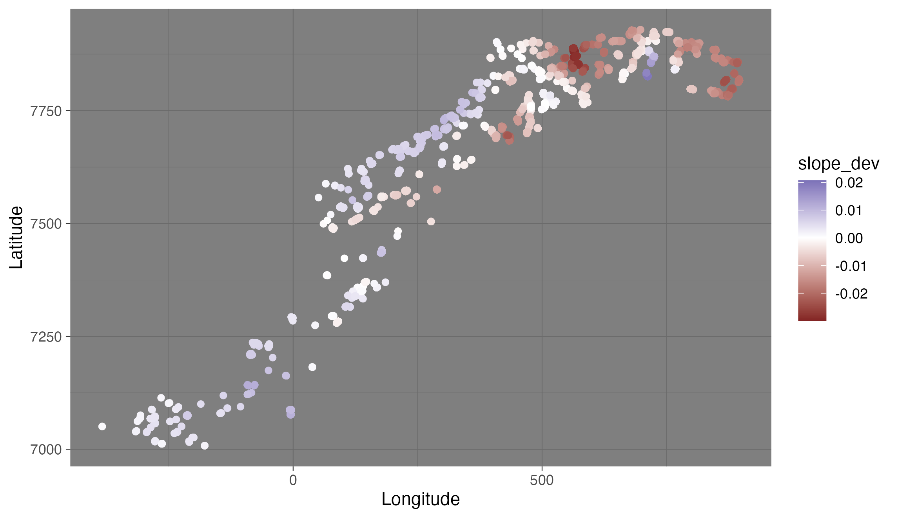
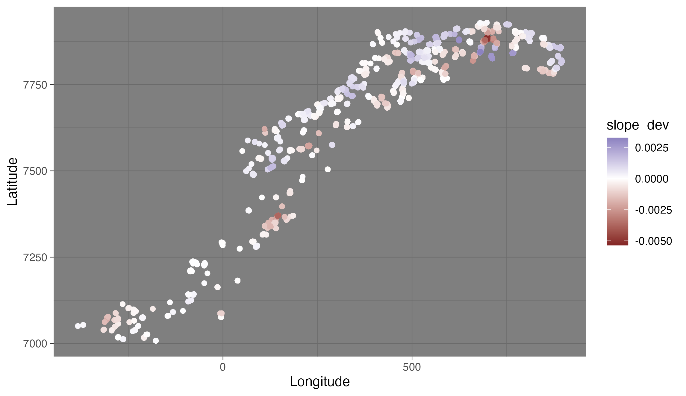
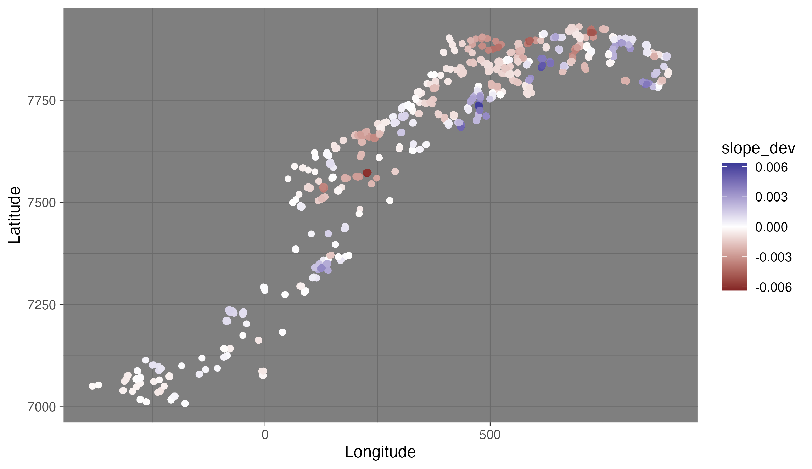

```{r preamble, include=FALSE, cache=FALSE}
source("preamble.R")
do.call(knitr::opts_chunk$set, knitr_opts)
```

```{r libs, include=FALSE}
library(dplyr)
library(sdmTMB)
library(ggplot2)
```

.small[
# Why might we want time-varying effects?

* Time-varying slopes: 
  * To allow for evolving responses to covariates (e.g., species moving deeper over time)
  
  * Example use: [English et al. (2021) Fish and Fisheries](https://doi.org/10.1111/faf.12613)  
    Modelled groundfish density with depth; didn't want to constrain fish if they were moving deeper when water was warmer
  
* Time-varying intercepts:
  * To allow variable means across time with constraints
  * To have a model to interpolate or forecast over time
]

---

# Time-varying intercepts

Several ways in sdmTMB:

* factors: `as.factor(year)` (independent)
* random effects: ` + (1 | year)` (drawn from normal distribution)
* smooth: ` + s(year)`
* as random walk (shown next)

---

#  Random walk covariates in sdmTMB

Random walk:

$$
\begin{aligned}
x_t &= x_{t-1} + \epsilon_t\\
\epsilon &\sim \mathrm{Normal(0, \sigma^2)}
\end{aligned}
$$

Defined by `time_varying` argument

Takes a *one-sided* formula, e.g. `~ 1` or `~ 0 + depth`

Note: initial coefficient is unconstrained, i.e. **do not place the same covariate in 
the `formula` argument** (this includes the intercept)

---

# Time-varying intercept

Note: a `0` or `-1` in formula for suppressing global intercept

Otherwise, both the main effects and time-varying effects would have the same parameter and this can't be estimated.

.small[
```{r tv-int, echo = TRUE}
mesh <- make_mesh(pcod, xy_cols = c("X", "Y"), cutoff = 10)
fit <- sdmTMB(
  density ~ 0 + s(depth, k = 5), 
  time_varying = ~ 1, #<<
  data = pcod, mesh = mesh,
  time = "year",  
  family = tweedie(link = "log")
)
```
]

---

# Getting coefficients 

Return with 

.small[
```{r sum-fit1, echo=TRUE, eval=FALSE}
print(fit)
```
]

.small[
```{r, echo=TRUE, eval=FALSE}
#> Spatiotemporal model fit by ML ['sdmTMB']
#> Formula: density ~ 0 + s(depth, k = 5)
#> Time column: "year"
#> ...
#> Time-varying parameters: #<<
#>                  coef.est coef.se #<<
#> (Intercept)-2003     1.96    0.29 #<<
#> (Intercept)-2004     2.31    0.27 #<<
#> (Intercept)-2005     2.06    0.27 #<<
#> ... #<<
#> (Intercept)-2015     2.07    0.27 #<<
#> (Intercept)-2017     1.55    0.29 #<<
#> ...
```
]

---

# Getting coefficients 

Or by digging into `fit$sd_report`

(Not yet in `tidy.sdmTMB()`.)

```{r b-rw-est, echo=TRUE}
library(TMB)
est <- as.list(fit$sd_report, "Est")
est_se <- as.list(fit$sd_report, "Std. Error")
cbind(est$b_rw_t, est_se$b_rw_t)
```

---

# Other approaches to modeling time-varying intercepts

.small[
```{r eval = FALSE, echo=TRUE}
density ~ s(depth) + 0 + as.factor(year)
```
]
.small[
```{r eval = FALSE, echo=TRUE}
density ~ s(depth) + (1 | year)
```
]
.small[
```{r eval = FALSE, echo=TRUE}
density ~ s(depth) + s(year)
```
]
---

# These approaches are similar but subtly different

```{r compare-fits, echo=FALSE}
fit_fc <- sdmTMB(
  density ~ s(depth, k = 5) + as.factor(year),
  data = pcod, mesh = mesh,
  time = "year",
  family = tweedie(link = "log")
)

fit_sm <- sdmTMB(
  density ~ s(depth, k = 5) + s(year, k = 7),
  data = pcod, mesh = mesh,
  time = "year",
  family = tweedie(link = "log")
)

nd <- pcod
nd$fyear <- as.factor(nd$year)

fit_re <- sdmTMB(
  density ~ s(depth, k = 5) + (1 | fyear),
  data = nd, mesh = mesh,
  time = "year",
  family = tweedie(link = "log")
)

# just make predictions on avg depth / location
newdf <- data.frame(
  depth = mean(pcod$depth),
  year = unique(pcod$year)
)
newdf$fyear <- as.factor(newdf$year)

pred_fit <- predict(fit, newdata = newdf, se_fit = TRUE, re_form = ~ 0)
pred_fit$model <- "time_varying = 1"
pred_sm <- predict(fit_sm, newdata = newdf, se_fit = TRUE, re_form = ~ 0)
pred_sm$model <- "s(year, k = 7)"
pred_re <- predict(fit_re, newdata = newdf, se_fit = TRUE, re_form = ~ 0)
pred_re$model <- "(1 | fyear)"
pred_fc <- predict(fit_fc, newdata = newdf, se_fit = TRUE, re_form = ~ 0)
pred_fc$model <- "as.factor(year)"

pred <- rbind(pred_fit, pred_sm, pred_re, pred_fc)

ggplot(pred, aes(year, est, fill = model, col = model)) +
  geom_pointrange(aes(ymin = est - 2 * est_se, ymax = est + 2 * est_se), 
    position = position_dodge(width = 1)) +
  scale_colour_brewer(palette = "Dark2")
```

<!--   -->

<!-- * H/T Eric Pederson -->

---

# Time-varying coefficients

Time-varying (random walk) effect of depth

Intercept in this model NOT time-varying

```{r fit-tv-depth, eval=TRUE, echo=TRUE, message=FALSE, results='hide'}
fit_tv <- sdmTMB(
  density ~ 1, 
  time_varying = ~ 0 + depth_scaled + depth_scaled2, #<<
  data = pcod, mesh = mesh,
  time = "year",
  family = tweedie(link = "log"),
  spatial = "on",
  spatiotemporal = "iid",
  silent = FALSE
)
```

---

# Time-varying coefficients

Time-varying (random walk) effect of depth

<!-- To plot these, we make a data frame that contains all combinations of the time-varying covariate and time. This is easily created using `expand.grid()` or `tidyr::expand_grid()`. -->

```{r tv-depth-eff}
nd <- expand.grid(
  depth_scaled = seq(min(pcod$depth_scaled) + 0.2,
    max(pcod$depth_scaled) - 0.2, length.out = 100),
  year = unique(pcod$year)
)
nd$depth_scaled2 <- nd$depth_scaled^2
p <- predict(fit_tv, newdata = nd, se_fit = TRUE, re_form = NA)

p$depth <- exp(nd$depth_scaled * pcod$depth_sd[1] + pcod$depth_mean[1])
ggplot(p, aes(depth, exp(est),
  ymin = exp(est - 1 * est_se),
  ymax = exp(est + 1 * est_se),
  group = as.factor(year)
)) +
  geom_line(aes(colour = year), lwd = 1) +
  geom_ribbon(aes(fill = year), alpha = 0.1) +
  coord_cartesian(expand = FALSE, xlim = c(min(pcod$depth), 300)) +
  labs(x = "Depth (m)", y = "Biomass density (kg/km2)")
```

---

# Time-varying coefficient notes

* `time_varying` is a formula for coefficients that follow a random walk over time

--

* Make sure a coefficient isn't in both `formula` and `time_varying`, this includes the intercept

--

* The `time_varying` formula cannot have smoothers `s()` in it! Instead:
  * Polynomials: `time_varying = ~ x + I(x^2)`
  * `formula = s(depth, by = factor_year)` (independent smooths) 
  * `formula = s(depth, year)` (2D smooth)


<!-- See the vignette [Intro to modelling with sdmTMB](https://pbs-assess.github.io/sdmTMB/articles/basic-intro.html) for more details. -->

---

# What is a spatially varying coefficient?

* Describes how the effect of a variable varies over space

  * e.g., how does the temporal trend in fish density vary among locations?
  
  * e.g., how does fish distribution look when the PDO is high vs. low?
  
---

# Mathematically

Minimal model: 

$$g(u_{s}) = \omega_{s} + X_{\zeta}\zeta_{s}$$
* $g()$ is an inverse link function and $u$ a linear predictor 
* $\omega_{s}$ represents spatial field (intercept)  
* $X_{\zeta}$ is design matrix of covariates (usually varying by time, but constant in space)
* $\zeta_{s}$ is estimated spatially varying coefficient  
* `sdmTMB` allows for multiple SVCs in the same model
---

# When might we want a spatially varying coefficient?

* When we suspect non-local effects of a regional forcing, that varies spatially
  * e.g., the influence of ENSO depends on latitude; influence of Bering Sea cold pool on pollock
* Any variation in species-habitat relationships over space, spatial variation in density dependence, recruitment, etc
  
--

* When the question requires evaluating change at fine spatial scales
  * e.g., there is no directional trend in species distribution shifts at broad scales, due to nuanced or opposing patterns over space being obscured 
---

# Spatially varying coefficients in sdmTMB

Spatially varying effect of time on cod density:

```{r spat-varying-fit, echo=TRUE}
pcod$year_scaled <- as.numeric(scale(pcod$year))
mesh <- make_mesh(pcod, c("X", "Y"), cutoff = 10)
fit <- sdmTMB(
  density ~ s(depth, k = 5) + year_scaled,
  spatial_varying = ~ 0 + year_scaled, #<<
  data = pcod, 
  mesh = mesh, 
  time = "year",
  family = tweedie(link = "log"),
  spatiotemporal = "off"
)
```

<!-- See `zeta_s` in the output, which represents the coefficient varying in space. You'll want to ensure you set up your model such that it ballpark has a mean of 0 (e.g., by including it in `formula` too). -->

---

# Local trends in cod population density

```{r plot-zeta}
nd <- replicate_df(qcs_grid, "year", unique(pcod$year))
qcs_grid <- nd
qcs_grid$year_scaled <- (qcs_grid$year - mean(pcod$year)) / sd(pcod$year)
p <- predict(fit, qcs_grid)
p <- dplyr::filter(p, year == 2011) # any year
ggplot(p, aes(X, Y, fill = zeta_s_year_scaled)) + geom_raster() +
  scale_fill_gradient2()
```

---

# Scale-dependent interpretation of species distribution shifts



.tiny[
[Barnett, L.A.K., Ward, E.J. & Anderson, S.C. Improving estimates of species distribution change by incorporating local trends. Ecography, 44: 427-439. (2021)](https://doi.org/10.1111/ecog.05176)
]

<!-- To see how the interpretation of change in distribution depends on spatial scale, lets compare our fine-scale interpretation to a coarse-scale interpretation using a time series of the coastwide COG. These are results for arrowtooth flounder on the US west coast, where I am showing maps of the trend in population density over time, clusters of locations with similar trends, and the prediction of mean density over all years, which shows us that arrowtooth are most prevalent in the northern half of the region.  However, the trend map indicates that densities are mostly decreasing in the north and increasing in the central area toward the southern end of its core range.  Thus, it seems that arrowtooth are expanding southward as a traveling wave at the leading edge of the range.

On the far right panel, you can see that the COG also indicates a southward shift, yet it is slight and only detectable in this case because of a narrow 95% CI.  From this alone it would be hard to say whether the change is really due to increased southward movement or productivity, or a decrease in productivity in the north. -->

--

* Potential applied uses
  * Determining spatial structure of assessment model inputs
  * Determining quota allocation over space

<!-- --- -->

<!-- # Spatially varying effect of NAO on Snowy Owls -->

<!-- .small[ -->
<!-- ```{r owl-fit, echo=TRUE, eval=FALSE} -->
<!-- mesh <- make_mesh(snow, c("X", "Y"), cutoff = 1.5) -->
<!-- fit_owls <- sdmTMB( -->
<!--   count ~ 1 + nao + (1 | year_factor), -->
<!--   spatial_varying = ~ 0 + nao, #<< -->
<!--   family = nbinom2(link = "log"),  -->
<!--   data = snow,  -->
<!--   mesh = mesh, -->
<!--   time = "year",  -->
<!--   spatial = "on", -->
<!--   spatiotemporal = "iid" -->
<!-- ) -->
<!-- ``` -->
<!-- ] -->

<!-- <!-- Snowy Owls (*Bubo scandiacus*) breed on the arctic tundra and are irruptive migrants, meaning that they appear across the mid latitudes of North America in much greater numbers in some winters than others. -->
<!-- The reasons for the interannual variation in the number of individuals migrating south are not well understood, but seem to be related to high abundances of food during the breeding season and therefore sharp increases in breeding ground population densities [@robillard2016].  -->
<!-- The North Atlantic Oscillation Index (NAO) has been linked to productivity of both owls and their prey in Europe [@millon2014]. --> -->

<!-- <!-- Description: spatially varying coefficient for effect of mean annual NAO (North Atlantic Oscillation) on counts of Snowy Owls observed on annual citizen science Christmas Bird Counts 1979--2020 in Canada and the US.  -->

<!-- Our only fixed effect will be the NAO climate index (`nao`), but because of the wide spatial extent of these surveys, we also expect that the effect of NAO might not be consistent throughout North America. Therefore, the effect of NAO will also be allowed to vary spatially using this formula: `spatial_varying = ~ 0 + nao`. -->

<!-- Because there does not appear to be much correlation between years, year will be included as a random factor: `(1 | year_factor)`, allowing the mean estimate for each of these spatiotemporal fields to vary.  -->
<!-- --> -->

<!-- --- -->

<!-- # Influence of NAO on Snowy Owls is greatest in southeast -->

<!--  -->

<!-- <!-- Interpretation: Points represent all count locations and circle area is scaled to the mean number of owls observed per year. We found a weak average positive effect of annual mean NAO on overall counts, but a southeast to northwest gradient in the intensity of the effect.This result is consistent with owls closest to the Atlantic coast and those migrating the furthest south being the most affected by NAO. (The effect is multiplicative on owl count per NAO unit) --> -->

---

# Application: coastal cod

* Lots of previous work investigating variation in maturity and growth
* All analyses have treated space as a factor (region)

```{r eval=FALSE}
glm(log(length) ~ fishing_area * age + sex)
```

---

# Coastal cod maturity at age

```{r eval=FALSE, echo=TRUE}
fit <- sdmTMB(maturity ~ z_depth + sex*age,
               mesh = mesh,
               spatial_varying = ~ age,
                 family = binomial(),
               spatial="on",
               time="year",
               spatiotemporal = "iid",
               data = d)
```

---

# Coastal cod maturity at age

* Spatial coefficient on age strongly supported 
* Pattern similar to distribution of coastal cod? 
* Spatial range ~ 90km

---

# Coastal cod length at age

* vonB growth complicated, Gompertz can be linearized

```{r eval=FALSE, echo=TRUE}
fit <- sdmTMB(log_length ~ z_depth + sex*age,
               mesh = mesh,
               spatial_varying = ~ age,
               spatial="on",
               time="year",
               spatiotemporal = "iid",
               data = d)
```

---

# Coastal cod length at age

* Spatial coefficient on age strongly supported 
* Matern range ~ 43km


---

# Coastal cod condition factor

* Ln(weight) v ln(length) regression

```{r echo = TRUE, eval=FALSE}
fit <- sdmTMB(log_weight ~ z_depth + sex*z_length,
               mesh = mesh,
               spatial_varying = ~ z_length,
               spatial="on",
               time="year",
               spatiotemporal = "iid",
               data = d)
```

---

# Coastal cod condition factor

* Spatial coefficient on length strongly supported 
* Matern range ~ 44km


---

# Tips and tricks

* Unlike `time_varying`, likely *do* want the same coefficient in the main `formula` effects
  * `spatial_varying` represents a random field with mean zero
--

* Predictor should be roughly mean zero and SD of 1 to help with estimation
--

* Used to be limited to one effect; now no limitations

--

See vignette: [Fitting spatial trend models with sdmTMB](https://pbs-assess.github.io/sdmTMB/articles/spatial-trend-models.html)

See sdmTMB paper for Snowy Owl example led by Philina
