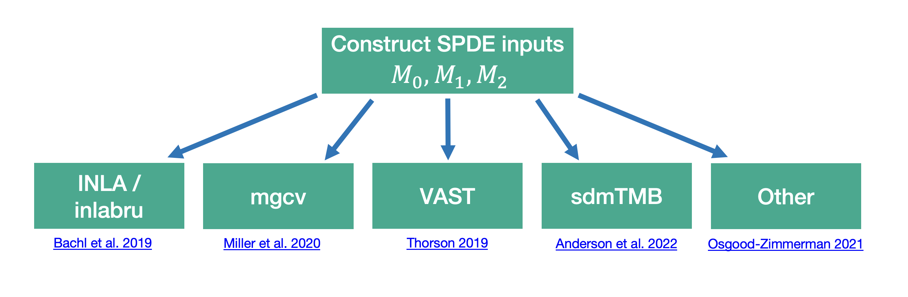
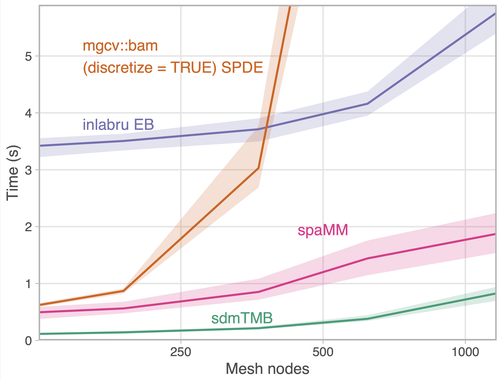

class: middle, inverse

<h1>sdmTMB: an R package for fast,<br>
flexible, and user-friendly generalized linear mixed effects models with spatial and spatiotemporal random fields</h1>

<!-- <h1>sdmTMB and explorations in mesh resolution see-sawing indices of abundance</h1> -->

Sean C. Anderson<sup>1</sup>, Eric J. Ward<sup>2</sup>, Philina A. English<sup>1</sup>, Lewis A.K. Barnett<sup>2</sup>

.xsmall[
<sup>1</sup>Fisheries and Oceans Canada  
<sup>2</sup>U.S. National Oceanic and Atmospheric Administration
]

<!--  -->

---

<!-- Build with: xaringan::inf_mr() -->

<!--
Plan

1. spatial models
2. random field approaches
3. why sdmTMB?
4. accessible syntax
  - example
  - basic syntax walk through
5. fast
6. advanced functionality examples
8. summary
9. finding out more
10. acknowledgements

-->

```{r preamble, include=FALSE, cache=FALSE}
source(here::here("canssi-2023/preamble.R"))
```

```{r libs, include=FALSE}
library(dplyr)
library(sdmTMB)
library(ggplot2)
```

```{r rnaturalearthhires}
if (!require("rnaturalearthhires", quietly = TRUE)) {
  stop("Please install 'rnaturalearthhires'.\n",
  "`remotes::install_github('ropensci/rnaturalearthhires')`")
}
```

# Geostatistical data are ubiquitous in ecology and fisheries

```{r sp-explicit-dat}
set.seed(123)
predictor_dat <- expand.grid(
  X = seq(0, 1, length.out = 100), Y = seq(0, 1, length.out = 100)
)
mesh <- make_mesh(predictor_dat, xy_cols = c("X", "Y"), cutoff = 0.01)

sim_dat <- sdmTMB_simulate(
  formula = ~ 1,
  data = predictor_dat,
  mesh = mesh,
  family = gaussian(),
  range = 0.5,
  phi = 0.05,
  sigma_O = 0.6,
  seed = 123,
  B = 0
)

set.seed(123)
obs_vec <- sample(seq_len(nrow(sim_dat)), 250)
sim_dat$i <- seq_len(nrow(sim_dat))
obs <- filter(sim_dat, i %in% obs_vec)
```

```{r vis-spatial-explicit, out.width='440px', fig.width=7}
ggplot(sim_dat, aes(X, Y, fill = exp(eta))) +
  geom_raster() +
  scale_fill_viridis_c() +
  geom_point(data = obs, mapping = aes(X, Y, size = exp(observed)), inherit.aes = FALSE, 
    pch = 21, colour = "white") +
  theme_void() +
  guides(fill = "none", size = "none") +
  coord_equal(xlim = c(0, 1), ylim = c(0, 1)) +
  scale_size(range = c(0, 8))
```

Latent variables can cause complex spatial correlation

--

Gaussian random fields are an increasingly popular method for approximating these patterns

---

# Random fields are computationally challenging

Solutions:

--

* Gaussian predictive process models (Banerjee et al. 2008, Latimer et al. 2009)

--

* Covariance tapering (Furrer et al. 2006), nearest neighbour (Datta et al. 2016) approaches

--

* Stochastic Partial Differential Equation (SPDE) approach (Lindgren et al. 2011, INLA)

---

# SPDE estimation approach

The solution to an SPDE is an approximation of a Gaussian random field

VAST developed links between R-INLA and TMB

Options:



---

# Why sdmTMB?


.small[Familiar syntax (similar to glmmTMB, mgcv)]

--

.small[Fast marginal maximum likelihood estimation via TMB (or MCMC via Stan)]

--

.small[Features: e.g., penalized splines, time-varying parameters, breakpoint models]

--

.small[
Modularity: mesh, fitting, predicting, index calculation, etc.
]

---

# sdmTMB models as GLMMs

<br>
<br>


---

# `sdmTMB()`

Set up is similar to `glmmTMB()`.  
Common arguments:

```r
fit <- sdmTMB(
  formula,
  data,
  mesh,
  time = NULL,
  family = gaussian(link = "identity"),
  spatial = c("on", "off"),
  spatiotemporal = c("iid", "ar1", "rw", "off"),
  offset = NULL,
  ...
)
```

See `?sdmTMB`

---

class: center, middle, inverse

# A basic spatial random field example

---

# The built-in Pacific Cod dataset

.xsmall[
```{r fake-pcod-head, echo=TRUE, eval=FALSE}
library(sdmTMB)
head(pcod)
```
]

```{r nothing00, eval=FALSE}
tibble::as_tibble(head(pcod)) %>% 
  dplyr::select(year, density, lon, lat, X, Y) %>% 
  head(n = 3)
```


.xsmall[
```
#>  year density   lon    lat   X     Y
#> <int>   <dbl> <dbl>  <dbl> <dbl> <dbl>
#>  2003   113.  -130.0  52.3  446  5793
#>  2003    41.7 -130.0  52.3  446  5800
#>  2003     0   -130.0  52.4  449  5802
```
]

```{r plot-pcod-raw, out.width="575px", fig.width=6}
lims_x <- c(230957.7 + 105000, 1157991 - 570000) + c(-10000, 10000)
lims_y <- c(5366427 + 270000, 6353456 - 513000) + c(-10000, 10000)
land <- "grey86"
land_border <- "grey86"

map_data <- rnaturalearth::ne_countries(
  scale = "large",
  returnclass = "sf", country = "canada"
)
# Crop the polygon for plotting and efficiency:
# st_bbox(map_data) # find the rough coordinates
bc_coast <- suppressWarnings(suppressMessages(
  sf::st_crop(
    map_data,
    c(xmin = -134, ymin = 46, xmax = -120, ymax = 57)
  )
))
utm_zone9 <- 3156
bc_coast_proj <- sf::st_transform(bc_coast, crs = utm_zone9)

pcod_temp <- pcod
pcod_temp$X1000 <- pcod_temp$X * 1000
pcod_temp$Y1000 <- pcod_temp$Y * 1000

ggplot(bc_coast_proj) +
  geom_sf(colour = land_border, lwd = 0.3, fill = land) +
  geom_point(data = pcod_temp, mapping = aes(X1000, Y1000,
    size = density, colour = density
  )) +
  theme_light() +
  scale_x_continuous(
    limits = lims_x
  ) +
  scale_y_continuous(
    limits = lims_y
  ) +
  xlab("") +
  ylab("") +
  labs(colour = expression("Density" ~ (kg / km^2))) +
  scale_size_area() +
  scale_colour_viridis_c(trans = "log10") +
  guides(size = "none")
```

---

# Construct a mesh

.small[
```{r mesh-demo, echo=TRUE, fig.asp=0.8, out.width='400px', fig.width=7}
mesh <- make_mesh(pcod, c("X", "Y"), cutoff = 8)
plot(mesh)
```

Or supply any INLA mesh to `make_mesh(..., mesh = )`
]

---

# Fit the model

.large[
```{r pcod1-fit, echo=TRUE}
fit <- sdmTMB(
  density ~ s(depth),
  data = pcod,
  family = tweedie(link = "log"),
  mesh = mesh,
  spatial = "on"
)
```
]

---

# Summary

.small[
```{r summary, echo=TRUE, eval=FALSE}
fit
```
]

.xsmall[
```{r summary-output, echo=TRUE}
#> Spatial model fit by ML ['sdmTMB']
#> Formula: density ~ s(depth)
#> Mesh: mesh
#> Data: pcod
#> Family: tweedie(link = 'log')
#>  
#>             coef.est coef.se
#> (Intercept)     2.26    0.19
#> sdepth         10.89   23.88
#> 
#> Smooth terms:
#>            Std. Dev.
#> sds(depth)     13.07
#> 
#> Dispersion parameter: 12.18
#> Tweedie p: 1.57
#> Matern range: 12.64
#> Spatial SD: 2.04
#> ML criterion at convergence: 6353.582
```
]

---

# Sanity check

.small[
```{r checksanity2, eval=TRUE, message=TRUE, warning=FALSE, echo=TRUE}
sanity(fit)
```
]

---

# Tidy (extract parameter values)

```{r tidy, echo=TRUE}
tidy(fit, conf.int = TRUE)


tidy(fit, effects = "ran_pars", conf.int = TRUE)
```

---

# Prediction

```{r grid, echo=FALSE, eval=TRUE}
grid <- qcs_grid
```

```{r predict1, echo=TRUE, eval=FALSE}
p <- predict(fit) # fitted data
p <- predict(fit, newdata = grid) # new data
head(p)
```

```{r predict-plot, eval=TRUE, echo=FALSE}
p <- predict(fit, newdata = grid)
dplyr::select(p, X, Y, est, est_non_rf, est_rf, omega_s) %>% 
  head(n = 3)
```

---

# Visualizing predictions

.small[
```{r vis-predictions-fake, eval=FALSE, echo=TRUE}
ggplot(p, aes(X, Y, fill = exp(est))) +
  geom_raster()

ggplot(p, aes(X, Y, fill = omega_s)) +
  geom_raster()
```
]

```{r vis-predictions, fig.asp=0.4, out.width="800px", fig.width=8, echo=FALSE}
g1 <- ggplot(p, aes(X, Y, fill = exp(est))) +
  geom_raster() +
  scale_fill_viridis_c(trans = "sqrt") +
  coord_fixed()
g2 <- ggplot(p, aes(X, Y, fill = omega_s)) +
  geom_raster() +
  scale_fill_gradient2() +
  coord_fixed()
cowplot::plot_grid(g1, g2, nrow = 1L)
```


---

class: center, middle, inverse

# Syntax

---

# Formula interface

Similar interface to widely used R packages:

.small[
```{r formulas1, echo=TRUE, eval=FALSE}
# linear effect of x1:
formula = y ~ x1

# add smoother effect of x2:
formula = y ~ x1 + s(x2)

# add random intercept by group g:
formula = y ~ x1 + s(x2) + (1 | g)
```
]

---

# Smoothers (as in mgcv)

Penalized smoothers ('p-splines'):

.small[
```{r formulas-smoothers, echo=TRUE, eval=FALSE}
# smoother effect of x:
formula = y ~ s(x)

# basis dimension of 5:
formula = y ~ s(x, k = 5)

# bivariate smoother effect of x & y:
formula = y ~ s(x, y)

# smoother effect of x1 varying by x2:
formula = y ~ s(x1, by = x2)

# other kinds of mgcv smoothers:
formula = ~ s(month, bs = "cc", k = 12)
```
]

---

# Families

.small[
'Standard' families:  
  `gaussian()`, `Gamma()`, 
  `binomial()`, `poisson()`, `Beta()`, 
  `student()`, `tweedie()`, 
  `nbinom1()`, `nbinom2()`,
  `truncated_nbinom1()`, `truncated_nbinom2()`
]

--

.small[
Delta/hurdle families:  
  `delta_gamma()`, `delta_lognormal()`,
  `delta_truncated_nbinom1()`,
  `delta_truncated_nbinom2()` 
]
  
--

.small[
Extraordinary catch event families (Thorson et al. 2011):  
  `gamma_mix()`, `lognormal_mix()`, `nbinom2_mix()`, ...
]

--

.small[
Censored family:  
  `censored_poisson()` (Watson et al. 2023, CJFAS)
]

---

# Spatial fields can be turned on/off

By default `sdmTMB()` estimates a spatial field  

```{r echo=TRUE, eval=FALSE}
fit <- sdmTMB(
  y ~ x,
  family = gaussian(),
  data = dat,
  mesh = mesh,
  spatial = "on", #<<
  ...
)
```

---

# Spatiotemporal fields can be added

By default `sdmTMB()` estimates a spatiotemporal  
field if the `time` argument is specified

```{r echo=TRUE, eval=FALSE}
fit <- sdmTMB(
  y ~ x,
  family = gaussian(),
  data = dat,
  mesh = mesh,
  time = "year", # column in data #<<
  spatiotemporal = "iid", #<<
  ...
)
```

---

# Types of spatiotemporal fields

* None: `spatiotemporal = "off"`

* Independent: `spatiotemporal = "iid"`

* Random walk: `spatiotemporal = "rw"`

* Autoregressive: `spatiotemporal = "ar1"`

---

# Independent spatiotemporal fields

```{r iid-demo}
predictor_dat <- expand.grid(
  x = seq(0, 1, length.out = 100),
  y = seq(0, 1, length.out = 100),
  year = seq_len(6)
)
mesh2 <- make_mesh(predictor_dat, xy_cols = c("x", "y"), cutoff = 0.05)
sim_dat <- sdmTMB_simulate(
  formula = ~ 1,
  data = predictor_dat,
  time = "year",
  mesh = mesh2,
  family = gaussian(),
  range = 0.5,
  sigma_E = 0.2,
  phi = 0.1,
  sigma_O = NULL,
  seed = 1,
  B = 0
)
ggplot(sim_dat, aes(x, y, fill = mu)) +
  facet_wrap(vars(year)) +
  geom_raster() +
  scale_fill_gradient2() +
  coord_fixed(expand = FALSE) +
  guides(fill = "none")
```

---

# AR1 spatiotemporal fields

```{r ar1-demo}
sim_dat <- sdmTMB_simulate(
  formula = ~ 1,
  data = predictor_dat,
  time = "year",
  mesh = mesh2,
  family = gaussian(),
  range = 0.5,
  sigma_E = 0.2,
  rho = 0.85,
  phi = 0.1,
  sigma_O = NULL,
  seed = 1,
  B = 0
)
ggplot(sim_dat, aes(x, y, fill = mu)) +
  facet_wrap(vars(year)) +
  geom_raster() +
  scale_fill_gradient2() +
  coord_fixed(expand = FALSE) +
  guides(fill = "none")
```

---

class: center, middle, inverse

# Speed

---

# TMB and hence sdmTMB is fast

.xsmall[
7–30 times faster than INLA*
]




```{r speed1, out.width="500px", fig.width=5, fig.asp=0.68, eval=FALSE, include=FALSE}
speed <- readRDS(here::here("isec-2022", "timing.rds"))
speed <- speed[!is.na(speed$model_clean), ]

cols <- RColorBrewer::brewer.pal(6, "Dark2")

colour_vect <- c(
  "sdmTMB" = cols[1],
  "inlabru EB" = cols[3],
  "spaMM" = cols[4],
  "mgcv::bam\n(discretize = TRUE) SPDE" = cols[2]
)

leg <- tribble(
  ~model_clean, ~mean_mesh_n, ~time,
  "sdmTMB", 173, 0.26,
  "inlabru EB", 173, 3.5,
  # "spaMM", 500, 2.0,
  "mgcv::bam\n(discretize = TRUE) SPDE", 249, 20.5
)

speed %>%
  filter(model_clean != "spaMM") %>%
  ggplot(aes(mean_mesh_n, time, colour = model_clean)) +
  geom_ribbon(aes(ymin = lwr, ymax = upr, fill = model_clean), alpha = 0.2, colour = NA) +
  geom_line(lwd = 0.7) +
  scale_y_log10() +
  scale_x_log10(breaks = c(250, 500, 1000)) +
  ggsidekick::theme_sleek() +
  theme(panel.grid.major = element_line(colour = "grey90")) +
  theme(legend.position = c(0.4, 0.85)) +
  geom_text(aes(label = model_clean), data = leg, hjust = 0) +
  scale_fill_manual(values = colour_vect) +
  scale_colour_manual(values = colour_vect) +
  labs(y = "Time (s)", x = "Mesh nodes", colour = "Model", fill = "Model") +
  coord_cartesian(expand = FALSE, ylim = c(0.09, 45)) +
  theme(panel.spacing.x = unit(20, "pt"), legend.position = "none")
```

.tiny[
`*` Maximum marginal likelihood vs. approximate Bayes  
`*` SPDE-based GLM with a spatial random field and increasing mesh complexity  
`*` 1 core; faster empirical Bayes INLA integration; marginal likelihood vs. approximate Bayes]


```{r speed-xkcd, out.width="500px", fig.width=5, fig.asp=0.68, eval=FALSE}
leg2 <- tribble(
  ~model_clean, ~mean_mesh_n, ~time,
  "sdmTMB", 170, 0.5,
  "inlabru EB", 170, 3.5,
  # "spaMM", 500, 2.0,
  "mgcv::bam\n(discretize = TRUE) SPDE", 249, 20.5
)
leg2 <- leg2 %>% filter(model_clean != "mgcv::bam\n(discretize = TRUE) SPDE")
speed %>%
  filter(model_clean != "spaMM") %>%
  # filter(model_clean != "mgcv::bam\n(discretize = TRUE) SPDE") %>%
  ggplot(aes(mean_mesh_n, time, colour = model_clean)) +
  geom_ribbon(aes(ymin = lwr, ymax = upr, fill = model_clean), alpha = 0.2, colour = NA) +
  geom_line(lwd = 0.7) +
  # scale_y_log10() +
  # scale_x_log10(breaks = c(250, 500, 1000)) +
  ggsidekick::theme_sleek() +
  theme(panel.grid.major = element_line(colour = "grey90")) +
  theme(legend.position = c(0.4, 0.85)) +
  geom_text(aes(label = model_clean), data = leg2, hjust = 0) +
  scale_fill_manual(values = colour_vect) +
  scale_colour_manual(values = colour_vect) +
  labs(y = "Time (s)", x = "Mesh nodes", colour = "Model", fill = "Model") +
  coord_cartesian(expand = FALSE, ylim = c(0, 6)) +
  theme(panel.spacing.x = unit(20, "pt"), legend.position = "none") +
  annotate("text", x = 170, y = 5.5, label = "Without log axes", hjust = 0,
    fontface = 2, size = 4.5, colour = "grey20")
```


---

class: center, middle, inverse

# Example advanced features

---

# Anisotropy

```{r aniso-mesh}
# dd <- readRDS("~/src/gfsynopsis-2021/report/data-cache-april-2022/pacific-cod.rds")
# dd <- dd$survey_sets
# dd <- filter(dd, survey_abbrev == "SYN WCVI") %>% 
#   select(density_kgpm2, catch_weight, area_km2, year, depth_m, latitude, longitude) %>% 
#   rename(density = density_kgpm2, depth = depth_m)
# dd <- sdmTMB::add_utm_columns(dd)
# saveRDS(dd, here::here("isec-2022", "wcvi-pcod.rds"))
pcod_wcvi <- readRDS(here::here("isec-2022", "wcvi-pcod.rds"))
mesh_wcvi <- make_mesh(pcod_wcvi, c("X", "Y"), cutoff = 7)
```

.xsmall[
```{r aniso-fit, echo=TRUE}
fit_aniso <- sdmTMB(
  density ~ as.factor(year),
  anisotropy = TRUE, #<<
  time = "year",
  data = pcod_wcvi,
  mesh = mesh_wcvi,
  family = tweedie()
)
```
]

```{r aniso-plot, out.width='750px', fig.width=8, fig.asp=0.36}
g1 <- ggplot(pcod_wcvi, aes(X, Y, colour = log(density))) +
  geom_point(pch = 20, alpha = 0.9) +
  coord_equal()
g2 <- sdmTMB:::plot_anisotropy(fit_aniso)
cowplot::plot_grid(g1, g2, nrow = 1, align = "hv")
```

.tiny[
Haskard 2007, Cressie Wikle 2011, Thorson et al. 2015
]

---

# Time-varying coefficients


```{r tv0}
pcod_mesh <- make_mesh(pcod, c("X", "Y"), cutoff = 10)
```

.xsmall[
```{r tv1, echo=TRUE}
fit_tv <- sdmTMB(
  density ~ 0 + as.factor(year),
  time_varying = ~ 0 + depth_scaled + I(depth_scaled^2), #<<
  data = pcod,
  mesh = pcod_mesh,
  family = tweedie(link = "log"),
  time = "year",
  spatiotemporal = "off"
)
```
]

```{r tv2}
nd <- expand.grid(
  depth_scaled = seq(min(pcod$depth_scaled) + 0.2,
    max(pcod$depth_scaled) - 0.2,
    length.out = 200
  ),
  year = unique(pcod$year) # all years
)
p <- predict(fit_tv, newdata = nd, se_fit = TRUE, re_form = NA)
```


```{r timevarying-plot, fig.asp=0.55, out.width='550px', fig.width=6.2}
ggplot(p, aes(depth_scaled, exp(est),
  ymin = exp(est - 1.96 * est_se),
  ymax = exp(est + 1.96 * est_se),
  group = as.factor(year)
)) +
  geom_line(aes(colour = year), lwd = 1) +
  geom_ribbon(aes(fill = year), alpha = 0.1) +
  scale_colour_viridis_c() +
  scale_fill_viridis_c() +
  scale_x_continuous(labels = function(x) round(exp(x * pcod$depth_sd[1] + pcod$depth_mean[1]))) +
  coord_cartesian(expand = FALSE) +
  labs(x = "Depth (m)", y = "Biomass density (kg/km2)")
```

---

# Spatially varying coefficients

```{r svc0}
pcod$centered_year <- pcod$year - mean(pcod$year)
mesh <- make_mesh(pcod, c("X", "Y"), cutoff = 5)
```

.xsmall[
```{r svc1, echo=TRUE}
fit_sv <- sdmTMB(
  density ~ centered_year, 
  spatial_varying = ~ 0 + centered_year, #<<
  data = pcod,
  mesh = mesh, 
  family = tweedie(link = "log")
)
```
]

```{r svc2}
nd <- qcs_grid
nd <- replicate_df(nd, "year", unique(pcod$year))
nd$centered_year <- nd$year - mean(pcod$year)
p1 <- predict(fit_sv, newdata = nd)
```

```{r spatial-varying-plot, out.width='550px', fig.width=6.2, fig.asp=0.54}
b <- tidy(fit_sv)
centered_year_effect <- b$estimate[b$term == "centered_year"]
filter(p1, year == 2003) %>%  # any year
  ggplot(aes(X, Y, fill = exp(centered_year_effect + zeta_s_centered_year))) +
  geom_raster() +
  coord_fixed() +
  scale_fill_gradient2(midpoint = 1) +
  labs(fill = "Change in density\nper year")
```

.tiny[
Hastie Tibshirani 1993, Gelfand et al. 2003, Barnett et al. 2021, Thorson et al. 2023, ...
]

---

# Feature comparisons

.pull-left[
.small[
sdmTMB:
- Non-linear coefficients
  - Thresholds, P-splines, time-varying coefs
- Additional distributions:
  - NB1, 0-truncated, censored, ...
- Optional priors/penalties
- Cross-validation
- Model ensembling
- More modular
]
]

.pull-right[
.small[
VAST:
- Spatial factor analyses
- Multivariate responses
- EOF analyses
- Data integration
- More, I'm sure!
]
]

---

class: center, middle, inverse

# Index standardization

---

# Fit a model for index standardization of Pacific Cod data

```{r pcod-st-fit-covariate, echo=TRUE, eval=TRUE, results='hide'}
fit <- sdmTMB(
  density ~ s(depth) + as.factor(year), #<<
  data = pcod,
  mesh = mesh,
  family = tweedie(link = "log"),
  spatial = "on",  
  time = "year", #<<
  spatiotemporal = "iid"  #<<
)
```

---

# Predict over the survey domain

```{r pcod-st-grid, echo=FALSE, message=FALSE, warning=FALSE}
# replicate grid over all years:
survey_grid <- replicate_df(qcs_grid, "year", unique(pcod$year))
```

```{r pcod-st-index1, echo=TRUE, message=FALSE, warning=FALSE}
pred <- predict(
  fit, 
  newdata = survey_grid, 
  return_tmb_object = TRUE
)
```

---

# Plotting depth and year effects

.xsmall[
```{r pcod-st-plot-depth, echo=FALSE, fig.width=7}
ggplot(pred$data, aes(X, Y, fill = exp(est_non_rf))) +
  geom_raster() +
  scale_fill_viridis_c() +
  facet_wrap(~year) +
  coord_fixed()
```
]

---

# Plotting spatial random effects

.xsmall[
```{r pcod-st-plot-omega, echo=FALSE, fig.width=7}
ggplot(pred$data, aes(X, Y, fill = omega_s)) +
  geom_raster() +
  scale_fill_gradient2() +
  facet_wrap(~year) +
  coord_fixed()
```
]

---

# Plotting spatiotemporal random effects

.xsmall[
```{r pcod-st-plot-eps, echo=FALSE, fig.width=7}
ggplot(pred$data, aes(X, Y, fill = epsilon_st)) +
  geom_raster() +
  scale_fill_gradient2() +
  facet_wrap(~year) +
  coord_fixed()
```
]

---

# Plotting overall predictions

```{r pcod-st-plot-est, echo=FALSE, fig.width=7}
.p <- pred$data
max_est <- quantile(.p$est, 0.998)
.p <- mutate(.p, est_trim = if_else(est > max_est, max_est, est))
ggplot(.p, aes(X, Y, fill = exp(est_trim))) +
  geom_raster() +
  scale_fill_viridis_c(trans = "sqrt") +
  facet_wrap(~year) +
  coord_fixed() +
  labs(fill = "Biomass density\n(kg/km^2)")
```

---

# Calculating an area-weighted population index

Sum densities multiplied by cell areas and calculate standard errors

```{r pcod-index, echo=TRUE}
index <- get_index(pred, area = 4, bias_correct = TRUE)
```

---

# Plot the standardized index

<br>

.small[
```{r pcod-st-index-plot, echo=TRUE, fig.width=6, fig.asp=0.5, out.width="700px", echo=FALSE}
ggplot(index, aes(year, est)) + geom_line() +
  geom_ribbon(aes(ymin = lwr, ymax = upr), alpha = 0.4) +
  xlab('Year') + ylab('Biomass estimate (kg)')
```
]

---

# Learning more

.small[
**CRAN:**
https://CRAN.R-project.org/package=sdmTMB

**GitHub:** <https://github.com/pbs-assess/sdmTMB>

**Documentation:**  
<https://pbs-assess.github.io/sdmTMB/index.html>

**Preprint:**  
Anderson, S.C., E.J. Ward, P.A. English, L.A.K. Barnett. 2022. sdmTMB: an R package for fast, flexible, and user-friendly generalized linear mixed effects models with spatial and spatiotemporal random fields. bioRxiv 2022.03.24.485545; <https://doi.org/10.1101/2022.03.24.485545>

]

---

# Acknowledgements

*Co-developers:*  
Eric Ward (NOAA), Philina English (DFO), Lewis Barnett (NOAA)

*Software inspiration and dependencies:*  
VAST (Thorson et al. 2019), TMB (Kristensen et al. 2016), glmmTMB (Brooks et al. 2017), INLA (Rue et al. 2009; Lindgren et al. 2011), inlabru (Bachl et al. 2019), mgcv (Wood et al. 2011)

*sdmTMB improvements:*  
Jim Thorson, Joe Watson, Cole Monnahan, Julia Indivero, Max Lindmark, Stan Kotwicki, Jillian Dunic
