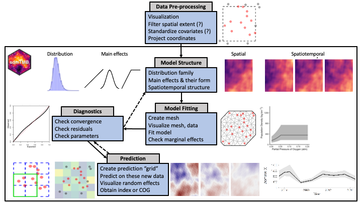

<!-- Build with: xaringan::inf_mr() -->

```{r preamble, include=FALSE, cache=FALSE}
source(here::here("noaa-psaw-2022/preamble.R"))
do.call(knitr::opts_chunk$set, knitr_opts)
```

```{r libs, include=FALSE}
library(dplyr)
library(sdmTMB)
library(ggplot2)
library(mgcv)
```

# Outline

* Brief intro to sdmTMB

* Research applications
  * Temporally varying effects
  * Spatially varying effects
  * Forecasting

---

# sdmTMB team


<!-- * Eric Ward, Northwest Fisheries Science Center (Seattle) -->
<!-- * Sean Anderson, Fisheries and Oceans Canada (Nanaimo) -->
<!-- * Lewis Barnett, Alaska Fisheries Science Center (Seattle)  -->
<!-- * Philina English, Fisheries and Oceans Canada (Nanaimo) -->

---

# sdmTMB highlights

sdmTMB is a user-friendly R package for spatially explicit predictive process modelling

* Familiar syntax to widely used functions/packages; `glm()`, mgcv, glmmTMB, etc.
  
* Performs fast (marginal) maximum likelihood estimation via TMB
  
* Widely applicable to species distribution modelling, stock assessment inputs, bycatch models, etc. that include spatially referenced data

---

# Why use a predictive process model?

* Data often has spatial attributes

* Ideal world:
  * Plug spatial covariates into a GLM / GLMM
  * Residuals are uncorrelated  
  
```{r sim-rf-intro, echo=FALSE, fig.asp=0.4}
set.seed(123)
predictor_dat <- data.frame(
  X = runif(300), Y = runif(300),
  year = 1
)
mesh <- make_mesh(predictor_dat,
  xy_cols = c("X", "Y"),
  cutoff = 0.1
)
sim_dat <- sdmTMB_simulate(
  formula = ~1,
  data = predictor_dat,
  time = "year",
  mesh = mesh,
  family = gaussian(link = "identity"),
  range = 0.00001,
  sigma_E = 0.1,
  phi = 0.01,
  sigma_O = 0.2,
  seed = 3542,
  B = c(0) # B0 = intercept
)

ggplot(sim_dat, aes(X, Y, col = observed)) +
  geom_point(alpha = 0.7, size = 3) +
  guides(col = guide_legend(title = "Residuals")) +
  scale_color_gradient2()
```

---

# Reality
  
* Residual spatial autocorrelation

```{r sim-rf-intro-cor, echo=FALSE, fig.asp=0.4}
set.seed(123)
predictor_dat <- data.frame(
  X = runif(300), Y = runif(300),
  year = 1
)
mesh <- make_mesh(predictor_dat,
  xy_cols = c("X", "Y"),
  cutoff = 0.1
)
sim_dat <- sdmTMB_simulate(
  formula = ~1,
  data = predictor_dat,
  time = "year",
  mesh = mesh,
  family = gaussian(link = "identity"),
  range = 0.25,
  sigma_E = 0.1,
  phi = 0.01,
  sigma_O = 0.1,
  seed = 3542,
  B = c(0) # B0 = intercept
)

ggplot(sim_dat, aes(X, Y, col = observed)) +
  geom_point(alpha=0.7, size=3) + 
  guides(col=guide_legend(title="Residuals")) +
  scale_color_gradient2()
```

---

# Modeling spatial autocorrelation

* Need 'wiggly'/smooth surface for approximating all spatial variables missing from model ('latent' variables)

* Several equivalent approaches exist
  * Smooths in `mgcv()`  
  * Random fields and the Stochastic Partial Differential Equation (SPDE)

* SPDE differs in that it explicitly estimates parameters for spatial covariance function

.xsmall[
Miller, D.L., Glennie, R. & Seaton, A.E. Understanding the Stochastic Partial Differential Equation Approach to Smoothing. JABES 25, 1–16 (2020)
]

---

# Predictive process models 

* Estimate spatial field as random effects (random field)

* Gaussian process predictive process models:
  * Estimate values at a subset of locations ('knots')
  * Use covariance function to interpolate from knots to locations of observations

---

# Predictive process models 

* More knots (vertical dashed lines) = more wiggliness & parameters to estimate

```{r show-gp, fig.height=4}
x <- seq(1, 50)
d <- as.matrix(dist(x, diag = TRUE))
set.seed(123)
df <- data.frame(
  x = x,
  true = c(spam::rmvnorm(1, mu = 0, Sigma = 1 * exp(-0.05 * d)))
)
df$y <- rnorm(df$true, df$true, 0.1)

f1 <- mgcv::gam(y ~ s(x, k = 25, bs = "bs"), data = df)

knots <- data.frame("x" = f1$smooth[[1]]$knots, ymin = 0, ymax = 1.0e10)
g1 <- ggplot(df, aes(x, y)) +
  geom_vline(data = knots, aes(xintercept = x), col = "grey20", size = 0.3, linetype = "dashed") +
  geom_point(col = "red", alpha = 0.7) +
  theme(panel.grid = element_blank()) +
  xlab("") +
  ylab("Observations") +
  geom_smooth(
    method = "gam",
    formula = y ~ s(x, bs = "bs", k = 25)
  ) +
  coord_cartesian(xlim = c(0, 50))

f2 <- mgcv::gam(y ~ s(x, k = 7, bs = "bs"), data = df)
knots <- data.frame("x" = f2$smooth[[1]]$knots, ymin = 0, ymax = 1.0e10)

g2 <- ggplot(df, aes(x, y)) +
  geom_vline(data = knots, aes(xintercept = x), col = "grey20", size = 0.3, linetype = "dashed") +
  geom_point(col = "red", alpha = 0.7) +
  theme(panel.grid = element_blank()) +
  xlab("") +
  ylab("Observations") +
  geom_smooth(method = "gam", formula = y ~ s(x, bs = "gp", k = 7)) +
  coord_cartesian(xlim = c(0, 50))
gridExtra::grid.arrange(g1, g2, ncol = 1)
```

---

# What is a random field?

```{r sim-rf-dat, message=FALSE, warning=FALSE}
predictor_dat <- expand.grid(
  x = seq(0, 1, length.out = 100),
  y = seq(0, 1, length.out = 100),
  year = seq_len(6)
)
mesh <- make_mesh(predictor_dat, xy_cols = c("x", "y"), cutoff = 0.05)
sim_dat <- sdmTMB_simulate(
  formula = ~1,
  data = predictor_dat,
  time = "year",
  mesh = mesh,
  family = gaussian(),
  range = 0.5,
  sigma_E = 0.2,
  phi = 0.1,
  sigma_O = NULL,
  seed = 1,
  B = 0
)
```

```{r random-field-demo}
ggplot(sim_dat, aes(x, y, fill = mu)) +
  facet_wrap(vars(year)) +
  geom_raster() +
  scale_fill_gradient2() +
  coord_fixed(expand = FALSE)
```

---
background-image: url("images/eagle.png")
background-position: bottom right
background-size: 35%

# Random field


---
background-image: url("images/beaker.png")
background-position: bottom right
background-size: 35%

# Random field

* A 2 dimensional "Gaussian Process"

--

* A realization from a multivariate normal distribution with some covariance function

---
background-image: url("images/elmo.png")
background-position: bottom right
background-size: 30%

# Random field

* A way of estimating a wiggly surface to account for spatial and/or spatiotemporal correlation in data

--

* Alternatively, a way of estimating a wiggly surface to account for "latent" or unobserved variables

--

* As a bonus, it provides useful covariance parameter estimates: spatial variance and the distance at data points are effectively uncorrelated ("range")

---

# Estimating random fields in sdmTMB

Implementing the SPDE with INLA requires constructing a 'mesh'

```{r mesh-example, fig.width=6.5}
mesh <- make_mesh(pcod, xy_cols = c("X", "Y"), cutoff = 10)
ggplot() +
  inlabru::gg(mesh$mesh) +
  geom_point(data = pcod, aes(x = X, y = Y), alpha = 0.1, pch = 20) +
  coord_equal()
```

---

# sdmTMB workflow

1. Prepare data .xsmall[(convert to UTMs, scale covariates, ...)]

2. Construct a mesh

3. Fit the model

4. Inspect the model .xsmall[(and possibly refit the model)]

5. Predict from the model

6. Calculate derived quantities

---

# sdmTMB workflow

1. Prepare data: .blue[`add_utm_columns()`]

2. Construct a mesh: .blue[`make_mesh()`]

3. Fit the model: .blue[`sdmTMB()`]

4. Inspect the model: .blue[`print()`], .blue[`tidy()`], .blue[`residuals()`]

5. Predict from the model: .blue[`predict()`]

6. Calculate derived quantities: .blue[`get_index()`], .blue[`get_cog()`]

---

# sdmTMB workflow

1. Prepare data: .blue[`add_utm_columns()`]

2. Construct a mesh: .blue[`make_mesh()`]

3. **Fit the model:** .blue[`sdmTMB()`]

4. Inspect the model: .blue[`print()`], .blue[`tidy()`], .blue[`residuals()`]

5. Predict from the model: .blue[`predict()`]

6. Calculate derived quantities: .blue[`get_index()`], .blue[`get_cog()`]

---
class: center, middle, inverse

# Fitting the model: sdmTMB()

---

# sdmTMB()

Set up is similar to glmmTMB(). Common arguments:

```r
fit <- sdmTMB(
  formula,
  data,
  mesh,
  time = NULL,
  family = gaussian(link = "identity"),
  spatial = c("on", "off"),
  spatiotemporal = c("iid", "ar1", "rw", "off"),
  silent = TRUE,
  ...
)
```

See `?sdmTMB`

---

class: center, middle, inverse

# Fitting the model: non-spatial model components

---

# Formula interface

sdmTMB uses a similar formula interface to widely used R packages

A formula is used to specify fixed effects and (optionally) random intercepts

.small[
```{r formulas1, echo=TRUE, eval=FALSE}
# linear effect of x1:
formula = y ~ x1

# add smoother effect of x2:
formula = y ~ x1 + s(x2)

# add random intercept by group g:
formula = y ~ x1 + s(x2) + (1 | g)
```
]

---

# Smoothers (as in mgcv)

.small[
```{r formulas-smoothers, echo=TRUE, eval=FALSE}
# smoother effect of x:
formula = y ~ s(x)

# basis dimension of 5:
formula = y ~ s(x, k = 5)

# bivariate smoother effect of x & y:
formula = y ~ s(x, y)

# smoother effect of x1 varying by x2:
formula = y ~ s(x1, by = x2)

# other kinds of mgcv smoothers:
formula = ~ s(month, bs = "cc", k = 12)
```

Smoothers are penalized ('p-splines'), i.e. data determine 'wiggliness'
]

---

# Breakpoint functions for threshold analyses

```{r breakpt, echo=TRUE, eval=FALSE}
cpue ~ breakpt(temperature)
```

```{r make-breakpt, out.width='500px', fig.width=5}
df <- data.frame(x = seq(1, 100))
slope <- 0.1
df$y <- ifelse(df$x < 50, slope * df$x, slope * 50)
ggplot(df, aes(x, y)) +
  geom_line(col = "blue") +
  xlab("Temperature") +
  ylab("CPUE") +
  ggtitle("Breakpoint function")
```

---

# Logistic functions for threshold analyses

```{r logistic, echo=TRUE, eval=FALSE}
cpue ~ logistic(temperature)
```

```{r make-logistic, out.width='500px', fig.width=5}
df <- data.frame(x = seq(1, 100))
slope <- 0.1
df$y <- 3.0 / (1 + exp(-0.1 * (df$x - 50)))
ggplot(df, aes(x, y)) +
  geom_line(col = "blue") +
  xlab("Temperature") +
  ylab("CPUE") +
  ggtitle("Logistic function")
```

---

# Families and links

Many of the same families used in `glm()`, `glmmTMB()`, `mgcv::gam()` can be used here

Includes:
  `gaussian()`, `Gamma()`, 
  `binomial()`, `poisson()`, `Beta()`, 
  `student()`, `tweedie()`, 
  `nbinom1()`, `nbinom2()`,
  `truncated_nbinom1()`, `truncated_nbinom2()`
  
All have `link` arguments
  
See `?sdmTMB::Families`

---

class: center, middle, inverse

# Fitting the model: spatial model components

---

# Spatial vs. spatiotemporal fields

* A spatial field can be thought of as a spatial intercept

  * a wiggly spatial process that is constant in time
  
--

* Spatiotemporal variation represents separate fields estimated for each time
  slice (possibly correlated)
  
  * wiggly spatial processes that change through time

--

* Refer to [model description](https://pbs-assess.github.io/sdmTMB/articles/model-description.html) vignette for math notation

---

# Spatial fields can be turned on/off

* By default `sdmTMB()` estimates a spatial field  

```{r echo=TRUE, eval=FALSE}
fit <- sdmTMB(
  y ~ x,
  family = gaussian(),
  data = dat,
  mesh = mesh,
  spatial = "on", #<<
  ...
)
```

---

# Why *not* estimate a spatial field?

* If shared process across time slices isn't of interest

* If magnitude of spatiotemporal variability >> spatial variation

* If confounded with other parameters

---

# Spatiotemporal fields

* Why include spatiotemporal fields?

  * If the data are collected in both space and time *and* 
    there are 'latent' spatial processes that vary through time
  * e.g., effect of water temperature on abundance, if temperature wasn't in the model
  * Represents all the missing variables that vary through time

---

# Types of spatiotemporal fields

* None (`spatiotemporal = "off"`)

* Independent (`spatiotemporal = "iid"`)

* Random walk (`spatiotemporal = "rw"`)

* Autoregressive (`spatiotemporal = "ar1"`)

--

* The type of field to use depends on this question:

  * Do you expect hotspots to be independent with each time slice or adapt slowly over time?

---

# Independent (IID) spatiotemporal fields

```{r iid-demo}
predictor_dat <- expand.grid(
  x = seq(0, 1, length.out = 100),
  y = seq(0, 1, length.out = 100),
  year = seq_len(6)
)
mesh2 <- make_mesh(predictor_dat, xy_cols = c("x", "y"), cutoff = 0.05)
sim_dat <- sdmTMB_simulate(
  formula = ~ 1,
  data = predictor_dat,
  time = "year",
  mesh = mesh2,
  family = gaussian(),
  range = 0.5,
  sigma_E = 0.2,
  phi = 0.1,
  sigma_O = NULL,
  seed = 1,
  B = 0
)
ggplot(sim_dat, aes(x, y, fill = mu)) +
  facet_wrap(vars(year)) +
  geom_raster() +
  scale_fill_gradient2() +
  coord_fixed(expand = FALSE) +
  guides(fill = "none")
```

---

# AR1 spatiotemporal fields

```{r ar1-demo}
sim_dat <- sdmTMB_simulate(
  formula = ~ 1,
  data = predictor_dat,
  time = "year",
  mesh = mesh2,
  family = gaussian(),
  range = 0.5,
  sigma_E = 0.2,
  rho = 0.85,
  phi = 0.1,
  sigma_O = NULL,
  seed = 1,
  B = 0
)
ggplot(sim_dat, aes(x, y, fill = mu)) +
  facet_wrap(vars(year)) +
  geom_raster() +
  scale_fill_gradient2() +
  coord_fixed(expand = FALSE) +
  guides(fill = "none")
```

.small[Random walk = AR1 with 1.0 correlation]

---

class: center, middle, inverse

# Questions before moving to part II: research applications?

<!-- sdmTMB workflow summary figure doesn't show up well in slides  -->
