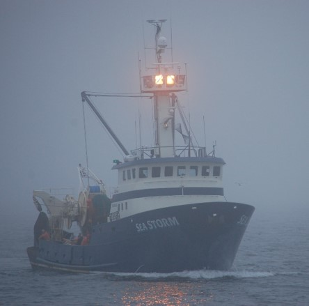
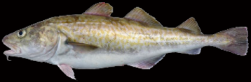

<!-- Build with: xaringan::inf_mr() -->

```{r preamble, include=FALSE, cache=FALSE}
source(here::here("noaa-psaw-2022/preamble.R"))
do.call(knitr::opts_chunk$set, knitr_opts)
```

```{r libs, include=FALSE}
library(dplyr)
library(sdmTMB)
library(ggplot2)
```

# Outline

* Research applications
  * Temporally varying effects
  * Spatially varying effects
  * Forecasting
  
---

.small[
# Why might we want time-varying effects?

* Time-varying slopes: 
  * To allow for evolving responses to covariates (e.g., species moving deeper over time)
  
  * Example use: [English et al. (2021) Fish and Fisheries](https://doi.org/10.1111/faf.12613)  
    Modelled groundfish density with depth; didn't want to constrain fish if they were moving deeper when water was warmer
  
* Time-varying intercepts:
  * To allow variable means across time with constraints
  * To have a model to interpolate or forecast over time
]

---

# Time-varying intercepts

Several ways in sdmTMB:

* factors: `as.factor(year)` (independent)
* random effects: ` + (1 | year)` (drawn from normal distribution)
* smooth: ` + s(year)`
* as random walk

```{r pcod-mesh, include = FALSE}
mesh <- make_mesh(pcod, c("X", "Y"), cutoff = 10)
```

<!--  AR(1) spatiotemporal field -->
```{r fit-ar1, include = FALSE}
# missing and forecasted years:
extra_years <- c(
  2006, 2008, 2010, 2012, 2014, 2016,
  2018:2025
)
fit_ar1 <- sdmTMB(
  density ~ depth_scaled + depth_scaled2,
  time = "year",
  extra_time = extra_years, #<<
  spatiotemporal = "AR1", #<<
  data = pcod,
  mesh = mesh,
  family = tweedie(link = "log"),
  spatial = "off",
  silent = TRUE
)
```

<!--  Random walk spatiotemporal field -->
```{r fit-rw, include = FALSE}
fit_rw <- sdmTMB(
  density ~ depth_scaled + depth_scaled2,
  time = "year",
  extra_time = extra_years, #<<
  spatiotemporal = "RW", #<<
  data = pcod,
  mesh = mesh,
  family = tweedie(link = "log"),
  spatial = "off",
  silent = TRUE
)
```

<!--  Random walk intercept + AR(1) fields -->

```{r, fit-rw-ar1, include = FALSE}
fit_rw_ar1 <- sdmTMB(
  density ~ 0 + depth_scaled + depth_scaled2,
  time = "year",
  time_varying = ~1, #<<
  extra_time = extra_years, #<<
  spatiotemporal = "AR1", #<<
  data = pcod,
  mesh = mesh,
  family = tweedie(link = "log"),
  spatial = "off",
  silent = TRUE
)
```

<!--  Smoother on year + AR(1) fields -->
```{r, fit-sm, include = FALSE}
fit_sm <- sdmTMB(
  density ~ s(year) + depth_scaled + depth_scaled2, #<<
  time = "year",
  extra_time = extra_years, #<<
  spatiotemporal = "AR1", #<<
  data = pcod,
  mesh = mesh,
  family = tweedie(link = "log"),
  spatial = "off",
  silent = TRUE
)
```

---

# Time-varying coefficients

Ex: time-varying (RW) effect of depth on QCS cod




---

# Time-varying coefficients

Ex: time-varying (RW) effect of depth on QCS cod

```{r fit-tv-depth, include = FALSE}
fit_tv <- sdmTMB(
  density ~ 1, 
  time_varying = ~ 0 + depth_scaled + depth_scaled2, #<<
  data = pcod, mesh = mesh,
  time = "year",
  family = tweedie(link = "log"),
  spatial = "on",
  spatiotemporal = "iid",
  silent = TRUE
)
```

```{r tv-depth-eff}
nd <- expand.grid(
  depth_scaled = seq(min(pcod$depth_scaled) + 0.2,
    max(pcod$depth_scaled) - 0.2, length.out = 100),
  year = unique(pcod$year)
)
nd$depth_scaled2 <- nd$depth_scaled^2
p <- predict(fit_tv, newdata = nd, se_fit = TRUE, re_form = NA)

p$depth <- exp(nd$depth_scaled * pcod$depth_sd[1] + pcod$depth_mean[1])
ggplot(p, aes(depth, exp(est),
  ymin = exp(est - 1 * est_se),
  ymax = exp(est + 1 * est_se),
  group = as.factor(year)
)) +
  geom_line(aes(colour = year), lwd = 1) +
  geom_ribbon(aes(fill = year), alpha = 0.1) +
  coord_cartesian(expand = FALSE, xlim = c(min(pcod$depth), 300)) +
  labs(x = "Depth (m)", y = "Biomass density (kg/km2)")
```

---

class: center, middle, inverse

# Spatially varying coefficient models

---

# What is a spatially varying coefficient?

* Describes how the effect of a variable varies over space

  * e.g., how does the temporal trend in fish density vary among locations?
  
  * e.g., how does fish distribution look when the PDO is high vs. low?

---

# When might we want a spatially varying coefficient?

* When we suspect non-local effects of a regional forcing, that varies spatially

  * e.g., the influence of ENSO depends on latitude; influence of Bering Sea cold pool on pollock
  
--

* When the question requires evaluating change at fine spatial scales
  * e.g., there is no directional trend in species distribution shifts at broad scales, due to nuanced or opposing patterns over space being obscured 
  
---

# Spatially varying coefficients in sdmTMB

Spatially varying effect of time on cod density (the "local trend")

```{r, include = FALSE}
pcod$year_scaled <- as.numeric(scale(pcod$year))
fit <- sdmTMB(
  density ~ s(depth, k = 5) + year_scaled,
  spatial_varying = ~ 0 + year_scaled, #<<
  data = pcod, 
  mesh = mesh, 
  time = "year",
  family = tweedie(link = "log"),
  spatiotemporal = "off"
)
```
<!-- See `zeta_s` in the output, which represents the coefficient varying in space. You'll want to ensure you set up your model such that it ballpark has a mean of 0 (e.g., by including it in `formula` too). -->

```{r plot-zeta}
qcs_grid$year_scaled <- (qcs_grid$year - mean(pcod$year)) / sd(pcod$year)
p <- predict(fit, qcs_grid)
p <- dplyr::filter(p, year == 2011) # any year
ggplot(p, aes(X, Y, fill = zeta_s)) + geom_raster() +
  scale_fill_gradient2()
```

---

# Scale-dependent interpretation of species distribution shifts


.tiny[
[Barnett, L.A.K., Ward, E.J. & Anderson, S.C. Improving estimates of species distribution change by incorporating local trends. Ecography, 44: 427-439. (2021)](https://doi.org/10.1111/ecog.05176)
]

<!-- To see how the interpretation of change in distribution depends on spatial scale, lets compare our fine-scale interpretation to a coarse-scale interpretation using a time series of the coastwide COG. These are results for arrowtooth flounder on the US west coast, where I am showing maps of the trend in population density over time, clusters of locations with similar trends, and the prediction of mean density over all years, which shows us that arrowtooth are most prevalent in the northern half of the region.  However, the trend map indicates that densities are mostly decreasing in the north and increasing in the central area toward the southern end of its core range.  Thus, it seems that arrowtooth are expanding southward as a traveling wave at the leading edge of the range.

On the far right panel, you can see that the COG also indicates a southward shift, yet it is slight and only detectable in this case because of a narrow 95% CI.  From this alone it would be hard to say whether the change is really due to increased southward movement or productivity, or a decrease in productivity in the north. -->

--

* Potential applied uses
  * Determining spatial structure of assessment model inputs
  * Determining quota allocation over space

---

class: center, middle, inverse

# Forecasting

---

# Types of prediction in time of interest

  * interpolating over missed survey year(s)
  * forecasting future year(s)
  
---

# Predicting to missing/future years

* Need a model for time: e.g., can't predict with years as factors

* Options: 
  * AR(1) or random walk random fields
  * Time-varying intercept
  * Smoother on year (`s(year)`)
  * Ignore time (fixed)
  * Some combination of the above

---

# Comparing options: predicted density at a single point in space

.xsmall[Vertical dashed lines indicate observations]

```{r pred-all}
newdf <- data.frame(
  year = unique(fit_ar1$data$year),
  X = mean(pcod$X),
  Y = mean(pcod$Y),
  depth_scaled = mean(pcod$depth_scaled),
  depth_scaled2 = mean(pcod$depth_scaled)^2
)
fits <- list(fit_ar1, fit_rw, fit_rw_ar1, fit_sm)
names(fits) <- c("AR1-fields", "RW-fields", "RW-time, AR1-fields", "s(year), AR1-fields")
set.seed(123)
preds <- purrr::map(fits, ~ predict(.x, newdf, nsim = 50L))
preds_df <- purrr::map_dfr(preds, function(.x) {
  reshape2::melt(.x, value.name = "est") %>%
    rename(year = Var1, iter = Var2)
}, .id = "type")
pred_df <- purrr::map_dfr(fits, ~ predict(.x, newdf, se_fit = TRUE), .id = "type")
```

```{r plot-time-comparison, fig.asp=0.62}
set.seed(1922)
iters <- sample(1:max(preds_df$iter), 12L)
ggplot(pred_df, aes(year, exp(est), ymin = exp(est - 2 * est_se), ymax = exp(est + 2 * est_se))) +
  geom_ribbon(alpha = 0.2) +
  geom_line(lwd = 1) +
  scale_y_log10() +
  facet_wrap(vars(type)) +
  geom_vline(xintercept = unique(pcod$year), lty = 2, alpha = 0.2) +
  theme(panel.grid = element_blank()) +
  geom_line(aes(year, exp(est), group = iter),
    alpha = 0.4,
    data = filter(preds_df, iter %in% iters), inherit.aes = FALSE, lwd = 0.5
  ) +
  ylab("Fish density (log-distributed axis)") + xlab("")
```

---

# AR(1) spatiotemporal fields evolve towards mean zero

```{r pred-ar1-plot-eps}
one_yr <- dplyr::filter(qcs_grid, year == 2017)
grid <- purrr::map_dfr(unique(fit_ar1$data$year), function(i) {
  one_yr$year <- i
  one_yr
})
p_ar1 <- predict(fit_ar1, newdata = grid)
ggplot(p_ar1, aes(X, Y, fill = epsilon_st)) +
  geom_raster() +
  facet_wrap(~year) +
  scale_fill_gradient2() +
  coord_fixed()
```

---

# Random walk fields do not evolve towards the mean

```{r pred-rw-plot-eps}
p_rw <- predict(fit_rw, newdata = grid)
ggplot(p_rw, aes(X, Y, fill = epsilon_st)) +
  geom_raster() +
  facet_wrap(~year) +
  scale_fill_gradient2() +
  coord_fixed()
```

---

# Spatiotemporal field uncertainty grows without data

```{r eps-se}
eps_est <- predict(fit_ar1, newdata = grid, nsim = 100, sims_var = "proj_re_st_vector")
grid$se <- apply(eps_est, 1, sd)
ggplot(grid, aes(X, Y, fill = se)) +
  geom_raster() +
  facet_wrap(~year) +
  coord_fixed() +
  labs(fill = "Standard error\nof spatiotemporal field")
```
.xsmall[Here AR(1) fields; random walk similar]

---

# Forecasting and interpolating summary

* Need a model for time
* AR(1) field processes revert towards mean
* Random walk field processes do not revert towards mean
* Smoothers should be used with caution when forecasting  
  .xsmall[(they continue whatever the basis functions were doing)]

---

class: center, middle, inverse

# Questions?
