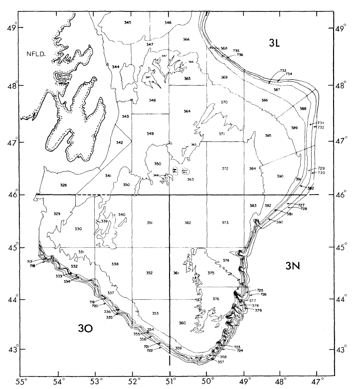
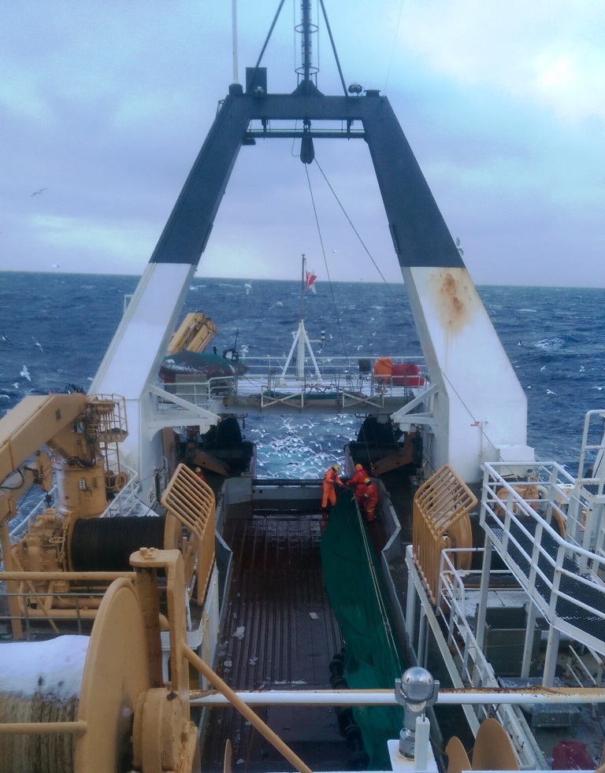
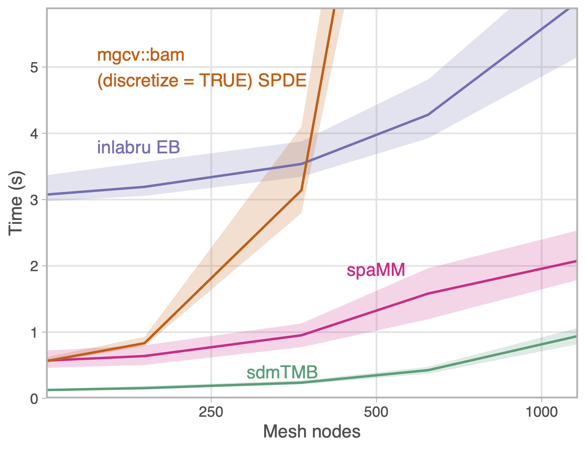
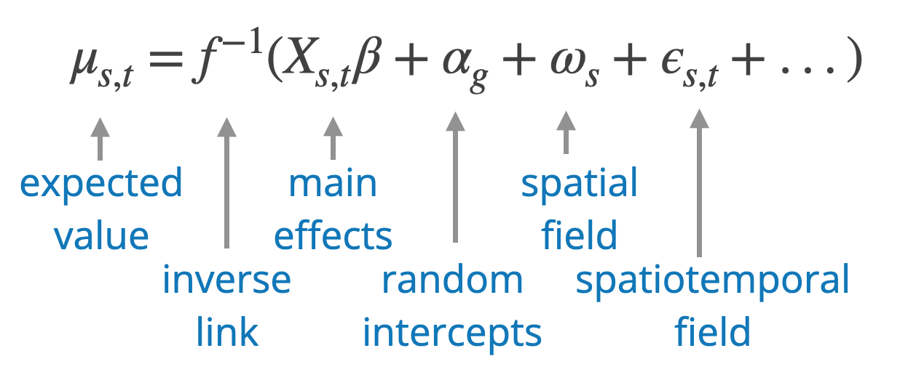

class: middle, inverse

<h1>sdmTMB: an R package for fast,<br>
flexible, and user-friendly generalized linear mixed effects models with spatial and spatiotemporal random fields</h1>

Sean C. Anderson<sup>1</sup>, Eric J. Ward<sup>2</sup>,<br>
Philina A. English<sup>1</sup>, Lewis A.K. Barnett<sup>2</sup>

.xsmall[
<sup>1</sup>Fisheries and Oceans Canada  
<sup>2</sup>U.S. National Oceanic and Atmospheric Administration
]

<!--  -->

---

<!-- Build with: xaringan::inf_mr() -->

<!--
Plan

1. spatial models
2. random field approaches
3. why sdmTMB?
4. accessible syntax
  - example
  - basic syntax walk through
5. fast
6. advanced functionality examples
8. summary
9. finding out more
10. acknowledgements

-->

```{r preamble, include=FALSE, cache=FALSE}
xaringanthemer::style_mono_accent(
  base_color = "#202020",
  header_font_google = xaringanthemer::google_font("Raleway"),
  text_font_google = xaringanthemer::google_font("Open Sans"),
  code_font_google = xaringanthemer::google_font("Fira Mono"),
  # title_slide_background_image = "../noaa-psaw-2022/images/logo-sdmTMB.png",
  title_slide_background_size = "14%",
  title_slide_background_position = "50% 90%",
  base_font_size = "20px",
  header_h1_font_size = "2.1rem",
  text_font_size = "1.5rem",
  code_font_size = "1.1rem",
  link_color = "#0047AB"
)

knitr_opts <- list(
  message = FALSE,
  warning = FALSE,
  collapse = TRUE,
  comment = "#>",
  fig.width = 7,
  dpi = 300,
  out.width = "700px",
  fig.asp = 1 / 1.618,
  cache = TRUE,
  autodep = TRUE,
  cache.comments = TRUE,
  fig.align = "center",
  echo = FALSE
)

options(ggplot2.continuous.colour = "viridis")
options(ggplot2.continuous.fill = "viridis")
ggplot2::theme_set(ggplot2::theme_minimal())

do.call(knitr::opts_chunk$set, knitr_opts)
```

```{r libs, include=FALSE}
library(dplyr)
library(sdmTMB)
library(ggplot2)
```

```{r rnaturalearthhires}
if (!require("rnaturalearthhires", quietly = TRUE)) {
  stop("Please install 'rnaturalearthhires'.\n",
  "`remotes::install_github('ropensci/rnaturalearthhires')`")
}
```

# Fisheries-independent surveys

Often designed with indices of abundance in mind

Indices of abundance are one of the highest quality sources of information in stock assessment


---

# Design-based indices of abundance

Surveys commonly use a stratified random sampling design

Lends itself to a "design-based" stratified mean index of abundance



---

# All surveys start with good intentions

.pull-left[
"Alas, change is inevitable".xsmall[*]

Design-based approach assumes perfect sampling implementation

Model-based approaches can help

.xsmall[*-Paul Regular]
]

.pull-right[

]

---

# Design-based vs. model-based indices

.pull-left[
*Design-based approach*

Requires perfect design  

Surveys are rarely perfect
(e.g., gaps in coverage)
]

.pull-right[
*Model-based approach*

Can account for (some) survey problems

Requires model assumptions

Assumptions are rarely perfect
]

---

# Why move towards model-based indices?

Model-based indices:

- Can account for several common implementation problems
   - e.g., changes to gear, gaps in coverage, changes to coverage
- Often have tighter confidence intervals
- Can account for mismatch between survey and stock domain
- Can integrate multiple data sources
- Can provide other meaningful inference

---

class: center, middle, inverse

# Model-based indexes of abundance

---

# What is an area-weighted model-based index of abundance?

1. Develop some model of abundance or biomass over space and time.

--
  
2. Predict across the survey domain (usually a grid).

--

3. Sum up the abundance or biomass predictions weighting each grid cell by its area.

---

# Things to think about in this model

What covariates?

How to deal with missing covariates + spatial correlation?

What observation error model?

Are our data consistent with the model?

---

# Covariates

Some covariates are things you want to *exclude* or standardize for in your predictions:  
.red[catchability covariates]
   - e.g., vessel effects, day of year
   
--

Some covariates are things you want to *include* or account for in your predictions: .red[density covariates]
  - e.g., depth, temperature
  
--
  
In your predictions, hold catchability covariates constant; set the density covariates to their actual values

---

# Latent variables / spatial correlation

```{r sp-explicit-dat}
set.seed(123)
predictor_dat <- expand.grid(
  X = seq(0, 1, length.out = 100), Y = seq(0, 1, length.out = 100)
)
mesh <- make_mesh(predictor_dat, xy_cols = c("X", "Y"), cutoff = 0.01)

sim_dat <- sdmTMB_simulate(
  formula = ~ 1,
  data = predictor_dat,
  mesh = mesh,
  family = gaussian(),
  range = 0.5,
  phi = 0.05,
  sigma_O = 0.6,
  seed = 123,
  B = 0
)

set.seed(123)
obs_vec <- sample(seq_len(nrow(sim_dat)), 250)
sim_dat$i <- seq_len(nrow(sim_dat))
obs <- filter(sim_dat, i %in% obs_vec)
```

```{r vis-spatial-explicit, out.width='320px', fig.width=7}
ggplot(sim_dat, aes(X, Y, fill = exp(eta))) +
  geom_raster() +
  scale_fill_viridis_c() +
  geom_point(data = obs, mapping = aes(X, Y, size = exp(observed)), inherit.aes = FALSE, 
    pch = 21, colour = "white") +
  theme_void() +
  guides(fill = "none", size = "none") +
  coord_equal(xlim = c(0, 1), ylim = c(0, 1)) +
  scale_size(range = c(0, 8))
```

Geostatistical: data observed at spatial coordinates

--

Latent (missing) variables can cause complex spatial correlation

--

Can invalidate simple statistical approaches and reduce their predictive accuracy

---

# Modeling spatial autocorrelation

```{r vis-spatial-explicit2, out.width='250px', fig.width=7}
ggplot(sim_dat, aes(X, Y, fill = exp(eta))) +
  geom_raster() +
  scale_fill_viridis_c() +
  geom_point(data = obs, mapping = aes(X, Y, size = exp(observed)), inherit.aes = FALSE, 
    pch = 21, colour = "white") +
  theme_void() +
  guides(fill = "none", size = "none") +
  coord_equal(xlim = c(0, 1), ylim = c(0, 1)) +
  scale_size(range = c(0, 8))
```

.small[Need a 'wiggly' surface to approximate all spatial variables missing from model]

--

.small[Random fields and the Stochastic Partial Differential Equation (SPDE) are one approach]

--

.small[Random fields explicitly estimate parameters for a spatial covariance function; popularized by INLA and VAST packages]

---

# Why sdmTMB?


.small[Familiar syntax (similar to glmmTMB, mgcv)]

--

.small[*Fast* marginal maximum likelihood estimation via TMB (or MCMC via Stan)]

--

.small[Features: e.g., spatial anisotropy, smoothers, breakpoint models, priors, ...]

--

.small[
Widely applicable to **s**pecies **d**istribution **m**odelling (**sdm**TMB)
]

---

# Why sdmTMB?


.small[Includes computation (with uncertainty) of area-weighted indexes of abundance]

--

.small[Includes a wide variety of observation families relevant to survey data (Tweedie, negative binomial, delta-Gamma, delta-lognormal, zero-truncated, ...)]

--

.small[Includes tools that facilitate model validation]
---


# TMB and hence sdmTMB is fast




.tiny[
`*` 4–16 times faster than INLA  
`*` Maximum marginal likelihood vs. approximate Bayes  
`*` SPDE-based GLM with a spatial random field and increasing mesh complexity  
`*` 1 core; faster empirical Bayes INLA integration; marginal likelihood vs. approximate Bayes]

---

# sdmTMB models as GLMMs

<br>
<br>



---

# `sdmTMB()`

Set up is similar to `glmmTMB()`.  
Common arguments:

```r
fit <- sdmTMB(
  formula,
  data,
  mesh,
  time = NULL,
  family = gaussian(link = "identity"),
  spatial = c("on", "off"),
  spatiotemporal = c("iid", "ar1", "rw", "off"),
  silent = TRUE,
  ...
)
```

See `?sdmTMB`

---

class: center, middle, inverse

# An example of index standardization with Pacific Cod data

---

# The built-in Pacific Cod dataset

.xsmall[
```{r fake-pcod-head, echo=TRUE, eval=FALSE}
library(sdmTMB)
head(pcod)
```
]

```{r nothing00, eval=FALSE}
tibble::as_tibble(head(pcod)) %>% 
  dplyr::select(year, density, lon, lat, X, Y) %>% 
  head(n = 3)
```


.xsmall[
```
#>  year density   lon    lat   X     Y
#> <int>   <dbl> <dbl>  <dbl> <dbl> <dbl>
#>  2003   113.  -130.0  52.3  446  5793
#>  2003    41.7 -130.0  52.3  446  5800
#>  2003     0   -130.0  52.4  449  5802
```
]

```{r plot-pcod-raw, out.width="575px", fig.width=6}
lims_x <- c(230957.7 + 105000, 1157991 - 570000) + c(-10000, 10000)
lims_y <- c(5366427 + 270000, 6353456 - 513000) + c(-10000, 10000)
land <- "grey86"
land_border <- "grey86"

map_data <- rnaturalearth::ne_countries(
  scale = "large",
  returnclass = "sf", country = "canada"
)
# Crop the polygon for plotting and efficiency:
# st_bbox(map_data) # find the rough coordinates
bc_coast <- suppressWarnings(suppressMessages(
  sf::st_crop(
    map_data,
    c(xmin = -134, ymin = 46, xmax = -120, ymax = 57)
  )
))
utm_zone9 <- 3156
bc_coast_proj <- sf::st_transform(bc_coast, crs = utm_zone9)

pcod_temp <- pcod
pcod_temp$X1000 <- pcod_temp$X * 1000
pcod_temp$Y1000 <- pcod_temp$Y * 1000

ggplot(bc_coast_proj) +
  geom_sf(colour = land_border, lwd = 0.3, fill = land) +
  geom_point(data = pcod_temp, mapping = aes(X1000, Y1000,
    size = density, colour = density
  )) +
  theme_light() +
  scale_x_continuous(
    limits = lims_x
  ) +
  scale_y_continuous(
    limits = lims_y
  ) +
  xlab("") +
  ylab("") +
  labs(colour = expression("Density" ~ (kg / km^2))) +
  scale_size_area() +
  scale_colour_viridis_c(trans = "log10") +
  guides(size = "none")
```

---

# Construct a mesh

.small[
```{r mesh-demo, echo=TRUE, fig.asp=0.8, out.width='400px', fig.width=7}
mesh <- make_mesh(pcod, c("X", "Y"), cutoff = 10)
plot(mesh)
```

Or supply any INLA mesh to `make_mesh(..., mesh = )`
]

---

# Fit a model for index standardization of Pacific Cod data

.small[
Include a smoother for depth

Include independent year effects

Include spatial and spatiotemporal random fields
]

```{r pcod-st-fit-covariate, echo=TRUE, eval=TRUE, results='hide'}
fit <- sdmTMB(
  density ~ s(depth) + 0 + as.factor(year), #<<
  data = pcod,
  mesh = mesh,
  family = tweedie(link = "log"),
  spatial = "on",  #<<
  time = "year",
  spatiotemporal = "iid"  #<<
)
```

---

# Checking convergence  

.small[
Learning curve of TMB can be steep  

Models can be very complex; hard to diagnose issues

`sanity()` function tries to help
]

.small[
```{r checksanity, eval=TRUE, message=TRUE, warning=FALSE, echo=TRUE}
sanity(fit)
```
]

---

# Inspecting the model fit

.small[
```{r print-pcod-st-fit, eval=FALSE, echo=TRUE}
fit
```

```{r print-real, echo=TRUE, eval=FALSE}
#> Spatiotemporal model fit by ML ['sdmTMB']
#> Formula: density ~ s(depth) + 0 + as.factor(year)
#> Mesh: mesh (isotropic covariance)
#> Time column: year
#> Data: pcod
#> Family: tweedie(link = 'log')
#>  
#>                     coef.est coef.se
#> as.factor(year)2003     1.80    0.28
#> as.factor(year)2004     2.40    0.27
#> ...
#> 
#> Dispersion parameter: 10.73
#> Tweedie p: 1.49
#> Matérn range: 12.23
#> Spatial SD: 1.85
#> Spatiotemporal SD: 1.84
#> ML criterion at convergence: 6242.801
```

]

---

# Randomized quantile residuals

```{r resid1, echo=TRUE, out.width='500px', fig.width=6}
set.seed(1)
rq_res <- residuals(fit) # 
qqnorm(rq_res);qqline(rq_res)
```

.xsmall[
Warning: these residuals are fast but might look off even if the model is fine. Also see MCMC residuals. See the ['Residual checking' vignette](https://pbs-assess.github.io/sdmTMB/articles/residual-checking.html).
]

---

# Model residuals in space

.small[
```{r resid2, echo=FALSE, out.width='700px', fig.width=6}
pcod$resids <- residuals(fit)
filter(pcod, year %in% c(2011, 2013, 2015, 2017)) %>% 
  ggplot(aes(X, Y, colour = resids)) + #<<
  geom_point() +
  facet_wrap(~year) +
  scale_colour_gradient2() +
  coord_fixed()
```
]

---

class: center, middle, inverse

# Predict from the model

---

# Predict over the survey domain

.small[
`qcs_grid`: a 2x2 km grid extending over the full survey domain (Queen Charlotte Sound)
]
.small[
```{r, echo=FALSE, out.width="500px", fig.width=5}
ggplot(qcs_grid, aes(X, Y, fill = depth)) + 
  geom_raster() +
  coord_fixed() +
  scale_fill_viridis_c(option = "C", direction = -1, trans = "sqrt")
```
]

---

# Predict over the survey domain

```{r pcod-st-grid, echo=FALSE, message=FALSE, warning=FALSE}
# replicate grid over all years:
survey_grid <- replicate_df(qcs_grid, "year", unique(pcod$year))
```

```{r pcod-st-index1, echo=TRUE, message=FALSE, warning=FALSE}
pred <- predict(
  fit, 
  newdata = survey_grid, 
  return_tmb_object = TRUE
)
```

---

# Plotting depth and year effects

.xsmall[
```{r pcod-st-plot-depth, echo=FALSE, fig.width=7}
ggplot(pred$data, aes(X, Y, fill = exp(est_non_rf))) +
  geom_raster() +
  scale_fill_viridis_c() +
  facet_wrap(~year) +
  coord_fixed()
```
]

---

# Plotting spatial random effects

.xsmall[
```{r pcod-st-plot-omega, echo=FALSE, fig.width=7}
ggplot(pred$data, aes(X, Y, fill = omega_s)) +
  geom_raster() +
  scale_fill_gradient2() +
  facet_wrap(~year) +
  coord_fixed()
```
]

---

# Plotting spatiotemporal random effects

.xsmall[
```{r pcod-st-plot-eps, echo=FALSE, fig.width=7}
ggplot(pred$data, aes(X, Y, fill = epsilon_st)) +
  geom_raster() +
  scale_fill_gradient2() +
  facet_wrap(~year) +
  coord_fixed()
```
]

---

# Plotting overall predictions

```{r pcod-st-plot-est, echo=FALSE, fig.width=7}
.p <- pred$data
max_est <- quantile(.p$est, 0.998)
.p <- mutate(.p, est_trim = if_else(est > max_est, max_est, est))
ggplot(.p, aes(X, Y, fill = exp(est_trim))) +
  geom_raster() +
  scale_fill_viridis_c(trans = "sqrt") +
  facet_wrap(~year) +
  coord_fixed() +
  labs(fill = "Biomass density\n(kg/km^2)")
```

---

# Calculating an area-weighted population index

Sum densities multiplied by cell areas

(*and calculate standard errors)

```{r pcod-index, echo=TRUE}
index <- get_index(pred, area = 4, bias_correct = TRUE)
```

---

# Plot the standardized index

.small[
```{r pcod-st-index-plot, echo=TRUE, fig.width=6, fig.asp=0.5, out.width="700px", echo=FALSE}
ggplot(index, aes(year, est)) + geom_line() +
  geom_ribbon(aes(ymin = lwr, ymax = upr), alpha = 0.4) +
  xlab('Year') + ylab('Biomass estimate (kg)')
```
]

---

class: center, middle, inverse

# Use and testing

---

# Testing 

\>700 unit tests; ~80% testing coverage

Self-testing against simulated data

Cross-package testing against VAST, INLA, mgcv, glmmTMB

---

# Use elsewhere

.small[Developed for and used in Pacific DFO groundfish assessments]

--

.small[Now used across species and divisions here (e.g., juvenile salmon, spot prawn, eulachon, ..., species distribution modelling for marine planning)]

--

.small[Official tool at NOAA Northwest Fisheries Science Center; reviewed at SSC with extensive VAST comparisons]

--

.small[Used within ICES, NAFO, several CSRF-funded DFO research projects]

--

.small[~20 [published papers or stock assessments](https://github.com/pbs-assess/sdmTMB/wiki/Publications-using-sdmTMB)]

---

# Acknowledgements

*Co-developers:*  
Eric Ward (NOAA), Philina English (DFO), Lewis Barnett (NOAA)

*Software inspiration and dependencies:*  
VAST (Thorson et al. 2019), TMB (Kristensen et al. 2016), glmmTMB (Brooks et al. 2017), INLA (Rue et al. 2009; Lindgren et al. 2011), inlabru (Bachl et al. 2019), mgcv (Wood et al. 2011)

*sdmTMB improvements:*  
Jim Thorson, Joe Watson, Cole Monnahan, Julia Indivero, Max Lindmark, Stan Kotwicki

---

# Learning more

.small[
**CRAN:**  
<https://CRAN.R-project.org/package=sdmTMB>

**GitHub:**  
<https://github.com/pbs-assess/sdmTMB>

**Documentation:**  
<https://pbs-assess.github.io/sdmTMB/index.html>

**Preprint:**  
Anderson, S.C., E.J. Ward, P.A. English, L.A.K. Barnett. 2022. sdmTMB: an R package for fast, flexible, and user-friendly generalized linear mixed effects models with spatial and spatiotemporal random fields. bioRxiv 2022.03.24.485545; <https://doi.org/10.1101/2022.03.24.485545>
]

