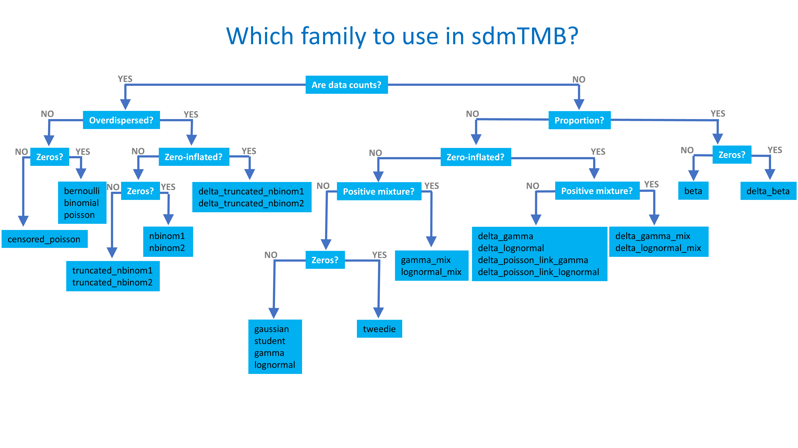

<!-- Build with: xaringan::inf_mr() -->

```{r preamble, include=FALSE, cache=FALSE}
source(here::here("imr-2023/preamble.R"))
do.call(knitr::opts_chunk$set, knitr_opts)
```

```{r libs, include=FALSE}
library(dplyr)
library(sdmTMB)
library(ggplot2)
library(sf)
```

# Families

Many of the same families used in `glm()`, `glmmTMB()`, `mgcv::gam()` can be used here

Includes:
  `gaussian()`, `Gamma()`, 
  `binomial()`, `poisson()`, `Beta()`, 
  `student()`, `tweedie()`, 
  `nbinom1()`, `nbinom2()`,
  `truncated_nbinom1()`, `truncated_nbinom2()`,
  `delta_gamma()`, `delta_lognormal()`, `delta_beta()`, and more...
  
All have `link` arguments
  
See `?sdmTMB::Families`

---
<!-- These are exported dimensions from Powerpoint * 80% -->
.center[

 
*New distributions continue to be added  

]

---

# An aside on the Tweedie

.small[
Useful for positive continuous data with zeros (e.g., biomass density per unit effort) 

Dispersion ( $\phi$ ) and power ( $p$ ) parameters allow for a wide variety of shapes including many zeros

Also known as compound Poisson-Gamma distribution
]

```{r sim-tweedie, fig.width=4, out.width='400px'}
set.seed(123)
r1 <- fishMod::rTweedie(20000, mu = 3, phi = 0.1, p = 1.3)
r2 <- fishMod::rTweedie(20000, mu = 3, phi = 1.5, p = 1.3)
df <- data.frame(y = c(r1, r2), phi = sort(rep(c("0.1", "1.5"), length(r1))))
df$phi <- paste("Dispersion (phi) =", df$phi)
ggplot(df, aes(y)) +
  geom_histogram(bins = 200) +
  ylab("Density") +
  facet_wrap(~phi, ncol = 1, scale = "free_y") +
  coord_cartesian(xlim = c(0, 20))
```

---

# Delta models  

* Delta/hurdle model has 2 sub-models:
- presence/absence (binomial, logit link)  
- positive model (link varies by family)  

* `family` argument to sdmTMB can be a list()  
- for convenience, many delta- families implemented: `delta_gamma`, `delta_lognormal`, `delta_truncated_nbinom2` etc  

---

# Delta models

* Some arguments can be a list, e.g.
```{r argdemo, eval=FALSE, echo=TRUE}
fit <- sdmTMB(
  list(
    density ~ 1, 
    density ~ depth
  ),
  spatial = list('on', 'off'),  
  spatiotemporal = list('off', 'ar1'), 
  share_range = list(TRUE, FALSE),
  ...
)
```

* by default, all arguments shared  
* rest of arguments must be shared  
* smoothers and random intercepts must be shared

---

# An aside on mixture models

Positive components may be modeled as a mixture of 2 distributions

* Finite mixture model (2 components)  

* Also referred to as "ECE" (extreme catch event) model, Thorson et al. (2012)  

* Mechanisms: shoaling, etc.  

* See `gamma_mix()` and `lognormal_mix()`

* Can be delta model as `delta_gamma_mix()` and `delta_lognormal_mix()`

---

# SDMs with presence-only data

Infinitely Weighted Logistic Regression (IWLR)  
* [Fithian & Hastie (2013)](https://doi.org/10.1214/13-AOAS667)  

Downweighted Poisson Regression (DWPR)  
* [Renner et al. 2015](https://doi.org/10.1111/2041-210X.12352) 

Code examples with sdmTMB [here](https://github.com/pbs-assess/sdmTMB/blob/main/scratch/julia-vignettes/presence_absence.Rmd)
