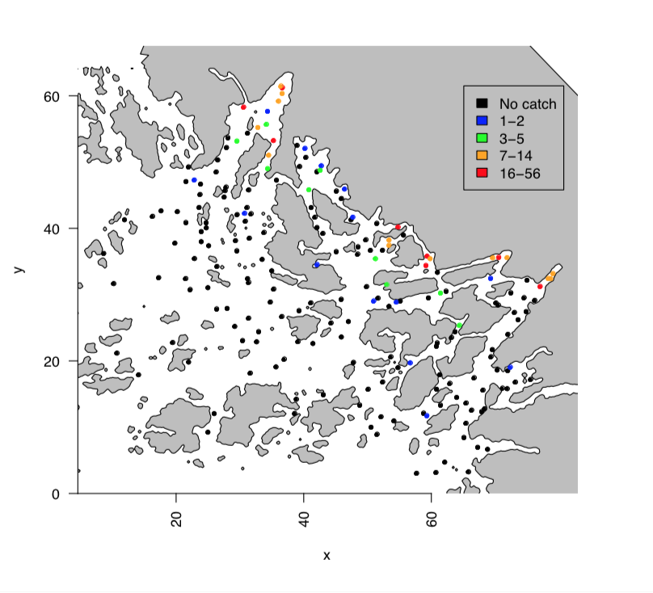

<!-- Build with: xaringan::inf_mr() -->

```{r preamble, include=FALSE, cache=FALSE}
source(here::here("dfo-tesa-2023/preamble.R"))
do.call(knitr::opts_chunk$set, knitr_opts)
```

```{r libs, include=FALSE}
library(dplyr)
library(sdmTMB)
library(ggplot2)
library(sf)
```

# Adding a barrier to a random field?

Why? Spatial correlation affected by:
  * Coastlines / Islands / lakes ([Bakka 2016](https://arxiv.org/abs/1608.03787)) 

.center[

]

---

# Example of barrier effects on a random field

.center[

]

---

# Adding a barrier within INLA

Specify `boundary` attribute to `inla.mesh.2d`  

```{r inla-mesh, eval=FALSE, echo=TRUE}
mesh <- inla.mesh.2d(
  boundary = poly,
  ...
)
```

poly created as an `sp` object  
* [INLA book](https://becarioprecario.bitbucket.io/spde-gitbook/ch-nonstationarity.html#ch:barrier)  
* [Haakon Bakka book](https://haakonbakkagit.github.io/btopic128.html)  

---

# Example: trawl surveys from Salish Sea

WDFW has extensive survey data on US side of border
  * described and analyzed in [Essington et al. (2021)](https://www.int-res.com/abstracts/meps/v657/p173-189/)

We'll use a single snapshot (2011)
  * focusing on presence-absence of Dungeness crab

---

# Crab data

Presence/absence of Dungeness crabs:

.small[
```{r load-crabs, echo=FALSE, fig.asp=0.5}
crabs <- readRDS(here::here("noaa-psaw-2022/data/crabs.rds"))
crabs$present <- as.factor(crabs$crab)

ggplot(crabs, aes(lon, lat, col = present)) +
  geom_point()
```
]
---

# Get coastline data for Puget Sound

.small[
```{r eval=FALSE, echo=TRUE}
remotes::install_github("ropensci/rnaturalearthhires")
```

```{r echo=TRUE}
map_data <- rnaturalearth::ne_countries(
  scale = "large",
  returnclass = "sf"
)

puso <- suppressWarnings(suppressMessages(
  sf::st_crop(
    map_data,
    c(xmin = -125, ymin = 46.8, xmax = -122, ymax = 49)
  )
))
crs_utm10 <- 3157 # Pick a projection, here UTM10

# 'WGS84'; necessary on some installs:
sf::st_crs(puso) <- 4326
puso <- sf::st_transform(puso, crs_utm10)
```
]

---

# Project and plot  

.small[
```{r proj-plot, echo=TRUE, eval=TRUE, fig.asp=0.5}
survey <- crabs %>%
  sf::st_as_sf(crs = 4326, coords = c("lon", "lat")) %>%
  sf::st_transform(3157) # utm zone 10
ggplot(puso) + # coastline and data:
  geom_sf() +
  geom_sf(data = survey, size = 0.5)
```
]

---

# Make the mesh

.small[
```{r mesh, echo=TRUE, eval=TRUE}
# Extract the coordinates:
surv_utm_coords <- st_coordinates(survey)

# Scale coordinates to km so the range parameter
# is on a reasonable scale for estimation:
crabs$Xkm <- surv_utm_coords[, 1] / 1000
crabs$Ykm <- surv_utm_coords[, 2] / 1000

mesh <- make_mesh(crabs,
  xy_cols = c("Xkm", "Ykm"),
  cutoff = 7
)
```
]

---

# Plotting the initial mesh 

```{r plot-mesh, echo=FALSE, fig.asp=0.9}
plot(mesh)
```

---

# Adding barrier attributes to the mesh

Use `sdmTMB::add_barrier_mesh()` to add on barrier component.

Choose a fraction of the range across physical barriers. Values of 0.1 or 0.2 seem to work well.

```{r barrier, echo=TRUE, eval=TRUE}
barrier_mesh <- add_barrier_mesh(
  spde_obj = mesh,
  barrier_sf = puso,
  range_fraction = 0.1, #<<
  proj_scaling = 1000, # data km but projection m
  plot = FALSE
)
```

---

# Mesh knots/vertices over land (green) vs. water (blue)

```{r plot-barrier, echo=FALSE, eval=TRUE}
mesh_df_water <- barrier_mesh$mesh_sf[barrier_mesh$normal_triangles, ]
mesh_df_land <- barrier_mesh$mesh_sf[barrier_mesh$barrier_triangles, ]
ggplot(puso) +
  geom_sf() +
  geom_sf(data = mesh_df_water, size = 2, colour = "blue") +
  geom_sf(data = mesh_df_land, size = 2, colour = "darkgreen")
```

---

# Fitting the model  

* Fit model as before with a barrier

```{r fit-model1, echo = TRUE}
fit_barrier <- sdmTMB(crab ~ 1,
  data = crabs,
  mesh = barrier_mesh,
  family = binomial(link = "logit")
)
```
```{r fit-model2, echo = FALSE}
fit <- sdmTMB(crab ~ 1,
  data = crabs,
  mesh = mesh,
  family = binomial(link = "logit")
)
```
---

# Compare spatial parameters

* Without barrier
```{r show-reg, echo=FALSE}
tidy(fit, "ran_pars", conf.int = TRUE)
```

* With barrier
```{r show-barrier, echo=FALSE}
tidy(fit_barrier, "ran_pars", conf.int = TRUE)
```

---

# Conclusions

* Accounting for the barrier changes inference about spatial process

In this example:

* Without: less complexity in spatial field (large range, small variance)

* With: larger spatial variation, smaller better estimated range

---

# Advice

.small[
* Physical barriers aren't an issue for some coastlines

* Don't choose a `range_fraction` that is much lower than 0.1

* Accounting for spatial correlation barriers can affect local spatial predictions

* Accounting for spatial correlation barriers can affect estimates of range and variance

* If the goal is index standardization, the impact is usually subtle

* Anisotropy often more important than barriers (and you can't currently have both)
]
