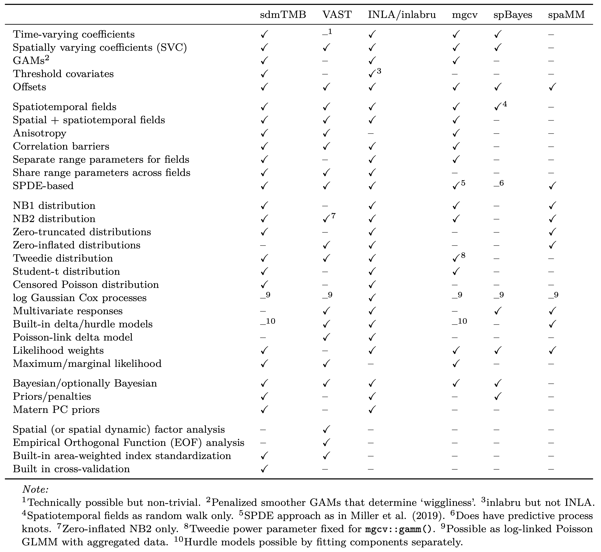

<!-- Previous slides: https://www.dropbox.com/s/gu43n4gvqmo0uzy/sdmTMB-intro-2021.pdf?dl=1 -->
<!-- Build with: xaringan::inf_mr() -->

```{r preamble, include=FALSE, cache=FALSE}
source(here::here("noaa-psaw-2022/preamble.R"))
do.call(knitr::opts_chunk$set, knitr_opts)
```

```{r libs, include=FALSE}
library(sdmTMB)
```

---

# Getting help

* sdmTMB GitHub repository:  
  <https://github.com/pbs-assess/sdmTMB>
  
* sdmTMB documentation:  
  <https://pbs-assess.github.io/sdmTMB/index.html>

*  New features to suggest? Bugs?  
  <https://github.com/pbs-assess/sdmTMB/issues>

---

# Related modelling software

.center[

]
---

# SPDE approach / INLA / etc; comparison with other software

<!-- --- -->

<!-- # Fitting basic spatial models in sdmTMB (Philina) -->

<!-- * Making meshes … link to INLA tutorial (+interactive meshbuilder) -->
<!-- * How do you know your model hasn’t converged? Who is Hessian and why hasn’t he converged? -->
<!-- * What warnings do you need to worry about?  -->
<!-- * Overall magnitude of errors / observation error etc.  -->

---

class: center, middle, inverse

# Troubleshooting

---

# Who is Hessian and why are they not "positive definite"??

* A Hessian matrix is a matrix of second derivatives of a function (here the negative log likelihoood surface)
* The inverse of the negative Hessian is the covariance matrix
* Warning means the curvature of the negative log-likelihood surface is inconsistent with the model having found the best fit.
* Overparameterized? Variance estimated near zero?
* See [vignette("troubleshooting", "glmmTMB")](https://cran.r-project.org/web/packages/glmmTMB/vignettes/troubleshooting.html)

---

# Example of non-converging model

.small[
```{r pcod-spatial-rf, echo=TRUE, message=TRUE, warning=TRUE}
mesh <- make_mesh(pcod, xy_cols = c("X", "Y"), cutoff = 10)

fit <- sdmTMB(
  present ~ depth*year,
  data = pcod,
  mesh = mesh,
  family = binomial(link = "logit"),
  spatial = "on"
)
```
]
---

# Inspecting output

* One or more SEs being NaN is a problem  
.small[
```{r, echo=TRUE, highlight.output=c(6)}
fit$sd_report
```
]

---

# What does b_j represent?

```{r}
present ~ depth*year
```

Interpretation: 
$$b_1 + b_2*depth+b_3*year+b_4*depth:year$$
* Linear interaction term seems tricky to estimate
* Solutions:
  * drop linear interaction (maybe not important)
  * explore non-linear smooths
  
---

# Smooth effects by year

* Separate smooths with unique wiggliness

```{r eval = FALSE, echo=TRUE}
pcod$fyear = as.factor(pcod$year)
fit <- sdmTMB(
  present ~ s(depth, by=fyear),
  data = pcod,
  mesh = mesh,
  family = binomial(link = "logit"),
  spatial = "on"
)
```

---

# 2D smooth effects

* year x depth as smooth interaction
```{r eval = FALSE, echo=TRUE}
fit <- sdmTMB(
  present ~ s(depth, by=year),
  data = pcod,
  mesh = mesh,
  family = binomial(link = "logit"),
  spatial = "on"
)
```

---
 
# Other warning messages / diagnostics

* `Matrix` package, compiler warnings
  * generally ok, but see `glmmTMB` page 
<https://glmmtmb.github.io/glmmTMB/>

* TMB users forum
<https://groups.google.com/g/tmb-users/>  

---

# Words of wisdom

* Start simple
  * intercept only
  * no spatial varying / time varying parameters
  * drop spatial / spatiotemporal fields  
  
* Try other approaches: will a similar model converge in `mgcv`?

* Is observation error variance >> process variance?
  * known to be problematic for state-space models

---

# Words of wisdom

* Start simple
  * intercept only
  * no spatial varying / time varying parameters
  * drop spatial / spatiotemporal fields  
  
* Try other approaches: will a similar model converge in `mgcv`?

* Is observation error variance >> process variance?
  * known to be problematic for state-space models

---

# Words of wisdom

* Start simple
  * intercept only
  * no spatial varying / time varying parameters
  * drop spatial / spatiotemporal fields  
  
* Try other approaches: will a similar model converge in `mgcv`?

* Is observation error variance >> process variance?
  * known to be problematic for state-space models

---

# Large observation error looks like noise

* $\sigma_{obs}$ >> $\sigma_{O}$, $\sigma_{E}$

```{r sim-rf-large_phi, echo=FALSE, fig.asp=0.5}
set.seed(123)
  # a1 is a fake predictor:
predictor_dat <- data.frame(
  X = runif(300), Y = runif(300),
  year = 1
)
mesh <- make_mesh(predictor_dat, 
    xy_cols = c("X", "Y"), 
    cutoff = 0.1)

sim_dat <- sdmTMB_sim2(
    formula = ~ 1,
    data = predictor_dat,
    time = "year",
    mesh = mesh,
    family = gaussian(link = "identity"),
    range = 0.5,
    sigma_E = 0.1,
    phi = 1.0,
    sigma_O = 0.1,
    seed = 3542,
    B = c(0.2) # B0 = intercept
  )

ggplot(sim_dat, aes(X,Y,col=observed)) + 
  geom_point() + 
  scale_colour_gradient2()
```
 
---
  
# Moderate observation errors

* $\sigma_{obs}$ = $\sigma_{O}$ = $\sigma_{E}$
    
```{r sim-rf-med_phi, echo = FALSE, fig.asp=0.5}
  set.seed(123)
  
  sim_dat <- sdmTMB_sim2(
    formula = ~ 1,
    data = predictor_dat,
    time = "year",
    mesh = mesh,
    family = gaussian(link = "identity"),
    range = 0.5,
    sigma_E = 0.1,
    phi = 0.1,
    sigma_O = 0.1,
    seed = 3542,
    B = c(0.2) # B0 = intercept
  )
  
  ggplot(sim_dat, aes(X,Y,col=observed)) + 
    geom_point() + 
    scale_colour_gradient2()
```
  
  
---

     
# Versus one with small observation errors  
    
* $\sigma_{obs}$ << $\sigma_{O}$, $\sigma_{E}$
    
```{r sim-rf-small_phi, echo = FALSE, fig.asp=0.5}
set.seed(123)
  
sim_dat <- sdmTMB_sim2(
    formula = ~ 1,
    data = predictor_dat,
    time = "year",
    mesh = mesh,
    family = gaussian(link = "identity"),
    range = 0.5,
    sigma_E = 0.1,
    phi = 0.01,
    sigma_O = 0.1,
    seed = 3542,
    B = c(0.2) # B0 = intercept
  )
  
ggplot(sim_dat, aes(X,Y,col=observed)) + 
  geom_point() + 
  scale_colour_gradient2()
```
  
  
