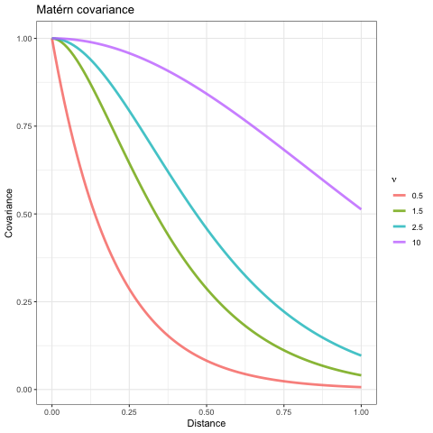

    <!-- # css: ["default", "default-fonts", "theme.css"] -->

<!-- Previous slides: https://www.dropbox.com/s/gu43n4gvqmo0uzy/sdmTMB-intro-2021.pdf?dl=1 -->

<!-- Build with: xaringan::inf_mr() -->

```{r options, include=FALSE}
knitr::opts_chunk$set(
  message = FALSE,
  warning = FALSE,
  collapse = TRUE,
  comment = "#>",
  fig.width = 9,
  fig.asp = 0.7,
  cache = TRUE,
  autodep = TRUE,
  cache.comments = TRUE,
  fig.align = "center",
  echo = FALSE
)
```

```{r xaringan-themer, include=FALSE, warning=FALSE}
library(xaringanthemer)
style_mono_accent(
  base_color = "#202020",
  header_font_google = google_font("Raleway"),
  text_font_google   = google_font("Open Sans"),
  code_font_google   = google_font("Fira Mono"),
  base_font_size = "20px",
  header_h1_font_size = "2.4rem",
  text_font_size = "1.5rem",
  code_font_size = "1.3rem"
)
```

```{r libs, include=FALSE}
library(ggplot2)
library(dplyr)
library(sdmTMB)
theme_set(theme_light())
```


# Course overview

* Fitting Spatial and Spatiotemporal Models with `sdmTMB`

---

# Who we are

* Eric Ward, Northwest Fisheries Science Center (Seattle)
* Sean Anderson, Fisheries and Oceans Canada (Nanaimo)
* Lewis Barnett, Alaska Fisheries Science Center (Seattle) 
* Philina English, Fisheries and Oceans Canada (Nanaimo)

---

# Plan for the 2-session course

* Session 1 (March 3): describe models, and walk through code with us

* Session 2 (March 10): have `sdmTMB` installed, run models and explore advanced features

* Each day, we have ~ 1.5 - 2 hours of content, and will plan to take a 10-15 minute break halfway through.

* Have questions? Use the chat, ask during our break, or at the end. Thanks!

---

# Resources

* `sdmTMB` Readme [https://github.com/pbs-assess/sdmTMB](https://github.com/pbs-assess/sdmTMB)
* `sdmTMB` documentation
[https://pbs-assess.github.io/sdmTMB/index.html](https://pbs-assess.github.io/sdmTMB/index.html)

*  New features to suggest? 
  * Add to list of 'issues' 

---

class: center, middle, inverse

# Covariance functions & gaussian processes for time series

---

# Gaussian processes 101

* Using messy data to approximate underlying truth

```{r sim-gp, fig.height=4}

x = seq(1,50)
d = as.matrix(dist(x, diag=TRUE))
set.seed(123)
df = data.frame(x = x,
                true = c(rmvnorm(1, mu = 0, Sigma = 1*exp(-0.05*d))))
df$y = rnorm(df$true, df$true, 0.1)

g1 = ggplot(df, aes(x,y)) + 
  geom_point(col="red",alpha=0.7) + 
  theme_bw() + xlab("") + ylab("Observations")
g2 = g1 + geom_line(aes(x,true))

gridExtra::grid.arrange(g1,g2,ncol=1)
```

??? 
There's many flexible approaches to modeling latent dynamics (state space models, etc). GPs are one of those, without constraints (e.g. stationarity in time, ARMA properties, etc)

---

# Gaussian processes 101

* Dynamics of $\textbf{y}_t$ can be approximated with a Gaussian Process if $E[\textbf{y}_t] \sim MVN(\mu, \Sigma)$

* $\mu$ may be fixed, e.g. 0

* $\Sigma$ contains many parameters. Instead of estimating them jointly, elements can be approximated a covariance function
  * $\Sigma_{i,j} = f(x_{i}, x_{j})$
  * $n (n-1)/2$ parameters -> 2-3 parameters

* Which to choose? 

<!-- TODO: I don't think we need to highlight GP predictive process models, but that might be a good transition to working with meshes? -->
---

# Matérn covariance

* Flexible, can be exponential (= 0.5) or Gaussian (~ infinity)


---

# Predictive process models 

* High dimensional datasets (here, time) may still be computationally challenging

* GP predictive process models:
  * Estimate values at a subset of locations in the time series
  *   'knots', 'vertices', or 'control points'
  * Use covariance function to interpolate from knots to locations of observations

---

# Predictive process models 

```{r show-gp, fig.height=4}

x = seq(1,50)
d = as.matrix(dist(x, diag=TRUE))
set.seed(123)
df = data.frame(x = x,
                true = c(rmvnorm(1, mu = 0, Sigma = 1*exp(-0.05*d))))
df$y = rnorm(df$true, df$true, 0.1)

g1 = ggplot(df, aes(x,y)) + 
  geom_point(col="red",alpha=0.7) + 
  theme_bw() + xlab("") + ylab("Observations") + 
  geom_smooth(method = "gam", formula = y ~ s(x, bs = "gp", k = 25))
g2 = ggplot(df, aes(x,y)) + 
  geom_point(col="red",alpha=0.7) + 
  theme_bw() + xlab("") + ylab("Observations") + 
  geom_smooth(method = "gam", formula = y ~ s(x, bs = "gp", k = 7))
gridExtra::grid.arrange(g1,g2,ncol=1)
```

---

class: center, middle, inverse

# Spatial data & random fields

---

# Moving from 1 to 2 dimensions (data types) 

* Lattice: gridded data, e.g. interpolated SST from satellite observations 

* Areal: data collected in neighboring spatial areas, e.g. commercial catch records by state / county

* Georeferenced: data where observations are associated with latitude longitude 
  * Locations may be unique, or repeated (stations)
---

# Why is space important? 
<!-- TODO: introduce stationarity? Isotropy/anisotropy? -->

* Data covary spatially (neighbors that are closer are more similar)

* Relationship between distance and covariance can be described with a spatial covariance function

* Covariance function in 2D may be
  * isotropic (same covariance in each direction)
  * anisotropic (different in each direction)

* Assumed stationary

---

# What is a random field?

```{r sim-rf-dat, message=FALSE, warning=FALSE}
predictor_dat <- expand.grid(
  x = seq(0, 1, length.out = 100), 
  y = seq(0, 1, length.out = 100), 
  year = seq_len(6)
)
mesh <- make_mesh(predictor_dat, xy_cols = c("x", "y"), cutoff = 0.05)
sim_dat <- sdmTMB_simulate(
  formula = ~ 1,
  data = predictor_dat,
  time = "year",
  mesh = mesh,
  family = gaussian(),
  range = 0.5,
  sigma_E = 0.2,
  phi = 0.1,
  sigma_O = NULL,
  seed = 1,
  B = 0
)
```

```{r random-field-demo}
ggplot(sim_dat, aes(x, y, fill = mu)) + 
  facet_wrap(vars(year)) +
  geom_raster() +
  scale_fill_gradient2() +
  coord_fixed(expand = FALSE)
```

---
background-image: url("images/eagle.png")
background-position: bottom right
background-size: 35%

# Random field


---
background-image: url("images/beaker.png")
background-position: bottom right
background-size: 35%

# Random field


* .huge[A 2 dimensional "Gaussian Process"] 

--

* A realization from a multivariate normal distribution with some covariance function

---
background-image: url("images/elmo.png")
background-position: bottom right
background-size: 30%

# Random field

* A way of estimating a wiggly surface to account for spatial and/or spatiotemporal correlation in data.

--

* Alternatively, a way of estimating a wiggly surface to account for "latent" or unobserved variables.

--

* As a bonus, it provides use covariance parameter estimates: spatial variance and the distance at data points are effectively uncorrelated ("range")

<!-- TODO: include nugget / sill? Show slide with semivariogram image? -->
---

# Many ways to simulate random fields in R

* `RandomFields::RFsimulate()` simulates univariate / multivariate fields
* `fields::sim.rf()` simulates random fields on a grid
* `geoR::grf()` simulates random fields with irregular observations
* `glmmfields::sim_glmmfields()` simulates random fields with/without extreme values
* `sdmTMB::sdmTMB_sim()` simulates univariate fields with `sdmTMB`

???
Homework: try to work through some of these yourself. Make some plots, and see how changing the covariance affects the smoothness of these fields.
---

# Estimating random fields 

* Georeferenced data often involve 1000s or more points  

* Like in the 1-D setting, we need to approximate the spatial field 
  * Options include nearest neighbor methods, covariance tapering, etc.
  * Including more neighbors increases complexity
  
* `sdmTMB` uses an approach from INLA
  * for `VAST` users, this is the same
  * [INLA books](https://www.r-inla.org/learnmore/books)

---

# INLA and the SPDE approach

* SPDE uses sparse precision matrices $\Sigma^{-1}$ with Matérn covariance 

* INLA is software that performs data wrangling for SPDE estimation
  * INLA also performs fast Bayesian estimation (Laplace approximation)
  * `sdmTMB` uses INLA to wrangle matrices, but uses `TMB` for maximum likelihood estimation

---

# Introducing meshes

* Approximations to GMRF via SPDE approach are 'meshes'

```{r}
data("pcod")
mesh = make_mesh(pcod, xy_cols = c("X","Y"), cutoff = 10)
```


---

class: center, middle, inverse

# A gentle introduction to sdmTMB

---

# sdmTMB origins

* Need for reproducible code and methods for assessments [(Anderson et al. 2019)](https://publications.gc.ca/collections/collection_2020/mpo-dfo/fs70-5/Fs70-5-2019-041-eng.pdf)


---

# sdmTMB highlights

* `sdmTMB` is a user-friendly R package for modeling spatial processes. 
  * Familiar syntax to widely used packages; `glm`, `mgcv`, etc
  
  * Performs fast maximum likelihood estimation via `TMB` 
  
  * Widely applicable to many stock assessments, bycatch models, etc. that include spatially referenced data

---

# sdmTMB limitations

* `sdmTMB` fits a variety of models with univariate responses

* Cannot: 
  * fit multivariate models [VAST](https://github.com/James-Thorson-NOAA/VAST)
  * spatial dynamic factor analysis 
  * zero-inflated or hurdle models
  * log Gaussian Cox processes

---

# sdmTMB workflow


---

class: center, middle, inverse

# Syntax and formulas: non-spatial model components

---

* `sdmTMB` uses a similar interface to widely used R packages  

* Example: model CPUE as a function of depth
  * formula used to specify fixed effects
.medium[
```{r echo=TRUE, eval=FALSE}
fit <- sdmTMB(
  cpue ~ depth,
  family = gaussian(),
  data = dat,
  ...
)
```
]

---

# Other formulas from Rverse

* transformations using `I()` notation
.medium[
```{r echo=TRUE, eval=FALSE}
cpue ~ depth + I(depth^2)
```
]

* polynomial functions using `poly` 
.medium[
```{r echo=TRUE, eval=FALSE}
cpue ~ poly(depth, degree=2)
```
]

* smooth splines using `s()` from `mgcv`
.medium[
```{r echo=TRUE, eval=FALSE}
cpue ~ s(depth)
```
]

---

# Types of smooths in sdmTMB

* All smooths are penalized ("P-splines")

* Smooths can be > 1 dimension
.medium[
```{r echo=TRUE, eval=FALSE}
cpue ~ s(temperature, oxygen)
```
]

* Smooths can be by group
.medium[
```{r echo=TRUE, eval=FALSE}
cpue ~ s(temperature, by=year)
```
]

* Smooths can use other types of splines from `mgcv`
.medium[
```{r echo=TRUE, eval=FALSE}
cpue ~ s(month, bs="cc", k=12)
```
]

---

# Other non-linear functions for threshold analyses

* Breakpoint models 
.medium[
```{r echo=TRUE, eval=FALSE}
cpue ~ breakpt(temperature)
```
]  

```{r make-breakpt}
df = data.frame(x = 1:100)
slope = 0.1
df$y = ifelse(df$x < 50, slope*df$x, slope*50)
g1 = ggplot(df, aes(x, y)) + 
  geom_line(col="red")+
  xlab("Temperature") + 
  ylab("CPUE") + 
  ggtitle("Breakpoint function") + 
  theme_bw()
ggsave("images/breakpoint.png", plot=g1, height = 3)
```


---

# Other non-linear functions for threshold analyses

* Logistic models 
.medium[
```{r echo=TRUE, eval=FALSE}
cpue ~ logistic(temperature)
```
]  

```{r}
df = data.frame(x = 1:100)
slope = 0.1
df$y = 3.0 / (1 + exp(-0.1*(df$x -50)))
#df$y = ifelse(df$x < 50, slope*df$x, slope*50)
g1 = ggplot(df, aes(x, y)) + 
  geom_line(col="red")+
  xlab("Temperature") + 
  ylab("CPUE") + 
  ggtitle("Logistic function") + 
  theme_bw()
ggsave("images/logistic.png", plot=g1, height = 3)
```


---

# Families

* Many of the same families used in `glm`, `glmmTMB`, `mgcv` can be used here

* Includes: `gaussian()`, `Gamma()`, `binomial()`, `poisson()`, `Beta()`, `nbinom2()`, 
`student()`, `tweedie()`

* beta / binomial distribution have logit links, most others = log

---

# Tweedie

* Different values of $\phi$ allow for a wide variety of shapes, including zero-inflated data  

```{r sim-tweedie}
set.seed(123)
r1 = fishMod::rTweedie(10000, mu=3, phi=0.1, p=1.3)
r2 = fishMod::rTweedie(10000, mu=3, phi=1, p=1.3)
r3 = fishMod::rTweedie(10000, mu=3, phi=10, p=1.3)
df = data.frame(y = c(r1,r2,r3), phi = sort(rep(c("0.1","1","10"),length(r1))))

ggplot(df, aes(y)) + geom_histogram(bins=200) + theme_bw() + ylab("Density") + 
  facet_wrap(~phi, ncol=1, scale="free_y") + coord_cartesian(xlim=c(0,20))
```

---

# Additional arguments: weights and offsets

* Like `glm`, `glmmTMB`, `sdmTMB` allows the use of offsets and weights

.medium[
```{r echo=TRUE, eval=FALSE}
fit <- sdmTMB(
  cpue ~ depth + offset,
  family = gaussian(),
  data = dat,
  weights = my_weights,
  ...
)
```
]

---

class: center, middle, inverse

# Syntax and formulas: spatial model components

---

# Contrasting spatial v spatiotemporal fields

* Spatial field can be thought of as an intercept, common across all time slices

* Spatiotemporal variation represents separate fields estimated for each time slice

* Refer to vignette for math notation
---

# Spatial fields can be turned on / off

* By default `sdmTMB` estimates a spatial field  

.medium[
```{r echo=TRUE, eval=FALSE}
fit <- sdmTMB(
  cpue ~ depth + offset,
  family = gaussian(),
  data = dat,
  spatial = FALSE,
  ...
)
```
]

---

# Why not estimate a spatial field?

* Shared process across time slices isn't of interest

* Magnitude of spatiotemporal variability >> spatial variation

* Confounding with other parameters (more later)

---

# Spatiotemporal fields can be turned on / off

* By default `sdmTMB` estimates a spatiotemporal field  

.medium[
```{r echo=TRUE, eval=FALSE}
fit <- sdmTMB(
  cpue ~ depth + offset,
  family = gaussian(),
  data = dat,
  spatiotemporal = "off",
  ...
)
```
]

---

# Types of spatiotemporal fields

* Independent ("IID")

* Random walk ("RW")

* Autoregressive ("AR1")

---

# Spatiotemporal fields

* Why include spatiotemporal fields? 

* Why would a field be IID vs RW/AR1?
  * do we expect hotspots to persist over time?

---

class: center, middle, inverse

# A basic spatial example

---

# The Pacific Cod dataset

.medium[
```{r, echo=TRUE}
library(dplyr)
library(ggplot2)
library(sdmTMB)
pcod %>% 
  select(year, X, Y, depth, density, present) %>% 
  head()
```
]

---

# Fitting a basic GLM

```{r pcod-glm, echo=TRUE}
fit_glm <- glm(
  present ~ 1,
  data = pcod,
  family = binomial(link = "logit")
)

fit <- sdmTMB(
  present ~ 1,
  data = pcod,
  mesh = make_mesh(pcod, xy_cols = c("X", "Y"), cutoff = 10),
  family = binomial(link = "logit"),
  spatial = "off"
)
```

---

# SPDE approach / INLA / etc; comparison with other software

---

# Fitting basic spatial models in sdmTMB (Philina)

* Making meshes … link to INLA tutorial (+interactive meshbuilder)
* How do you know your model hasn’t converged? Who is Hessian and why hasn’t he converged?
* What warnings do you need to worry about? 
* Overall magnitude of errors / observation error etc. 

---

# Splines

---

# Spatiotemporal models, different structures

---

# Prediction (prediction in time – e.g. future SDMs, prediction in space – new areas / unsampled areas)

---

# Building a mesh

```{r}
mesh <- make_mesh(pcod, xy_cols = c("X", "Y"), cutoff = 10)
plot(mesh)
```

---

# Adding spatial random fields

```{r pcod-spatial-rf, echo=TRUE}
fit <- sdmTMB(
  present ~ s(depth, k = 5),
  data = pcod,
  mesh = mesh,
  family = binomial(link = "logit"),
  spatial = "on"   #<<
)
```

---

# Inspecting the model output

.medium[
```{r, echo=TRUE, highlight.output=c(1)}
summary(fit)
```
]

---

# Inspecting the model output

.medium[
```{r, echo=TRUE, highlight.output=2:5}
summary(fit)
```
]

---

# Inspecting the model output

.medium[
```{r, echo=TRUE, highlight.output=6:9}
summary(fit)
```
]

---

# Inspecting the model output

.medium[
```{r, echo=TRUE, highlight.output=11:13}
summary(fit)
```
]

---

# Extracting parameters in a data frame

```{r, echo=TRUE}
# Main effects:
tidy(fit)

# Variance-related terms:
tidy(fit, effects = "ran_pars")
```

<!-- TODO: sigma_O missing!? -->

---

# Extracting parameters in a data frame

.medium[
```{r, echo=TRUE}
tidy(fit, conf.int = TRUE) %>% 
  as_tibble()
```
]

---

# Making predictions

.medium[
```{r, echo=TRUE}
p <- predict(fit)
select(p, X, Y, est:omega_s) %>% 
  glimpse()
```
]

.small[
* `est`: Overall estimate **in link space**
* `est_non_rf`: Estimate of non-random-field components
* `est_rf`: Estimate of random-field components
* `omega_s`: Spatial random field
]

---

# Making predictions on new data


```{r, echo=TRUE}
select(qcs_grid, X, Y, depth) %>% 
  head()
nd <- filter(qcs_grid, year == 2017)
p <- predict(fit, newdata = nd)
```

---

# Plotting predictions on new data

```{r, echo=TRUE, fig.width=7}
ggplot(p, aes(X, Y, fill = plogis(est))) +
  geom_raster() +
  scale_fill_viridis_c()
```

---

# Plotting main effect contributions

```{r, echo=TRUE, fig.width=7}
ggplot(p, aes(X, Y, fill = plogis(est_non_rf))) +
  geom_raster() +
    scale_fill_viridis_c()
```

---

# Plotting spatial random effects

```{r, echo=TRUE, fig.width=7}
ggplot(p, aes(X, Y, fill = omega_s)) +
  geom_raster() +
  scale_fill_gradient2()
```

---

# Plotting depth effect

.medium[
```{r, echo=TRUE}
nd <- data.frame(depth = seq(30, 300, length.out = 100))
p <- predict(fit, newdata = nd, se_fit = TRUE, re_form = ~ 0)
```
```{r, fig.width=5, echo=TRUE}
p$lwr <- plogis(p$est - 1.96 * p$est_se)
p$upr <- plogis(p$est + 1.96 * p$est_se)
ggplot(p, aes(nd$depth, plogis(est), ymin = lwr, ymax = upr)) +
  geom_ribbon(alpha = 0.2) +
  geom_line() + xlab("Depth (m)") + ylab("")
```
]

---


# sdmTMB formulas

.large[
```r
# linear effect of x1:
formula = y ~ x1 

# add smoother effect of x2:
formula = y ~ x1 + s(x2)

# add random intercept by group g:
formula = y ~ x1 + s(x2) + (1 | g)
```
]

---

# Smoothers (as in mgcv)

.large[
```r
# smoother effect of x:
formula = y ~ s(x)

# basis dimension of 5:
formula = y ~ s(x, k = 5)

# bivariate smoother effect of x & y:
formula = y ~ s(x, y)

# smoother effect of x1 varying by x2:
formula = y ~ s(x1, by = x2)
```
]

---

# Getting help

---
