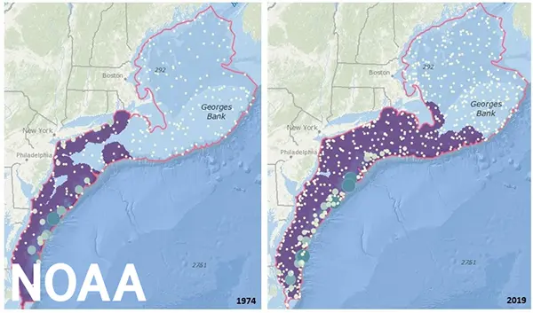

<!-- Build with: xaringan::inf_mr() -->

```{r preamble, include=FALSE, cache=FALSE}
source(here::here("noaa-psaw-2022/preamble.R"))
do.call(knitr::opts_chunk$set, knitr_opts)
```

```{r libs, include=FALSE}
library(dplyr)
library(sdmTMB)
library(ggplot2)
library(mgcv)
```

# Motivating questions



* Species are shifting distributions in response to climate change (here, black sea bass via DisMAP)
* Increased opportunities for novel trophic and fisheries interactions  

---

# Spatial data *usually* requires spatial models

* Ideal world:
  * Plug spatial covariates into a GLM / GLMM
  * Residuals are uncorrelated  
  
```{r sim-rf-intro, echo=FALSE, fig.asp=0.4}
set.seed(123)
predictor_dat <- data.frame(
  X = runif(300), Y = runif(300),
  year = 1
)
mesh <- make_mesh(predictor_dat,
  xy_cols = c("X", "Y"),
  cutoff = 0.1
)
sim_dat <- sdmTMB_simulate(
  formula = ~1,
  data = predictor_dat,
  time = "year",
  mesh = mesh,
  family = gaussian(link = "identity"),
  range = 0.00001,
  sigma_E = 0.1,
  phi = 0.01,
  sigma_O = 0.2,
  seed = 3542,
  B = c(0) # B0 = intercept
)

ggplot(sim_dat, aes(X, Y, col = observed)) +
  geom_point(alpha = 0.7, size = 3) +
  guides(col = guide_legend(title = "Residuals")) +
  scale_color_gradient2()
```

---

# Reality: we need spatial models
  
* Latent variables often spatially correlated

```{r sim-rf-intro-cor, echo=FALSE, fig.asp=0.4}
set.seed(123)
predictor_dat <- data.frame(
  X = runif(300), Y = runif(300),
  year = 1
)
mesh <- make_mesh(predictor_dat,
  xy_cols = c("X", "Y"),
  cutoff = 0.1
)
sim_dat <- sdmTMB_simulate(
  formula = ~1,
  data = predictor_dat,
  time = "year",
  mesh = mesh,
  family = gaussian(link = "identity"),
  range = 0.25,
  sigma_E = 0.1,
  phi = 0.01,
  sigma_O = 0.1,
  seed = 3542,
  B = c(0) # B0 = intercept
)

ggplot(sim_dat, aes(X, Y, col = observed)) +
  geom_point(alpha=0.7, size=3) + 
  guides(col=guide_legend(title="Residuals")) +
  scale_color_gradient2()
```

---

# Modeling spatial autocorrelation

* Need 'wiggly'/smooth surface to approximate all spatial variables missing from model ('latent' variables)

* Several equivalent approaches exist
  * Smooths in `mgcv()`  
  * Random fields and the Stochastic Partial Differential Equation (SPDE)

* SPDE differs in that it explicitly estimates parameters for spatial covariance function

.xsmall[
Miller, D.L., Glennie, R. & Seaton, A.E. Understanding the Stochastic Partial Differential Equation Approach to Smoothing. JABES 25, 1–16 (2020)
]

---

# Matérn covariance

Flexible, can be exponential or Gaussian

```{r matern-plot}
x <- seq(from = 0, to = 1, length.out = 100)
df <- data.frame(
  x = rep(x, 4),
  "nu" = sort(rep(c(0.5, 1.5, 2.5, 10), 100))
)
df$row <- seq(1, nrow(df))
df <- dplyr::group_by(df, row) %>%
  dplyr::mutate(
    cov =
      rSPDE::matern.covariance(h = x, kappa = 5, nu = nu, sigma = 1)
  )
df$nu <- as.factor(df$nu)
# TODO INLA is fixed at...
ggplot(df, aes(x, cov, col = nu, group = nu)) +
  geom_line(size = 1.3, alpha = 0.8) +
  theme_bw() +
  xlab("Distance") +
  ylab("Covariance") +
  ggtitle("Matérn covariance") +
  guides(col = guide_legend(title = expression(nu))) +
  theme(text = element_text(size = 21)) +
  coord_cartesian(expand = FALSE)
```

---

# Random fields may be constant or vary over time

* wiggliness and variability estimated 

```{r sim-rf-dat, message=FALSE, warning=FALSE}
predictor_dat <- expand.grid(
  x = seq(0, 1, length.out = 100),
  y = seq(0, 1, length.out = 100),
  year = seq_len(6)
)
mesh <- make_mesh(predictor_dat, xy_cols = c("x", "y"), cutoff = 0.05)
sim_dat <- sdmTMB_simulate(
  formula = ~1,
  data = predictor_dat,
  time = "year",
  mesh = mesh,
  family = gaussian(),
  range = 0.5,
  sigma_E = 0.2,
  phi = 0.1,
  sigma_O = NULL,
  seed = 1,
  B = 0
)
```

```{r random-field-demo}
ggplot(sim_dat, aes(x, y, fill = mu)) +
  facet_wrap(vars(year)) +
  geom_raster() +
  scale_fill_gradient2() +
  coord_fixed(expand = FALSE)
```

---

# Many ways to simulate random fields

* `RandomFields::RFsimulate()` simulates univariate / multivariate fields
* `fields::sim.rf()` simulates random fields on a grid
* `geoR::grf()` simulates random fields with irregular observations
* `glmmfields::sim_glmmfields()` simulates random fields with/without extreme values
* `sdmTMB::sdmTMB_simulate()` simulates univariate fields with `sdmTMB`

???
Homework: try to work through some of these yourself. Make some plots, and see how changing the covariance affects the smoothness of these fields.

---

# Effects of changing variance and range

```{r sim-rf-grid, echo=FALSE, fig.asp=0.7}
set.seed(123)
predictor_dat <- data.frame(
  X = runif(300), Y = runif(300),
  year = 1
)
mesh <- make_mesh(predictor_dat,
  xy_cols = c("X", "Y"),
  cutoff = 0.1
)

grid_pars = expand.grid("range"=c(0.1, 0.5),
                        "sigma_O" = c(0.05, 0.1))

for(i in 1:nrow(grid_pars)) {
  s <- sdmTMB_simulate(
    formula = ~1,
    data = predictor_dat,
    time = "year",
    mesh = mesh,
    family = gaussian(link = "identity"),
    range = grid_pars$range[i],
    sigma_E = NULL,
    phi = 0.01,
    sigma_O = grid_pars$sigma_O[i],
    seed = 3542,
    B = c(0) # B0 = intercept
  )
  s$range = grid_pars$range[i]
  s$sigma_O = grid_pars$sigma_O[i]
  if(i == 1) {
    sim_dat = s
  } else sim_dat = rbind(s, sim_dat)
}

sim_dat$sigma_O = paste0("sigma_O = ", sim_dat$sigma_O)
sim_dat$range = paste0("range = ", sim_dat$range)
ggplot(sim_dat, aes(X, Y, col = observed)) +
  geom_point(size=1) + 
  scale_color_gradient2() + 
  facet_wrap(range ~ sigma_O)
```

???
Homework: try to increase obervation erorr -- what does this look like compared to the previous plots?
  
---

# Estimating random fields 

.small[
* Georeferenced data often involve 1000s or more points

* sdmTMB uses an approach from INLA
  * for VAST users, this is the same
  * INLA books:  
    <https://www.r-inla.org/learnmore/books>
]

---

# INLA and the SPDE approach

.xsmall[
* SPDE: stochastic partial differential equation

* The solution to a specific SPDE is a Gaussian random field (GRF) with Matérn covariance

* This, and sparse precision matrices, let us efficiently fit approximations to GRFs to large spatial datasets

* INLA is software that performs data wrangling for SPDE estimation
  * INLA also performs approximate Bayesian estimation
  * sdmTMB uses INLA to wrangle matrices, but uses TMB for maximum likelihood estimation
]

.tiny[
Lindgren, F., Rue, H., and Lindström, J. 2011. An explicit link between Gaussian fields and Gaussian Markov random fields: the stochastic partial differential equation approach. Journal of the Royal Statistical Society: Series B. 73(4): 423–498.
]

---

# Introducing meshes

Implementing the SPDE with INLA requires constructing a 'mesh'

```{r mesh-example, fig.width=6.5}
mesh <- make_mesh(pcod, xy_cols = c("X", "Y"), cutoff = 10)
ggplot() +
  inlabru::gg(mesh$mesh) +
  geom_point(data = pcod, aes(x = X, y = Y), alpha = 0.1, pch = 20) +
  coord_equal()
```

---

# Mesh construction

.small[
* A unique mesh is generally made for each dataset
* Rules of thumb:
  * More triangles = more computation time
  * More triangles = more fine-scale spatial predictions
  * Borders with coarser resolution reduce number of triangles
  * Use minimum edge size to avoid meshes becoming too fine
  * Want fewer vertices than data points
  * Triangle edge size needs to be smaller than spatial range

* "How to make a bad mesh?" [Haakon Bakka's book](https://haakonbakkagit.github.io/btopic114.html)
]

---

# Building your own mesh

* `INLA::inla.mesh.2d()`: lets many arguments be customized

* `INLA::meshbuilder()`: Shiny app for constructing a mesh, provides R code

* Meshes can include barriers / islands / coastlines with shapefiles

* INLA books
<https://www.r-inla.org/learnmore/books>

---

# Example: cutoff = 50km

sdmTMB has a function `make_mesh()` to help

```{r mesh-example4, fig.width=6.5}
mesh <- make_mesh(pcod, xy_cols = c("X", "Y"), cutoff = 50)
ggplot() +
  inlabru::gg(mesh$mesh) +
  geom_point(data = pcod, aes(x = X, y = Y), alpha = 0.1, pch = 20) +
  coord_equal()
```

---

# Example: cutoff = 10km

```{r mesh-example2, fig.width=6.5}
mesh <- make_mesh(pcod, xy_cols = c("X", "Y"), cutoff = 10)
ggplot() +
  inlabru::gg(mesh$mesh) +
  geom_point(data = pcod, aes(x = X, y = Y), alpha = 0.1, pch = 20) +
  coord_equal()
```

---

class: center, middle, inverse

# Using sdmTMB

---

# Motivation for sdmTMB package

sdmTMB is a user-friendly R package for modeling spatial processes

* Familiar syntax to widely used functions/packages; `glm()`, mgcv, glmmTMB, etc.
  
* Performs fast (marginal) maximum likelihood estimation via TMB
  
* Widely applicable to species distribution modelling, stock assessment inputs, bycatch models, etc. that include spatially referenced data

---

# Installing sdmTMB

Currently:

* Install a C++ compiler
  * e.g., [Rtools](https://cran.r-project.org/bin/windows/Rtools/rtools40.html) on Windows
  * e.g., Xcode command line tools on a Mac:  
  `xcode-select --install`

.small[
```{r, eval=FALSE, echo=TRUE}
# install.packages("remotes")
remotes::install_github("pbs-assess/sdmTMB", 
  dependencies = TRUE)
```
]

Should be on CRAN soon so the C++ compiler won't be necessary.

---

# sdmTMB workflow

1. Prepare data .xsmall[(convert to UTMs, scale covariates, ...)]

2. Construct a mesh

3. Fit the model

4. Inspect the model .xsmall[(and possibly refit the model)]

5. Predict from the model

6. Calculate any derived quantities

---

# sdmTMB workflow

1. Prepare data: .blue[`add_utm_columns()`]

2. Construct a mesh: .blue[`make_mesh()`]

3. Fit the model: .blue[`sdmTMB()`]

4. Inspect the model: .blue[`print()`], .blue[`tidy()`], .blue[`residuals()`]

5. Predict from the model: .blue[`predict()`]

6. Get derived quantities: .blue[`get_index()`], .blue[`get_cog()`]

---

# Example of adding UTM columns

```{r, echo=TRUE, message=TRUE}
d <- data.frame(
  lat = c(52.1, 53.4), 
  lon = c(-130.0, -131.4)
)
d <- sdmTMB::add_utm_columns(d, c("lon", "lat"))
d
```

* Note default `units = "km"`
* Why? Range parameter estimated in units of X and Y
* Should be not too big or small for estimation

---

# Constructing a mesh

.small[
Size of mesh has the single largest impact on fitting speed

`cutoff` is in units of x and y (minimum triangle size)
]

.small[
```{r make-mesh, echo=TRUE, fig.asp=1, out.width='280px', fig.width=5.5}
d <- data.frame(x = runif(500), y = runif(500))
mesh <- make_mesh(d, xy_cols = c("x", "y"), cutoff = 0.1)
mesh$mesh$n
plot(mesh)
```
]

---

# Fitting the model with sdmTMB()

Set up is similar to glmmTMB(). Common arguments:

```r
fit <- sdmTMB(
  formula,
  data,
  mesh,
  time = NULL,
  family = gaussian(link = "identity"),
  spatial = c("on", "off"),
  spatiotemporal = c("iid", "ar1", "rw", "off"),
  silent = TRUE,
  ...
)
```

See `?sdmTMB`

---

# Formula interface

sdmTMB uses a similar formula interface to widely used R packages  

A formula is used to specify fixed effects and (optionally) random intercepts

.small[
```{r formulas1, echo=TRUE, eval=FALSE}
# linear effect of x1:
formula = y ~ x1

# add smoother effect of x2:
formula = y ~ x1 + s(x2)

# add random intercept by group g:
formula = y ~ x1 + s(x2) + (1 | g)
```
]

---

# Smoothers (as in mgcv)

.small[
```{r formulas-smoothers, echo=TRUE, eval=FALSE}
# smoother effect of x:
formula = y ~ s(x)

# basis dimension of 5:
formula = y ~ s(x, k = 5)

# bivariate smoother effect of x & y:
formula = y ~ s(x, y)

# smoother effect of x1 varying by x2:
formula = y ~ s(x1, by = x2)

# other kinds of mgcv smoothers:
formula = ~ s(month, bs = "cc", k = 12)
```

Smoothers are penalized ('p-splines'), i.e. data determine 'wiggliness'
]

---

# Other common R formula options

Polynomials and omitting the intercept:

```{r formulas-other, echo=TRUE, eval=FALSE}
y ~ depth + I(depth^2) # transformations

y ~ poly(depth, degree = 2) # polynomials

cpue ~ breakpt(temperature) # breakpoints

cpue ~ logistic(temperature) # logistic 
```

---

# Families

Many of the same families used in `glm()`, `glmmTMB()`, `mgcv::gam()` can be used here

Includes:
  `gaussian()`, `Gamma()`, 
  `binomial()`, `poisson()`, `Beta()`, 
  `student()`, `tweedie()`, 
  `nbinom1()`, `nbinom2()`,
  `truncated_nbinom1()`, `truncated_nbinom2()`
  
All have `link` arguments
  
See `?sdmTMB::Families`

---

# Spatial vs. spatiotemporal fields

* A spatial field can be thought of as a spatial intercept

  * a wiggly spatial process that is constant in time

* Spatiotemporal variation represents separate fields estimated for each time
  slice (possibly correlated)
  
  * wiggly spatial processes that change through time

* Refer to [model description](https://pbs-assess.github.io/sdmTMB/articles/model-description.html) vignette for math notation

---

# Spatial fields can be turned on/off

* By default `sdmTMB()` estimates a spatial field  

```{r echo=TRUE, eval=FALSE}
fit <- sdmTMB(
  y ~ x,
  family = gaussian(),
  data = dat,
  mesh = mesh,
  spatial = "on", #<<
  ...
)
```

---

# Why *not* estimate a spatial field?

* If shared process across time slices isn't of interest

* If magnitude of spatiotemporal variability >> spatial variation
  * some species have extremely dynamic ranges

* If confounded with other parameters (more later)

---

# Spatiotemporal fields can be turned on/off

* By default `sdmTMB()` estimates a spatiotemporal field if the `time` argument is specified

```{r echo=TRUE, eval=FALSE}
fit <- sdmTMB(
  y ~ x,
  family = gaussian(),
  data = dat,
  mesh = mesh,
  time = "year", # column in `data` #<<
  spatiotemporal = "iid", #<<
  ...
)
```

---

# Types of spatiotemporal fields

* None (`spatiotemporal = "off"`)

* Independent (`spatiotemporal = "iid"`)

* Random walk (`spatiotemporal = "rw"`)

* Autoregressive (`spatiotemporal = "ar1"`)

---

# Independent (IID) spatiotemporal fields

```{r iid-demo}
predictor_dat <- expand.grid(
  x = seq(0, 1, length.out = 100),
  y = seq(0, 1, length.out = 100),
  year = seq_len(6)
)
mesh2 <- make_mesh(predictor_dat, xy_cols = c("x", "y"), cutoff = 0.05)
sim_dat <- sdmTMB_simulate(
  formula = ~ 1,
  data = predictor_dat,
  time = "year",
  mesh = mesh2,
  family = gaussian(),
  range = 0.5,
  sigma_E = 0.2,
  phi = 0.1,
  sigma_O = NULL,
  seed = 1,
  B = 0
)
ggplot(sim_dat, aes(x, y, fill = mu)) +
  facet_wrap(vars(year)) +
  geom_raster() +
  scale_fill_gradient2() +
  coord_fixed(expand = FALSE) +
  guides(fill = "none")
```

---

# AR1 spatiotemporal fields

```{r ar1-demo}
sim_dat <- sdmTMB_simulate(
  formula = ~ 1,
  data = predictor_dat,
  time = "year",
  mesh = mesh2,
  family = gaussian(),
  range = 0.5,
  sigma_E = 0.2,
  rho = 0.85,
  phi = 0.1,
  sigma_O = NULL,
  seed = 1,
  B = 0
)
ggplot(sim_dat, aes(x, y, fill = mu)) +
  facet_wrap(vars(year)) +
  geom_raster() +
  scale_fill_gradient2() +
  coord_fixed(expand = FALSE) +
  guides(fill = "none")
```

.small[Random walk = AR1 with 1.0 correlation]

---

# Spatiotemporal fields

* Why include spatiotemporal fields?

  * If the data are collected in both space and time *and* 
    there are 'latent' spatial processes that vary through time
  * E.g., effect of water temperature on abundance if temperature wasn't in the model
  * Represents all the missing variables that vary through time

--

* Why would a field be IID vs RW/AR1?

  * Do we expect hotspots to be independent with each time slice or adapt slowly over time?

---

# After model fitting

Inspecting, summarizing, predicting, etc.

Covered in examples in next slides.

* `predict()`: `?predict.sdmTMB`
* `residuals()`: `?residuals.sdmTMB`
* `print()`
* `tidy()`: `?tidy.sdmTMB`
* `get_index()`
*  `...`

---

class: center, middle, inverse

# Using sdmTMB

---

# The Pacific Cod dataset

DFO trawl survey data from Queen Charlotte Sound off BC

.small[
```{r, echo=TRUE}
library(dplyr)
library(ggplot2)
library(sdmTMB)
pcod %>%
  select(year, X, Y, depth, density, present) %>% 
  head()
```
]

---

# Building a mesh

.small[
```{r, echo=TRUE}
mesh <- make_mesh(pcod, xy_cols = c("X", "Y"), cutoff = 10)
plot(mesh)
```
]

---

# Adding spatial random fields

We'll model just presence-absence and ignore covariates
```{r pcod-null, echo=TRUE}
fit <- sdmTMB(
  present ~ 1, # intercept only
  data = pcod,
  mesh = mesh,
  family = binomial(link = "logit"),
  spatial = "on"   #<<
)
```

---

# Should we include depth?

* Predictions here in *logit* space shows a trend  

```{r plotdepth, echo=FALSE}
pred_df <- pcod
pred_df$pred <- predict(fit)$est

ggplot(pred_df, aes(depth, pred)) + 
  geom_point(size=0.3, alpha=0.5) + 
  geom_smooth(se = FALSE) + 
  xlab("pcod$depth") + 
  ylab("predict(fit)$est")
```

---

# Add depth as a quadratic effect

* covariates can also be passed in as `depth`, `depth2`

```{r pcod-spatial-rf-depth, echo=TRUE}
fit <- sdmTMB(
  present ~ poly(log(depth), 2), #<<
  data = pcod,
  mesh = mesh,
  family = binomial(link = "logit"),
  spatial = "on"   #<<
)
```

---

# Inspecting the model output

.small[
```{r, echo=TRUE, highlight.output=c(1)}
fit
```
]

---

# Inspecting the model output

.small[
```{r, echo=TRUE, highlight.output=2:5}
fit
```
]

---

# Inspecting the model output

.small[
```{r, echo=TRUE, highlight.output=6:9}
fit
```
]
---

# Inspecting the model output

.small[
```{r, echo=TRUE, highlight.output=11:13}
fit
```
]

---

# Extracting parameters in a data frame

```{r, echo=TRUE}
# Main effects:
tidy(fit)

# Variance-related terms:
tidy(fit, effects = "ran_pars")
```

---

# Extracting parameters in a data frame

.small[
```{r, echo=TRUE}
tidy(fit, "ran_pars", conf.int = TRUE) %>% 
  as_tibble()
```
]

---

# Making predictions

Without other arguments, `predict` makes predictions at locations of original observations

.small[
```{r, echo=TRUE}
p <- predict(fit) #<<
select(p, X, Y, est:omega_s) %>% 
  as_tibble()
```
]

---

# Making predictions

Objects will include the following 

* `est`: Overall estimate **in link space** (logit here)
* `est_non_rf`: Estimate of non-random-field components
* `est_rf`: Estimate of random-field components
* `omega_s`: Spatial random field

---

# Making predictions on new data

.small[
* `qcs_grid`: a 2x2 km grid extending over the full survey domain
]
.small[
```{r, echo=TRUE, out.width="500px", fig.width=5}
nd <- filter(qcs_grid, year == 2017) # pick any year
ggplot(nd, aes(X, Y, fill = depth)) + 
  geom_raster() +
  coord_fixed()
```
]

---

# Making predictions on new data


```{r, echo=TRUE}
head(select(nd, X, Y, depth))

p <- predict(fit, newdata = nd) #<<
```

---

# Plotting predictions on new data

.small[
```{r, echo=TRUE, fig.width=6, out.width="600px"}
ggplot(p, aes(X, Y, fill = plogis(est))) +
  geom_raster() +
  scale_fill_viridis_c() +
  coord_fixed()
```
]

---

# Plotting main effect contributions

.small[
```{r, echo=TRUE, fig.width=6, out.width="600px"}
ggplot(p, aes(X, Y, fill = plogis(est_non_rf))) +
  geom_raster() +
  scale_fill_viridis_c() +
  coord_fixed()
```
]

---

# Plotting spatial random effects

.small[
```{r, echo=TRUE, fig.width=6, out.width="600px"}
ggplot(p, aes(X, Y, fill = omega_s)) +
  geom_raster() +
  scale_fill_gradient2() +
  coord_fixed()
```
]

---

# Plotting depth effect

.small[
```{r pcod-sp-depth-pred, echo=TRUE}
nd <- data.frame(depth = seq(30, 500, length.out = 300))
p <- predict(
  fit, 
  newdata = nd, 
  se_fit = TRUE, #<<
  re_form = ~ 0 #<<
)
p$lwr <- plogis(p$est - 1.96 * p$est_se)
p$upr <- plogis(p$est + 1.96 * p$est_se)
```

```{r pcod-sp-depth-pred-plot, fig.width=5, echo=FALSE, out.width='500px', fig.asp=0.5}
ggplot(p, aes(log(nd$depth), plogis(est), ymin = lwr, ymax = upr)) +
  geom_ribbon(alpha = 0.2) +
  geom_line() + xlab("Depth (m)") + ylab("") +
  coord_cartesian(ylim = c(0, 1), expand = FALSE)
```
]

---

# Extending to a spatiotemporal model

Reminder, the Pacific Cod dataset:

.small[
```{r, echo=TRUE}
pcod %>% 
  select(year, X, Y, depth, density, present) %>% 
  head()
```
]

---

# Switching to density

`tweedie` can model zero-inflated skewed distributions

```{r pcod-spatial-rf-density, echo=TRUE, eval=FALSE}
fit <- sdmTMB(
  density ~ poly(log(depth), 2), #<<
  data = pcod,
  mesh = mesh,
  family = tweedie(link = "log"), #<<
  spatial = "on"
)
```

---

# Adding spatiotemporal fields

```{r pcod-st-fit, echo=TRUE, eval=TRUE, results='hide'}
fit <- sdmTMB(
  density ~ s(depth, k = 5) + 0 + as.factor(year), #<<
  data = pcod,
  mesh = mesh,
  family = tweedie(link = "log"),
  spatial = "on",
  time = "year", #<<
  spatiotemporal = "iid", #<<
  silent = FALSE # show progress!
)
```

---

# Inspecting the model fit

.small[
```{r print-pcod-st-fit, eval=FALSE, echo=TRUE}
fit
```

```{r pcod-st-print2, echo=TRUE, eval=TRUE}
#> Spatiotemporal model fit by ML ['sdmTMB']
#> Formula: density ~ s(depth) + 0 + as.factor(year)
#> Time column: "year"
#> Mesh: mesh
#> Data: pcod
#> Family: tweedie(link = 'log')
#>                     coef.est coef.se
#> as.factor(year)2003     1.79    0.29 #<<
#> as.factor(year)2004     2.36    0.27 #<<
#> ...
#> 
#> Dispersion parameter: 10.78
#> Tweedie p: 1.49
#> Matern range: 12.85 #<<
#> Spatial SD: 1.81
#> Spatiotemporal SD: 1.78 #<<
#> ML criterion at convergence: 6246.433
```
]

---

# Model residuals

.xsmall[
Warning: these residuals might look off even if the model is fine. Also see `dharma_residuals()` or MCMC residuals. See the ['Residual checking' vignette](https://pbs-assess.github.io/sdmTMB/articles/residual-checking.html).
]

```{r resid1, echo=TRUE, out.width='500px', fig.width=5}
set.seed(1)
rq_res <- residuals(fit) # randomized quantile residuals
qqnorm(rq_res);qqline(rq_res)
```

---

# Model residuals in space

.small[
```{r resid2, echo=TRUE, out.width='500px', fig.width=5}
pcod$resids <- residuals(fit)
filter(pcod, year %in% c(2015, 2017)) %>% 
  ggplot(aes(X, Y, colour = resids)) + #<<
  geom_point() +
  facet_wrap(~year) +
  scale_colour_gradient2() +
  coord_fixed()
```
]

---

# Predicting on the survey grid

```{r pcod-st-pred, echo=TRUE}
p <- predict(fit, newdata = qcs_grid)
```

* `est`: Overall estimate in link space (log here)
* `est_non_rf`: Estimate of non-random-field components
* `est_rf`: Estimate of random-field components
* `omega_s`: Spatial random field
* `epsilon_st`: **Spatiotemporal random field**

---

# Plotting overall predictions

.xsmall[
```{r pcod-st-plot-est, echo=TRUE, fig.width=7}
ggplot(p, aes(X, Y, fill = exp(est))) +
  geom_raster() +
  scale_fill_viridis_c(trans = "sqrt") +
  facet_wrap(~year) +
  coord_fixed()
```
]

---

# Plotting main effect contributions

.xsmall[
```{r pcod-st-plot-non-rf, echo=TRUE, fig.width=7}
ggplot(p, aes(X, Y, fill = exp(est_non_rf))) +
  geom_raster() +
  scale_fill_viridis_c(trans = "sqrt") +
  facet_wrap(~year) +
  coord_fixed()
```
]

---

# Plotting spatial random effects

.xsmall[
```{r pcod-st-plot-omega, echo=TRUE, fig.width=7}
ggplot(p, aes(X, Y, fill = omega_s)) +
  geom_raster() +
  scale_fill_gradient2() +
  facet_wrap(~year) +
  coord_fixed()
```
]

---

# Plotting spatiotemporal random effects

.xsmall[
```{r pcod-st-plot-eps, echo=TRUE, fig.width=7}
ggplot(p, aes(X, Y, fill = epsilon_st)) +
  geom_raster() +
  scale_fill_gradient2() +
  facet_wrap(~year) +
  coord_fixed()
```
]

---

# Calculating an area-weighted population index

.xsmall[
```{r pcod-st-index1, echo=TRUE, fig.width=6, fig.asp=0.5, out.width="600px"}
p2 <- predict(fit, newdata = qcs_grid, return_tmb_object = TRUE) #<<
index <- get_index(p2, area = 4, bias_correct = FALSE) #<<
ggplot(index, aes(year, est)) + geom_line() +
  geom_ribbon(aes(ymin = lwr, ymax = upr), alpha = 0.4) +
  xlab('Year') + ylab('Biomass estimate (kg)')
```
]

```{r pcod-st-index-sims, echo=FALSE, fig.width=6, fig.asp=0.5, out.width="600px", eval=FALSE}
# Calculating an area-weighted population index
# .xsmall[
# From simulated parameter draws.
# Warning: may be approximate; still under testing
# ]

psims <- predict(fit, newdata = qcs_grid, nsim = 1000) #<<
index_sims <- get_index_sims(psims, area = rep(4, nrow(psims))) #<<
ggplot(index_sims, aes(year, est)) + geom_line() +
  geom_ribbon(aes(ymin = lwr, ymax = upr), alpha = 0.4) +
  xlab('Year') + ylab('Biomass estimate (kg)')
```

---

# Calculating the center of gravity

.small[
```{r pcod-st-cog, echo=TRUE, fig.width=6, out.width="600px"}
cog <- get_cog(p2, bias_correct = FALSE, format = "wide") #<<
ggplot(cog, aes(est_x, est_y, colour = year)) + 
  geom_linerange(aes(xmin = lwr_x, xmax = upr_x)) +
  geom_linerange(aes(ymin = lwr_y, ymax = upr_y)) +
  coord_equal()
```
]

---

# Getting help

* sdmTMB GitHub repository:  
  <https://github.com/pbs-assess/sdmTMB>
  
* sdmTMB documentation:  
  <https://pbs-assess.github.io/sdmTMB/index.html>

*  New features to suggest? Bugs?  
  <https://github.com/pbs-assess/sdmTMB/issues>
  
*  Resources and reference material: 
  <https://github.com/pbs-assess/sdmTMB/wiki/resources>

---

# More teaching resources

*  Resources and reference material: 
  <https://github.com/pbs-assess/sdmTMB-teaching>

*  Spring 2022 workshop: 
  <https://pbs-assess.github.io/sdmTMB-teaching/noaa-psaw-2022/>

* Also on YouTube: 
  <https://www.youtube.com/watch?v=DIXa7ngVVL0> and <https://www.youtube.com/watch?v=VxnqgiAAjfk>

