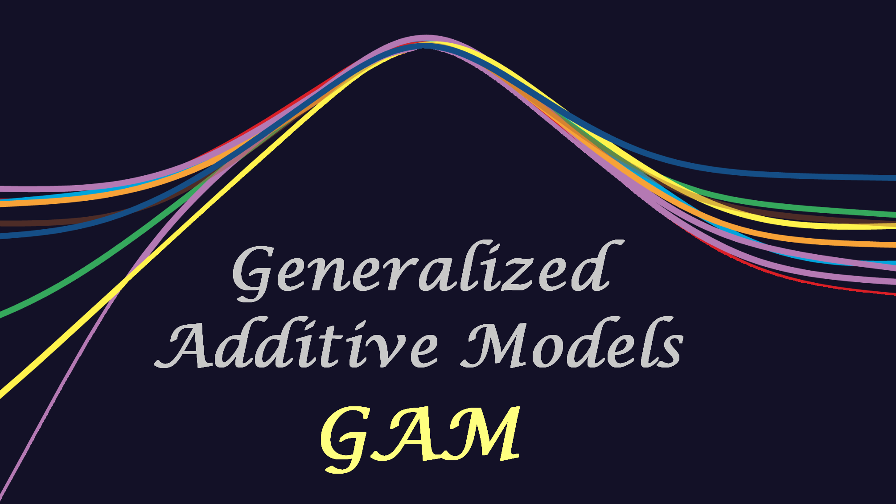
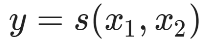
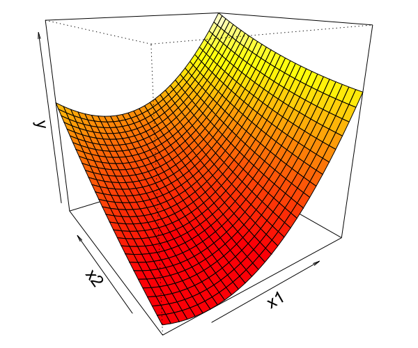

<!-- Build with: xaringan::inf_mr() -->

```{r preamble, include=FALSE, cache=FALSE}
source(here::here("uw-survey-2023/preamble.R"))
do.call(knitr::opts_chunk$set, knitr_opts)
```

```{r libs, include=FALSE}
library(dplyr)
library(sdmTMB)
library(ggplot2)
library(mgcv)
```

# Outline

* Brief intro to model-based index standardization with sdmTMB and mgcv

* Self-guided practical coding exercises

* If time, begin applying methods to your own data

---

# sdmTMB highlights

An R package for spatially explicit predictive-process GLMMs (Generalized Linear Mixed Effect Models)

* Can model spatial and spatiotemporal variation with Gaussian random fields

* Provides spatial covariance statistics that can be useful (e.g. spatial scale of correlation)


---

# mgcv similarities and differences

An R package for GAMMs (General additive mixed effect models)
  
* Can model spatial variation using smoothers on spatial coordinates

* Does not provide spatial covariance statistics



---

# Why use a spatial model?

* Data often has spatial attributes

* Ideal world:
  * Plug spatial covariates into a GLM / GLMM
  * Residuals are uncorrelated  
  
```{r sim-rf-intro, echo=FALSE, fig.asp=0.4}
set.seed(123)
predictor_dat <- data.frame(
  X = runif(300), Y = runif(300),
  year = 1
)
mesh <- make_mesh(predictor_dat,
  xy_cols = c("X", "Y"),
  cutoff = 0.1
)
sim_dat <- sdmTMB_simulate(
  formula = ~1,
  data = predictor_dat,
  time = "year",
  mesh = mesh,
  family = gaussian(link = "identity"),
  range = 0.00001,
  sigma_E = 0.1,
  phi = 0.01,
  sigma_O = 0.2,
  seed = 3542,
  B = c(0) # B0 = intercept
)

ggplot(sim_dat, aes(X, Y, col = observed)) +
  geom_point(alpha = 0.7, size = 3) +
  guides(col = guide_legend(title = "Residuals")) +
  scale_color_gradient2()
```

---

# Reality
  
* Residual spatial autocorrelation

```{r sim-rf-intro-cor, echo=FALSE, fig.asp=0.4}
set.seed(123)
predictor_dat <- data.frame(
  X = runif(300), Y = runif(300),
  year = 1
)
mesh <- make_mesh(predictor_dat,
  xy_cols = c("X", "Y"),
  cutoff = 0.1
)
sim_dat <- sdmTMB_simulate(
  formula = ~1,
  data = predictor_dat,
  time = "year",
  mesh = mesh,
  family = gaussian(link = "identity"),
  range = 0.25,
  sigma_E = 0.1,
  phi = 0.01,
  sigma_O = 0.1,
  seed = 3542,
  B = c(0) # B0 = intercept
)

ggplot(sim_dat, aes(X, Y, col = observed)) +
  geom_point(alpha=0.7, size=3) + 
  guides(col=guide_legend(title="Residuals")) +
  scale_color_gradient2()
```

---

# Modeling spatial autocorrelation

* Need 'wiggly'/smooth surface for approximating all spatial variables missing from model ('latent' variables)

* Several equivalent approaches exist
  * Smooths in `mgcv()`  
  * Random fields and the Stochastic Partial Differential Equation (SPDE)

* SPDE differs in that it explicitly estimates parameters for spatial covariance function

.xsmall[
Miller, D.L., Glennie, R. & Seaton, A.E. Understanding the Stochastic Partial Differential Equation Approach to Smoothing. JABES 25, 1–16 (2020)
]

---

# Predictive process models 

* Estimate spatial field as random effects (random field)

* Gaussian process predictive process models:
  * Estimate values at a subset of locations ('knots')
  * Use covariance function to interpolate from knots to locations of observations

---

# Predictive process models 

* More knots (vertical dashed lines) = more wiggliness & parameters to estimate

```{r show-gp, fig.height=4}
x <- seq(1, 50)
d <- as.matrix(dist(x, diag = TRUE))
set.seed(123)
df <- data.frame(
  x = x,
  true = c(spam::rmvnorm(1, mu = 0, Sigma = 1 * exp(-0.05 * d)))
)
df$y <- rnorm(df$true, df$true, 0.1)

f1 <- mgcv::gam(y ~ s(x, k = 25, bs = "bs"), data = df)

knots <- data.frame("x" = f1$smooth[[1]]$knots, ymin = 0, ymax = 1.0e10)
g1 <- ggplot(df, aes(x, y)) +
  geom_vline(data = knots, aes(xintercept = x), col = "grey20", size = 0.3, linetype = "dashed") +
  geom_point(col = "red", alpha = 0.7) +
  theme(panel.grid = element_blank()) +
  xlab("") +
  ylab("Observations") +
  geom_smooth(
    method = "gam",
    formula = y ~ s(x, bs = "bs", k = 25)
  ) +
  coord_cartesian(xlim = c(0, 50))

f2 <- mgcv::gam(y ~ s(x, k = 7, bs = "bs"), data = df)
knots <- data.frame("x" = f2$smooth[[1]]$knots, ymin = 0, ymax = 1.0e10)

g2 <- ggplot(df, aes(x, y)) +
  geom_vline(data = knots, aes(xintercept = x), col = "grey20", size = 0.3, linetype = "dashed") +
  geom_point(col = "red", alpha = 0.7) +
  theme(panel.grid = element_blank()) +
  xlab("") +
  ylab("Observations") +
  geom_smooth(method = "gam", formula = y ~ s(x, bs = "gp", k = 7)) +
  coord_cartesian(xlim = c(0, 50))
gridExtra::grid.arrange(g1, g2, ncol = 1)
```

---

# What is a random field in practical terms?

* A way of estimating a wiggly surface to account for spatial and/or spatiotemporal correlation in data

--

* Alternatively, a way of estimating a wiggly surface to account for "latent" or unobserved variables

--

* As a bonus, it provides useful covariance parameter estimates: spatial variance and the distance at data points are effectively uncorrelated ("range")

---

# sdmTMB workflow

1. Prepare data .xsmall[(convert to UTMs, scale covariates, ...)]

2. Construct a mesh

3. Fit the model

4. Inspect the model .xsmall[(and possibly refit the model)]

5. Predict from the model

6. Calculate index

---

# sdmTMB workflow

1. Prepare data: .blue[`add_utm_columns()`]

2. Construct a mesh: .blue[`make_mesh()`]

3. Fit the model: .blue[`sdmTMB()`]

4. Inspect the model: .blue[`print()`], .blue[`sanity()`], .blue[`tidy()`], .blue[`residuals()`]

5. Predict from the model: .blue[`predict()`]

6. Calculate index: .blue[`get_index()`]

<!--  -->

---

class: center, middle, inverse

# Preparing data: getting into constant distance coordinates

---

# Projecting to UTMs to preserve distance

* Helper function: `sdmTMB::add_utm_columns()`

* Guesses UTM zone and uses the sf package:  
`sf::st_as_sf()`, `sf::st_transform()`, and `sf::st_coordinates()`

* Note default `units = "km"` because:
  * Range parameter estimated in units of X and Y
  * Values not too big or small for estimation

---

class: center, middle, inverse

# Constructing a mesh

---

# Constructing a mesh

`make_mesh()` has 2 shortcuts to mesh construction

1. K-means algorithm: used to cluster points (e.g., `n_knots = 100`); approach taken in VAST; sensitive to random `seed` argument!

2. Cutoff: minimum allowed distance between vertices (e.g., `cutoff = 10`)

---

# Constructing a mesh

.small[
Size of mesh has the single largest impact on fitting speed
`cutoff` (minimum triangle side length) is in units of x and y 

```{r make-mesh, echo=TRUE, fig.asp=1, out.width='280px', fig.width=6.5}
d <- data.frame(x = runif(500), y = runif(500))
mesh <- make_mesh(d, xy_cols = c("x", "y"), cutoff = 0.1)
mesh$mesh$n
plot(mesh)
```
]

---

class: center, middle, inverse

# Fitting the model: sdmTMB()

---

# sdmTMB()

Common arguments:

```r
fit <- sdmTMB(
  formula,
  data,
  mesh,
  time = NULL,
  family = gaussian(link = "identity"),
  spatial = c("on", "off"),
  spatiotemporal = c("iid", "ar1", "rw", "off"),
  silent = TRUE,
  ...
)
```

See `?sdmTMB`

---

class: center, middle, inverse

# Fitting the model: non-spatial model components

---

# Formula interface

sdmTMB uses a similar formula interface to widely used R packages

A formula is used to specify fixed effects and (optionally) random intercepts

.small[
```{r formulas1, echo=TRUE, eval=FALSE}
# linear effect of x1:
formula = y ~ x1

# add smoother effect of x2:
formula = y ~ x1 + s(x2)

# add random intercept by group g:
formula = y ~ x1 + s(x2) + (1 | g)
```
]

---

# Other common R formula options

Polynomials and omitting the intercept:

```{r formulas-other, echo=TRUE, eval=FALSE}
# polynomial functions using `poly`
y ~ poly(depth, degree = 2)

# omit intercept
y ~ -1 + as.factor(year)
y ~ 0 + as.factor(year)
```

---

# Families and links

Many of the same families used in `glm()`, `glmmTMB()`, `mgcv::gam()` can be used here

Includes:
  `gaussian()`, `Gamma()`, 
  `binomial()`, `poisson()`, `Beta()`, 
  `student()`, `tweedie()`, 
  `nbinom1()`, `nbinom2()`,
  `truncated_nbinom1()`, `truncated_nbinom2()`,
  `delta_gamma()`, `delta_lognormal()`, `delta_beta()`, and more...
  
All have `link` arguments
  
See `?sdmTMB::Families`

---

class: center, middle, inverse

# Fitting the model: spatial model components

---

# Spatial vs. spatiotemporal fields

* A spatial field can be thought of as a spatial intercept

  * a wiggly spatial process that is constant in time
  
--

* Spatiotemporal variation represents separate fields estimated for each time
  slice (possibly correlated)
  
  * wiggly spatial processes that change through time

---

# Spatial fields can be turned on/off

* By default `sdmTMB()` estimates a spatial field  

```{r echo=TRUE, eval=FALSE}
fit <- sdmTMB(
  y ~ x,
  family = gaussian(),
  data = dat,
  mesh = mesh,
  spatial = "on", #<<
  ...
)
```

---

# Why *not* estimate a spatial field?

* If shared process across time slices isn't of interest

* If magnitude of spatiotemporal variability >> spatial variation

* If confounded with other parameters

---

# Spatiotemporal fields

* Represents missing variables that vary through time

* Why include spatiotemporal fields?
  * If the data are collected in both space and time *and* 
    there are 'latent' spatial processes that vary through time
    
      * e.g., effect of water temperature on abundance, if temperature wasn't in the model

---

# Types of spatiotemporal fields

* None (`spatiotemporal = "off"`)

* Independent (`spatiotemporal = "iid"`)

* Random walk (`spatiotemporal = "rw"`)

* Autoregressive (`spatiotemporal = "ar1"`)

---

# Types of spatiotemporal fields

* The type of field to use depends on this question:

  * Do you expect hotspots to be independent with each time slice (IID) or adapt slowly over time (AR1/RW)?
  
* For stock assessments, indices often use IID fields so that all temporal correlation is handled inside the assessment model itself

---

# Fit a model for index standardization of cod data

Omit intercept and include an annual mean in formula to derive annual index from coefficients

```{r pcod-st-fit, echo=TRUE, eval=TRUE, results='hide'}
mesh <- make_mesh(pcod, xy_cols=c("X", "Y"), cutoff=10)
fit <- sdmTMB(
  density ~ 0 + as.factor(year), #<<
  data = pcod,
  mesh = mesh,
  family = tweedie(link = "log"),
  spatial = "on",
  time = "year",
  spatiotemporal = "iid"
)
```

---

# Fit a model for index standardization of cod data

Include a covariate (depth) and specify how this should be modeled

```{r pcod-st-fit-covariate, echo=TRUE, eval=TRUE, results='hide'}
fit <- sdmTMB(
  density ~ s(depth) + 0 + as.factor(year), #<<
  data = pcod,
  mesh = mesh,
  family = tweedie(link = "log"),
  spatial = "on",
  time = "year",
  spatiotemporal = "iid"
)
```

---
class: center, middle, inverse

# Inspect the model

---

# Checking convergence  

* Learning curve of TMB can be steep  
* Models can be very complex (hard to diagnose issues)
* `sanity()` function tries to help

.xsmall[
```{r checksanity, eval=TRUE, message=TRUE, warning=FALSE, echo=TRUE}
sanity(fit)
```
]

---

# Inspecting the model fit

```{r print-pcod-st-fit, eval=FALSE, echo=TRUE}
fit
```

.xsmall[
```{r pcod-st-print2, echo=TRUE, eval=TRUE}
#>                     coef.est coef.se
# as.factor(year)2003     1.80    0.28
# as.factor(year)2004     2.40    0.27
# as.factor(year)2005     2.12    0.27
# as.factor(year)2007     0.92    0.29
# as.factor(year)2009     1.43    0.28
# as.factor(year)2011     1.88    0.28
# as.factor(year)2013     2.17    0.27
# as.factor(year)2015     2.11    0.27
# as.factor(year)2017     1.39    0.28
# sdepth                  3.95   26.46
# 
# Dispersion parameter: 10.73
# Tweedie p: 1.49
# Matern range: 12.23
# Spatial SD: 1.85
# Spatiotemporal SD: 1.84
# ML criterion at convergence: 6242.801
```
]

---

# Model residuals

.xsmall[
Warning: these residuals are fast but might look off even if the model is fine. Also see MCMC residuals. See the ['Residual checking' vignette](https://pbs-assess.github.io/sdmTMB/articles/residual-checking.html).
]

```{r resid1, echo=TRUE, out.width='500px', fig.width=5}
set.seed(1)
rq_res <- residuals(fit) # randomized quantile residuals
qqnorm(rq_res);qqline(rq_res)
```

---

# Model residuals in space

.small[
```{r resid2, echo=TRUE, out.width='500px', fig.width=5}
pcod$resids <- residuals(fit)
filter(pcod, year %in% c(2015, 2017)) %>% 
  ggplot(aes(X, Y, colour = resids)) + #<<
  geom_point() +
  facet_wrap(~year) +
  scale_colour_gradient2() +
  coord_fixed()
```
]

---

class: center, middle, inverse

# Predict from the model

---

# Predict over the survey domain

.small[
* `qcs_grid`: a 2x2 km grid extending over the full survey domain
]
.small[
```{r, echo=TRUE, out.width="500px", fig.width=5}
ggplot(qcs_grid, aes(X, Y, fill = depth)) + 
  geom_raster() +
  coord_fixed()
```
]

---

# Predict over the survey domain

.xsmall[
```{r pcod-st-index1, echo=TRUE, message=FALSE, warning=FALSE}
# replicate grid over all years:
survey_grid <- replicate_df(qcs_grid, "year", unique(pcod$year))
pred <- predict(
  fit, newdata = survey_grid, return_tmb_object = TRUE
)
select(pred$data, year, X, Y, est, est_non_rf, est_rf, omega_s, epsilon_st) |> 
  head()
```
]

---

# Predict over the survey domain

* `est`: Overall estimate in link space (log here)
* `est_non_rf`: Estimate of non-random-field components
* `est_rf`: Estimate of random-field components
* `omega_s`: Spatial random field
* `epsilon_st`: Spatiotemporal random field

---

# Plotting overall predictions

```{r pcod-st-plot-est, echo=FALSE, fig.width=7}
.p <- pred$data
max_est <- quantile(.p$est, 0.998)
.p <- mutate(.p, est_trim = if_else(est > max_est, max_est, est))
ggplot(.p, aes(X, Y, fill = exp(est_trim))) +
  geom_raster() +
  scale_fill_viridis_c(trans = "sqrt") +
  facet_wrap(~year) +
  coord_fixed() +
  labs(fill = "Biomass density\n(kg/km^2)")
```

---

# Plotting depth effect with visreg

.small[
```{r pcod-sp-depth-visreg-resp, echo=TRUE}
visreg::visreg(fit, xvar = "depth", scale = "response")
```
]

---

class: center, middle, inverse

# Calculate an area-weighted population index

---

# Sum densities multiplied by cell areas

(*and calculate standard errors)

```{r pcod-index, echo=TRUE}
index <- get_index(pred, area = 4, bias_correct = TRUE)
head(index)
```

---

# Plot the standardized index

.small[
```{r pcod-st-index-plot, echo=TRUE, fig.width=6, fig.asp=0.5, out.width="600px"}
ggplot(index, aes(year, est)) + geom_line() +
  geom_ribbon(aes(ymin = lwr, ymax = upr), alpha = 0.4) +
  xlab('Year') + ylab('Biomass estimate (kg)')
```
]

---

class: center, middle, inverse

# Part II: GAM indices with mgcv

---

# Very brief intro to GAMs

* A quick and easy way to model nonlinear responses

* Aim: smooth enough to fit data, but not overfit!

* For more details, see tutorials, e.g.,
**Generalized Additive Models in R: A Free Interactive Course**: <https://noamross.github.io/gams-in-r-course>.


---

# Goldilocks smoothing

* Smoothing parameter (lambda)


---

# Goldilocks smoothing

* Number of basis functions (k)


---

# Smoothers in mgcv

.small[
```{r formulas-smoothers, echo=TRUE, eval=FALSE}
# smoother effect of x:
formula = y ~ s(x)

# basis dimension of 5:
formula = y ~ s(x, k = 5)

# smoother effect of x1 varying by x2:
formula = y ~ s(x1, by = x2)
```
]

Many types of basis functions available (e.g. cyclic splines)

---

# Fit a GAM for index standardization of BC Pacific cod data

Include a covariate (depth) 

Analogous to nonspatial model (spatial = "off", spatiotemporal = "off")

.small[
```{r pcod-gam-fit, echo=TRUE, eval=TRUE, results='hide'}
fit_gam <- gam(
  formula = density ~ s(depth) + as.factor(year),
  family = tw(link = "log"),
  data = pcod
)
```
]

---

# Predict to survey area

.xsmall[
```{r pcod-gam-pred, echo=TRUE, eval=TRUE}
pred_gam <- predict(fit_gam, type = "response", newdata = survey_grid)
pred_gam_df <- cbind(survey_grid, pred_gam)

ggplot(pred_gam_df, aes(X, Y, fill = pred_gam)) + geom_raster() +
  scale_fill_viridis_c() + facet_wrap(~year) + coord_fixed() +
  labs(fill = "Log Biomass density\n(kg/km^2)")
```
]

---

# Calculate biomass index via simulation

.xsmall[
```{r pcod-gam-index, echo=TRUE, eval=TRUE}
sims <- gratia::fitted_samples(fit_gam, n=10, newdata=survey_grid, 
                               scale="response", seed=9)
sims$year <- survey_grid$year[sims$row]
sims$biomass <- sims$fitted * 4 # expand from density to biomass, given area

level <- 0.95 # specify probability for confidence interval

# Get sum of simulated biomass (density*area) across grid cells, with CI
lwr_fn <- function(x) {as.numeric(quantile(x, probs = (1 - level) / 2))}
upr_fn <- function(x) {as.numeric(quantile(x, probs = 1 - (1 - level) / 2))}

sims_sum <-  sims %>% 
  group_by(year,draw) %>% 
  summarise_at("biomass", list(biomass = sum)) %>%
  group_by(year) %>%
  summarise_at("biomass", list(est = median, # could use mean
                           lwr = lwr_fn,
                           upr = upr_fn))
```
]

Note that this approach uses a Gaussian approximation to the posterior

---

# Plot biomass index

.xsmall[
```{r pcod-gam-index-plot, echo=TRUE, eval=TRUE}
ggplot(sims_sum, aes(year, est)) + geom_line() +
  geom_ribbon(aes(ymin = lwr, ymax = upr), alpha = 0.4) +
  xlab('Year') + ylab('Biomass estimate (kg)')
```
]

---

# Spatial GAMs with 2-D smoothers





---

# Brief GAM tip summary

* Experiment with amount of smoothing to avoid under/over fitting

* Be wary of uncertainty estimated without fully Bayesian posterior sampling

* See examples of more complex (spatial and spatiotemporal) model structures in exercise

---

# Zooming out for perspective on alternative indices

There is *one* design-based index.

--

There are *many* possible model-based indexes. Thankfully, results are often (but not always!) qualitatively similar across sensible configurations.


.tiny[
Commander, C.J.C, L.A.K. Barnett, E.J. Ward, S.C. Anderson, T.E. Essington. 2022. The shadow model: how and why small choices in spatially explicit species distribution models affect predictions. PeerJ. 10: e12783. <https://doi.org/10.7717/peerj.12783>
]
